# Tomcat

web应用服务器：Tomcat、Jboss、Weblogic、Jetty

- 安装Tomcat

  ```shell
  brew install tomcat
  ```

  bin：存放各个平台（操作系统）下启动和停止Tomcat服务的脚本文件。bat --> windows， sh --> linux

  conf：存放各种Tomcat服务器的配置文件

  lib：存放Tomcat服务器所需要的jar文件

  log：存放Tomcat服务运行的日志

  temp：Tomcat运行时的临时文件
  
  webapps：存放允许客户端访问的资源（java程序）。
  
  work：存放Tomcat将JSP转换之后的Servlet文件


## Servlet

- 什么是Servlet？

  Servlet是Java Web开发的基石，与平台无关的服务器组件。它是运行在Servlet容器/Web应用服务器/Tomcat，负责与客户端进行通信。

- Servlet的功能：
  1. 创建并返回基于客户请求的动态HTML页面。
  2. 与数据库进行通信。

- 如何使用Servlet？

  Servlet本事是一组接口，javax.servlet，java.lang，java.util，javax.sql（java是基本的东西，javax是扩展的东西）

  自定义一个类，并且实现Servlet接口，这个类就具备了接受客户端请求以及做出相应的功能。

WEB-INF/web.xml

```xml
<?xml version="1.0" encoding="UTF-8"?>
<web-app xmlns="http://xmlns.jcp.org/xml/ns/javaee"
         xmlns:xsi="http://www.w3.org/2001/XMLSchema-instance"
         xsi:schemaLocation="http://xmlns.jcp.org/xml/ns/javaee http://xmlns.jcp.org/xml/ns/javaee/web-app_4_0.xsd"
         version="4.0">

  <servlet>
    <servlet-name>MyServlet</servlet-name>
    <servlet-class>com.anasiangangster.servlet.MyServlet</servlet-class>
  </servlet>
  <servlet-mapping>
    <servlet-name>MyServlet</servlet-name>
    <url-pattern>/myservlet</url-pattern>
  </servlet-mapping>
</web-app>
```

MyServlet.java

```java
package com.anasiangangster.servlet;

import javax.servlet.*;
import java.io.IOException;

public class MyServlet implements Servlet {
  @java.lang.Override
    public void init(ServletConfig servletConfig) throws ServletException {

  }

  @java.lang.Override
    public ServletConfig getServletConfig() {
    return null;
  }

  @java.lang.Override
    public void service(ServletRequest servletRequest, ServletResponse servletResponse) throws ServletException, IOException {
    String id = servletRequest.getParameter("id"); // String 可以接收null
    System.out.println("我是Servlet，我已经接收到了客户端发来的请求，参数是"+id);
    servletResponse.setContentType("text/html; charset=UTF-8");
    servletResponse.getWriter().write("你好客户端，我已经接收到你的请求");
  }

  @java.lang.Override
    public java.lang.String getServletInfo() {
    return null;
  }

  @java.lang.Override
    public void destroy() {

  }
}
```

浏览器不能直接访问Servlet文件，只能通过映射到方式来间接访问Servlet，映射需要开发者手动配置，有两种配置方式。

- 基于XML文件的配置方式

- 基于注解的方式

  ```java
  @WebServlet("/myservlet")
  public class MyServlet implements Servlet {
    
  }
  ```

上述两种配置方式结果完全一致，将myservlet与MyServlet进行映射，即在浏览器地址栏中直接访问/myservlet就可以映射到MyServlet

### Servlet的生命周期

1. 当浏览器访问Servlet的时候，Tomcat会查询当前Servlet的实例化对象是否存在，如果不存在，则通过反射机制动态创建对象，如果存在，直接执行第3步
2. 调用init方法完成初始化操作
3. 调用service方法完成业务逻辑操作
4. 关闭Tomcat时，会调用destory方法，释放当前对象所占用的资源

#### Servlet的生命周期方法

无参构造函数、init、service、destory

- 无参构造函数只调用一次，初始化对象
- init只调用一次，初始化对象
- service调用n次，执行业务方法
- destroy只调用一次，卸载对象

#### ServletConfig

该接口时用来描述Servlet的基本信息的。

getServletName() 返回Servlet的名称，全类名（带着包名的类名）

getInitParameters(String key) 获取init参数的值（web.xml）

getInitParameterNames() 返回所用的initParameter的name值，一般用作遍历初始化参数

getServletContext() 返回ServletContext对象，它是Servlet的上下文，整个Servlet的管理者，整个Servlet的服务信息。

ServletConfig和ServletContext的区别：

ServletConfig作用于某个Servlet实例，每个Servlet都有对应的ServletConfig；ServletContext作用于整个Web应用，一个Web应用对应一个ServletContext，多个Servlet实例对应一个ServletContext。

### Servlet的层次结构

Servlet --> GenericServlet --> HttpServlet

HTTP请求有很多中类型，常用的有四种：

GET 读取

POST 保存

PUT 修改

DELETE 删除

GenericServlet实现Servlet接口，同时为它的子类屏蔽了不常用的方法，子类只需要重写service方法即可。

HttpServlet继承GenericServlet，根据请求类型进行分发处理，GET进入doGet方法，POST进入doPost方法。

开发者自定义的Servlet类只需要继承HttpServlet即可，重写doGet和doPost。

```java
import javax.servlet.ServletException;
import javax.servlet.annotation.WebServlet;
import javax.servlet.http.HttpServlet;
import javax.servlet.http.HttpServletRequest;
import javax.servlet.http.HttpServletResponse;
import java.io.IOException;

@WebServlet("/test")
public class TestServlet extends HttpServlet {
  @Override
  protected void doGet(HttpServletRequest req, HttpServletResponse resp) throws ServletException, IOException {
    resp.getWriter().write("GET");
  }

  @Override
  protected void doPost(HttpServletRequest req, HttpServletResponse resp) throws ServletException, IOException {
    resp.getWriter().write("POST");
  }
}
```

## JSP

JSP本质上就是一个Servlet，JSP主要负责与用户交互，将最终的界面呈现给用户，HTML+JS+CSS+Java的混合文件。

当服务器接收到一个后缀是jsp的请求时，将该请求交给JSP引擎去处理，每一个JSP页面第一次被访问的时候，JSP引擎会将它翻译成一个Servlet文件，再由Web容器调用Servlet完成响应。

单纯从开发的角度看，JSP就是在HTML中嵌入Java程序。

具体的嵌入方式有3种：

1. JSP脚本

   执行Java逻辑代码

   ```jsp
   <% //Java代码 %>
   ```

2. JSP声明

   定义Java方法

   ```jsp
   <%!
     //声明Java方法
   %>
   ```

3. JSP表达式

   把Java对象直接输出到HTML页面中

   ```jsp
   <%=
     //Java变量
   %>
   ```

```jsp
<%!
  public String test() {
  return "Hello World";
}
%>
<%
	String str = test();
%>
<%=str%>
```

```jsp
<%@ page import="java.util.ArrayList" %>
<%@ page import="java.util.List" %>
<%@ page import="com.anasiangangster.entity.User" %>
<%@ page contentType="text/html; charset=UTF-8" pageEncoding="UTF-8" %>
<!DOCTYPE html>
<html>
  <head>
    <title>$Title$</title>
  </head>
  <body>
    <h1>Index</h1>
    <%
    // List<String> names = new ArrayList<>();
    // names.add("张三");
    // names.add("李四");
    // names.add("王五");
    // List<Integer> ages = new ArrayList<>();
    // ages.add(21);
    // ages.add(21);
    // ages.add(22);
    List<User> list = new ArrayList<>();
    list.add(new User("张三", 21));
    list.add(new User("李四", 23));
    list.add(new User("王五", 22));
    %>
    <table>
      <tr>
        <th>姓名</th>
        <th>年龄</th>
      </tr>

      <%
      for(int i = 0; i < list.size(); i++) {
      %>
        <tr>
          <td><%=list.get(i).getName()%></td>
          <td><%=list.get(i).getAge()%></td>
        </tr>
      <%
      }
      %>
    </table>
  </body>
</html>
```

### JSP内置对象

1. request：表示一次请求，HttpServletRequest

2. response：表示一次响应，HttpServletResponse

3. pageContext：页面上下文，获取页面信息，PageContext。

4. session：表示一次会话，浏览器开始会话开始，互交几次，关闭浏览器会话结束，保存用户信息，HttpSession。

5. application：表示当前Web应用，全局对象，保存所有用户共享信息，ServletContext。

6. config：当前JSP对应的Servlet的ServletConfig对象，获取当前Servlet的信息。

7. out：向浏览器输出数据，JspWriter

8. page：当前JSP对应的Servlet对象，Servlet

9. exception：表示JSP页面发生的异常，Exception

常用的是request、response、session、application、pageContext

#### request常用方法

1. String getParameter(String key) 获取客户端传来的参数

2. void setAttribute(String key, Object value) 通过键值对的形式保存数据

3. Object getAttrbute(String key) 通过key取出value 

4. RequestDispatcher getRequestDispatcher(String path) 返回一个RequestDispatcher对象，该对象的forward方法用于请求转发。

5. String[] getParameterValues() 获取客户端传来的多个同名参数

   ```jsp
   <%
   	// localhost:8080/index.jsp?name=aobo&name=karen&name=jake&name=傻逼
   	String[] names = request.getParameterValues("name");
   %>
   <%=Arrays.toString(names)%>
   ```

6. void setCharacterEncoding(String charset) 指定每个请求的编码

#### response常用方法

1. sendRedirect(String path) 重定向，页面之间的跳转。

转发getRequestDispatcher和重定向sendRedirect的区别：

转发是将同一个请求传给下一个页面；重定向是创建一个新的请求传给下一个页面，之前的请求结束生命周期。

转发：同一个请求在服务器之间传递，地址栏不变，这叫服务器跳转。

重定向：由客户端发送一次新的请求来访问跳转后的资源目标，地址栏改变，也叫客户端跳转

如果两个页面之间需要通过request来传值，则必须使用转发，不能使用重新定向

用户登录，如果用户名和密码正确，则跳转到首页（转发），并且展示用户名，否则重新回到登录页面（重定向）

### HTTP请求状态码

200：正常

404：资源找不到

400：请求类型不匹配

500：Java程序抛出异常（Java代码有问题）

# Session

用户会话

服务器无法识别每一次HTTP请求的出处（不知道来自于哪个终端），它只会接收到一个请求信号，所以说就存在一个问题：将用户的响应发送给其他人必须有一种技术来让服务器知道请求来自哪，这就是会话技术。

会话：就是客户端和服务器之间发生的一系列连续的请求和响应的过程，打开浏览器进行操作到关闭浏览器的过程。

会话状态：指服务器和浏览器在会话过程中过产生的状态信息，借助于会话的状态，服务器能够把属于同一次会话的一系列请求和响应关联起来。

实现会话有两种方式：

- session 服务端
- cookie 客户端

属于同一次会话的请求都有一个相同的标识符，sessionID

## Session常用方法

String getId() 获取sessionID

void setMaxInactiveInterval(int interval) 设置session的失效时间的，单位为秒

int getMaxInactiveInterval() 获取当前的session失效时间

void invalidate() 设置session立即失效

void setAttribute(String key, Object value) 通过键值对的形式来存储数据

Object getAttribute(String key) 通过键获取对应的数据

void removeAttribute(String key) 通过键删除对应的数据

# Cookie

Cookie是服务端在HTTP响应中附带传给浏览器的一个小的文本文件，一旦浏览器保存了某个Cookie，在之后的请求和响应过程中，会将次Cookie来回传递，这样就可以通过Cookie这个载体完成客户端和服务端的数据交互。

Cookie类

- 创建Cookie

  ```jsp
  <%
  	Cookie cookie = new Cookie("name", "aobo");
  	response.addCookie(cookie);
  %>
  ```

- 读取Cookie

  ```java
  Cookie[] cookies = request.getCookies();
  for (Cookie cookie:cookies) {
    System.out.println(cookie.getName());
  }
  ```

Cookie常用方法

void setMaxAge(int age) 设置Cookie有效时间，单位为秒

int getMaxAge() 获取Cookie的有效时间

String getName() 获取Cookie的name

String getValue() 获取Cookie的value

## Session和Cookie的区别

session：

- 保存在服务器（JVM内存）

- 保存的数据是Object
- 会随着会话的结束而销毁
- 保存重要信息

cookie：

- 保存在浏览器

- 保存的数据是String
- 可以长期保存在浏览器中，与会话无关
- 保存不重要信息


存储用户信息：

session：

- setAttribute("name", "admin") 存
- getAtrribute("name") 取
- 生命周期：服务端，只要Web应用重启就销毁；客户端，只要浏览器关闭就销毁
- 退出登录：session.invalidate()

cookie：

- response.addCookie(new Cookie("name", "admin")) 存

- ```jsp
  <%
  	Cookie[] cookies = request.getCookies();
  	for (Cookie cookie: cookies) {
    	if (cookie.getName().equals("name")) {
  %>
  			<%=cookie.getName()+":"+cookie.getValue()%>
  <%
  		}
  	}
  %>
  <a href="/cookielogout">退出登录</a>
  ```

  取

- 生命周期：不随服务端的重启而销毁，客户端：默认是只要关闭浏览器就销毁，我们通过setMaxAge()方法设置有效期，一旦设置了有效期，则不随浏览器的关闭而销毁，而是由设置的时间来决定。

- 退出登录：setMaxAge(0)

# JSP内置对象作用域

4个作用域

page、request、session、application

都有setAttribute、getAttribute方法

page作用域：对应的内置对象是pageContext

request作用域：对应的内置对象是request

session作用域：对应的内置对象是session

application作用域：对应的内置对象是application

page < request < session < application

page只在当前页面有效

request在一次请求内有效

session在一次会话内有效

application对应整个Web应用

> 重定向(redirect)是叫客户端重新发一次请求，请求转发(forward)还是同一个请求

- 网站的访问量统计

  ```jsp
  <%
  	Integer count = (Integer) application.getAttribute("count");
  	if (count == null) {
    	count = 1;
    	application.setAttribute("count", count);
  	} else {
    	count = (Integer) application.getAttribute("count");
    	count++;
    	application.setAttribute("count", count);
  	}
  %>
  <%="你是当前的第"+count+"位访客"%>
  ```

# EL表达式

Expression Language 表达式语言，替代JSP页面中数据访问时的复杂编码。可以非常便捷地取出域对象（pageContext、request、session、application）中保存的数据，前提是一定要先setAttribute，EL就相当于在简化getAttribute

${变量名}变量名就是setAttribute对应的key值

1. EL对应4中域对象的默认查找顺序：

   pageContext -> request -> session -> application

   按照上述的顺序进行查找，找到立即返回，在application中也无法找到，则返回null

2. 指定作用域进行查找

   pageContext：${pageScope.name}

   request：${requestScope.name}

   session：${sessionScope.name}

   application：${application.name}

数据级联

```jsp
    <%
//        pageContext.setAttribute("name", "page");
//        request.setAttribute("name", "request");
//        session.setAttribute("name", "session");
//        application.setAttribute("name", "application");
        User user = new User(1, "张三", 25);
        pageContext.setAttribute("user", user);
    %>
<%--    ${pageScope.user}--%>
    <table>
        <tr>
            <th>编号</th>
            <th>姓名</th>
            <th>年龄</th>
        </tr>
        <tr>
            <td>${user.setId(34)}</td>
            <td>${user.getName()}</td>
            <td>${user.age}</td>
        </tr>
    </table>
    ${user}
		${user["age"]}
```

EL执行表达式

与、或、非；&&、｜｜、！<、>、<=、>=、==

```shell
&& and
|| or
! not
== eq
!= ne
< lt
> gt
<= le
>= ge
empty 变量为null，长度为0的String，size为0的集合
```

# JSTL

JSP Standard Tag Library JSP标准标签库，JSP为开发者提供的一系列的标签，使用这些标签可以完成一些逻辑处理，比如循环遍历集合，让代码更加简洁，不再出现JSP脚本穿插的情况。

实际开发中EL和JSTL结合起来使用，JSTL侧重于逻辑处理，EL负责展示数据

JSTL的使用

1. 需要导入jar包，（两个jstl.jar standard.jar）手动导入Web-INFO/lib

2. 在JSP页面开始的地方导入JSTL标签库

   ```jsp
   <%@taglib prefix="c" uri="http://java.sun.com/jsp/jstl/core"%>
   ```

3. 在需要的地方使用

   ```jsp
   <c:forEach var="user" items="${list}">
     <tr>
       <td>${user.id}</td>
       <td>${user.name}</td>
       <td>${user.age}</td>
     </tr>
   </c:forEach>
   ```

JSTR的优点：

1. 提供了统一的标签
2. 可以用于编写各种动态功能

## 核心常用标签

set、out、remove、catch

set：向域对象中添加数据

```jsp
<%
	request.setAttribute(key, value)
%>
${name}

<c:set var="name" value="tom" scope="request"></c:set>
${requestScope.name}

<%
User user = new User(1, "aobo", 25);
request.setAttribute("user", user);
%>
<c:set target="${user}" property="name" value="aobo2"></c:set>
${user.name}
```

out：输出域对象中的数据

```jsp
<c:set var="name" value="tom"></c:set>
<c:out value="${name}" default="未定义"></c:out>
```

remove：删除域对象中的数据

```jsp
<c:remove var="name" scope="page"></c:remove>
```

catch：捕获异常

```jsp
<c:catch var="error">  <%  int a = 10 / 0;  %></c:catch>${error}
```

条件标签：

if、choose

```jsp
<c:set var="num1" value="1"></c:set><c:set var="num2" value="2"></c:set><c:if test="${num1 > num2}">ok</c:if><c:if test="${num1 < num2}">fail</c:if><hr><c:choose>  <c:when test="${num1 > num2}">ok</c:when>  <c:otherwise>fail</c:otherwise></c:choose>
```

迭代标签：

forEach

```jsp
<%	List<String> list = new ArrayList<>();	list.add("a");	list.add("b");	list.add("c");	list.add("d");	list.add("e");	list.add("f");	list.add("g");	list.add("h");	list.add("i");	request.setAttribute("list", list);%><c:forEach var="character" items="${list}" begin="2" end="3" step="2" varStatus="status">  ${status.index}-${character}<br></c:forEach>
```

## 格式化标签库常用的标签

```jsp
<%	request.setAttribute("date", new Date());%><fmt:formatDate value="${date}" pattern="yyyy-MM-dd HH:mm:ss"></fmt:formatDate><fmt:formatNumber value="5640640.68046840" maxIntegerDigits="2" maxFractionDigits="3"></fmt:formatNumber>
```

## 函数标签库常用的标签

```JSP
<%	request.setAttribute("info", "Java,C");%>${fn:contains(info,"python")}<br>${fn:startsWith(info,"Java")}<br>${fn:endsWith(info,"C")}<br>${fn:indexOf(info,"va")}<br>${fn:replace(info,"C","Python")}<br>${fn:substring(info,2,3)}<br>${fn:split(info, ",")[0]}
```

# 过滤器

Filter

熔断器Hystrix

功能：

1. 用来拦截传入的请求和传出的响应
2. 修改或以某中方式处理正在客户端和服务端之间交换的数据流

使用：

与使用Servlet类似、Filter是Java Web提供的一个接口，开发者只需要自定义一个类并且实现该接口即可

```java
package com.anasiangangster.filter;

import javax.servlet.*;
import java.io.IOException;

public class CharacterFilter implements Filter {
  @Override
  public void doFilter(ServletRequest servletRequest, ServletResponse servletResponse, FilterChain filterChain) throws IOException, ServletException {
    servletRequest.setCharacterEncoding("UTF-8");
    filterChain.doFilter(servletRequest, servletResponse);
  }
}
```

web.xml中配置Filter

```xml
<filter>
  <filter-name>characterEncoding</filter-name>
  <filter-class>com.anasiangangster.filter.CharacterFilter</filter-class>
</filter>
<filter-mapping>
  <filter-name>characterEncoding</filter-name>
  <url-pattern>/login</url-pattern>
  <url-pattern>/test</url-pattern>
</filter-mapping>
```

注意：doFilter方法中处理完业务逻辑之后，必须添加

```java
filterChain.doFilter(servletRequest, servletResponse);
```

否则请求/响应无法向后传递，一直停留在过滤器中。

## Filter的生命周期

当Tomcat启动时，通过反射机制调用Filter的无参构造函数创建实例化对象，同时调用init方法实现初始化；

doFilter方法调用多次，当Tomcat服务关闭的时候，调用destroy来销毁Filter对象。

无参构造函数：只调用一次，当Tomcat启动时调用（Filter一定要进行配置）

init方法：只调用一次，当Filter的实例化对象创建完成之后调用

doFilter：调用多次，访问Filter的业务逻辑都写在Filter中

destroy：只调用一次，Tomcat关闭时调用

同时配置多个Filter，Filter的调用顺序是由web.xml中的配置顺序来决定的，写在上面的配置先调用，因为web.xml是从上到下顺序读取的。

```xml
<filter>
  <filter-name>characterEncoding</filter-name>
  <filter-class>com.anasiangangster.filter.CharacterFilter</filter-class>
</filter>
<filter-mapping>
  <filter-name>characterEncoding</filter-name>
  <url-pattern>/login</url-pattern>
  <url-pattern>/test</url-pattern>
</filter-mapping>

<filter>
  <filter-name>myFilter</filter-name>
  <filter-class>com.anasiangangster.filter.MyFilter</filter-class>
</filter>
<filter-mapping>
  <filter-name>myFilter</filter-name>
  <url-pattern>/login</url-pattern>
</filter-mapping>
```

顺序

1. CharacterFilter
2. MyFilter

也可以通过注解的方式来简化web.xml的中的配置

```java
@WebFilter("/login")
```

用注解不能决定顺序

实际开发中的过滤器的使用场景：

1. 统一处理中文乱码

2. 屏蔽敏感词

   ```java
   package com.anasiangangster.filter;
   
   import javax.servlet.*;
   import javax.servlet.annotation.WebFilter;
   import java.io.IOException;
   
   @WebFilter("/test")
   public class WordFilter implements Filter {
     @Override
     public void doFilter(ServletRequest servletRequest, ServletResponse servletResponse, FilterChain filterChain) throws IOException, ServletException {
       //将"敏感词"替换成"***"
       String name = servletRequest.getParameter("name");
       name = name.replaceAll("敏感词", "***");
       servletRequest.setAttribute("name", name);
       filterChain.doFilter(servletRequest, servletResponse);
     }
   }
   ```

   ```java
   package com.anasiangangster.servlet;
   
   import javax.servlet.ServletException;
   import javax.servlet.annotation.WebServlet;
   import javax.servlet.http.HttpServlet;
   import javax.servlet.http.HttpServletRequest;
   import javax.servlet.http.HttpServletResponse;
   import java.io.IOException;
   
   @WebServlet("/test")
   public class TestServlet extends HttpServlet {
     @Override
     protected void doPost(HttpServletRequest req, HttpServletResponse resp) throws ServletException, IOException {
       //        String name = req.getParameter("name");
       String name = (String) req.getAttribute("name");
       System.out.println(name);
     }
   }
   ```

3. 控制资源的访问权限

   ```java
   package com.anasiangangster.filter;
   
   import javax.servlet.*;
   import javax.servlet.annotation.WebFilter;
   import javax.servlet.http.HttpServletRequest;
   import javax.servlet.http.HttpServletResponse;
   import javax.servlet.http.HttpSession;
   import java.io.IOException;
   
   @WebFilter("/download.jsp")
   public class DownloadFilter implements Filter {
       @Override
       public void doFilter(ServletRequest servletRequest, ServletResponse servletResponse, FilterChain filterChain) throws IOException, ServletException {
           HttpServletRequest request = (HttpServletRequest) servletRequest;
           HttpServletResponse response = (HttpServletResponse) servletResponse;
           HttpSession session = request.getSession();
           String name = (String) session.getAttribute("name");
           if (name != null) {
               filterChain.doFilter(servletRequest, servletResponse);
           } else {
               //不是登录状态
               response.sendRedirect("/login.jsp");
           }
       }
   }
   ```

Filter拦截多个Servlet

```java
@WebFilter(urlPatterns = {"/test", "login"}) // "/*" 来实现全局
```

# 文件上传下载

- JSP

  1. input的type设置为file
  2. form表单的method设置为post（get请求会将文件名传给后端，而不是文件本身）
  3. form表单的enctype设置multipart/form-data，以二进制的形式传输数据。

- Servlet

  ```java
  package com.anasiangangster.servlet;
  
  import javax.servlet.ServletException;
  import javax.servlet.annotation.WebServlet;
  import javax.servlet.http.HttpServlet;
  import javax.servlet.http.HttpServletRequest;
  import javax.servlet.http.HttpServletResponse;
  import java.io.*;
  
  @WebServlet("/upload")
  public class UploadServlet extends HttpServlet {
    @Override
    protected void doPost(HttpServletRequest req, HttpServletResponse resp) throws ServletException, IOException {
      //通过输入流获取客户端传来的数据流
      InputStream inputStream = req.getInputStream();
      Reader reader = new InputStreamReader(inputStream);
      BufferedReader bufferedReader = new BufferedReader(reader);
      //通过输出流将数据流出到本地硬盘
      //获取文件夹的绝对路径
      String path = req.getServletContext().getRealPath("file/copy.txt");
      OutputStream outputStream = new FileOutputStream(path);
      Writer writer = new OutputStreamWriter(outputStream);
      BufferedWriter bufferedWriter = new BufferedWriter(writer);
  
      String str = "";
      while ((str = bufferedReader.readLine()) != null) {
        bufferedWriter.write(str);
      }
  
      bufferedWriter.flush();
      bufferedWriter.close();
      writer.close();
      outputStream.close();
      bufferedReader.close();
      reader.close();
      inputStream.close();
    }
  }
  ```

  1. FileUpload组件可以将所有请求信息都解析成FileIterm对象，可以通过对FileItem对象的操作完成上传，面向对象的思想。

     ```java
     package com.anasiangangster.servlet;
     
     import org.apache.commons.fileupload.FileItem;
     import org.apache.commons.fileupload.FileUploadException;
     import org.apache.commons.fileupload.disk.DiskFileItemFactory;
     import org.apache.commons.fileupload.servlet.ServletFileUpload;
     
     import javax.servlet.ServletException;
     import javax.servlet.annotation.WebServlet;
     import javax.servlet.http.HttpServlet;
     import javax.servlet.http.HttpServletRequest;
     import javax.servlet.http.HttpServletResponse;
     import java.io.*;
     import java.util.List;
     
     @WebServlet("/upload")
     public class UploadServlet extends HttpServlet {
       @Override
       protected void doPost(HttpServletRequest req, HttpServletResponse resp) throws ServletException, IOException {
         try {
           DiskFileItemFactory fileItemFactory = new DiskFileItemFactory();
           ServletFileUpload servletFileUpload = new ServletFileUpload(fileItemFactory);
           List<FileItem> list = servletFileUpload.parseRequest(req);
           for(FileItem fileItem : list) {
             if(fileItem.isFormField()) {
               String name = fileItem.getFieldName();
               String value = fileItem.getString("UTF-8");
               System.out.println("name = " + name);
               System.out.println("value = " + value);
             } else {
               String fileName = fileItem.getName();
               long size = fileItem.getSize();
               System.out.println(fileName+":"+size+"Bytes");
               InputStream inputStream = fileItem.getInputStream();
               String path = req.getServletContext().getRealPath("file/"+fileName);
               OutputStream outputStream = new FileOutputStream(path);
               int temp = 0;
               while ((temp = inputStream.read()) != -1) {
                 outputStream.write(temp);
               }
               outputStream.close();
               inputStream.close();
               System.out.println("上传成功");
             }
           }
         } catch (FileUploadException e) {
           e.printStackTrace();
         }
       }
     }
     ```

# 文件下载

```java
package com.anasiangangster.servlet;

import javax.servlet.ServletException;
import javax.servlet.annotation.WebServlet;
import javax.servlet.http.HttpServlet;
import javax.servlet.http.HttpServletRequest;
import javax.servlet.http.HttpServletResponse;
import java.io.FileInputStream;
import java.io.IOException;
import java.io.InputStream;
import java.io.OutputStream;

@WebServlet("/download")
public class DownloadServlet extends HttpServlet {
  @Override
  protected void doGet(HttpServletRequest req, HttpServletResponse resp) throws ServletException, IOException {
    String type = req.getParameter("type");
    String fileName = "";
    switch (type) {
      case "png":
        fileName = "1.png";
        break;
      case "txt":
        fileName = "text.txt";
        break;
    }
    //设置响应的方式
    resp.setContentType("application/x-msdownload");
    //设置下载之后的文件名
    resp.setHeader("Content-Disposition", "attachment;filename="+fileName);
    //获取输出流
    OutputStream outputStream = resp.getOutputStream();
    String path = req.getServletContext().getRealPath("file/"+fileName);
    InputStream inputStream = new FileInputStream(path);
    int temp = 0;
    while ((temp = inputStream.read()) != -1) outputStream.write(temp);
    inputStream.close();
    outputStream.close();
  }
}
```

# Ajax

Asynchronous JavaScript And XML 异步的javaScript和XML

AJAX不是新的编程，指的是一种交互方式，异步加载，客户端和服务器的数据交互更新在局部页面的技术，不需要刷新整个页面（局部刷新）

优点：

1. 局部刷新，效率更高
2. 用户体验更好

基于jQuery的AJAX

```html
<%@ page contentType="text/html;charset=UTF-8" language="java" %>
<html>
<head>
    <title>test</title>
    <script type="text/javascript" src="js/jQuery-3.6.0.min.js"></script>
    <script type="text/javascript">
        $(function () {
            var btn = $("#btn");
            btn.click(function(){
                $.ajax({
                    url:"/test",
                    type:"post",
                    data:"id=1",
                    dataType:"text",
                    success:function (data){
                        var text = $("#text")
                        text.before("<h1>"+data+"</h1>")
                    }
                })
            });
        })
    </script>
</head>
<body>
<%--    ${str}--%>
<%--    <form action="/test" method="post">--%>
<%--        <input type="text">--%>
<%--        <input type="submit" value="提交">--%>
<%--    </form>--%>
    <input id="text" type="text">
    <input id="btn" type="button" value="提交">
</body>
</html>
```

不能用表单提交请求，该用jQuery方式动态绑定事件来提交。<form>是同步的，AJAX是异步的

Servlet不能跳转到JSP，只能将数据返回

```java
package com.anasiangangster.servlet;

import javax.servlet.ServletException;
import javax.servlet.annotation.WebServlet;
import javax.servlet.http.HttpServlet;
import javax.servlet.http.HttpServletRequest;
import javax.servlet.http.HttpServletResponse;
import java.io.IOException;

@WebServlet("/test")
public class TestServlet extends HttpServlet {
    @Override
    protected void doPost(HttpServletRequest req, HttpServletResponse resp) throws ServletException, IOException {
        String id = req.getParameter("id");
        System.out.println(id);
        try {
            Thread.sleep(3000);
        } catch (InterruptedException e) {
            e.printStackTrace();
        }
        String str = "Hello World";
//        req.setAttribute("str", str);
//        req.getRequestDispatcher("test.jsp").forward(req, resp);
        resp.getWriter().write(str);
    }
}
```

## 传统的Web数据交互 VS AJAX数据交互

- 客户端请求的方式不同：

传统，浏览器发送同步请求（form，a）

AJAX，异步引擎对象发送异步请求

- 服务器响应的方式不同：

传统，响应一个完整的JSP页面（视图）

AJAX，响应需要的数据（数据）

- 客户端处理方式不同：

传统，需要等待服务器完成响应，并且重新加载整个页面之后，用户才能进行后续操作，按照顺序走

AJAX，动态更新页面中的局部内容，不影响用户的其他操作

## AJAX原理


## 基于jQuery的AJAX语法

$.ajax((属性))

常用的属性：

url：请求的后端服务的地址

type：请求方式，默认get

data：请求参数，传给后台

dataType：服务器返回的数据类型，text/json

success：请求成功的回调函数

error：请求失败的回调函数，先error后complete

complete：请求完成的回调函数（无论成功或者失败，都会调用），先进complete再进success

## JSON

JavaScript Object Notation，一种轻量级的数据交互格式，完成js与java等后端开发语言对象数据之间的转换

客户端和服务器之间传递对象数据，需要用JSON格式

```java
package com.anasiangangster.entity;

public class User {
  private Integer id;
  private String name;
  private double score;

  public Integer getId() {
    return id;
  }

  public void setId(Integer id) {
    this.id = id;
  }

  public String getName() {
    return name;
  }

  public void setName(String name) {
    this.name = name;
  }

  public double getScore() {
    return score;
  }

  public void setScore(double score) {
    this.score = score;
  }

  public User(Integer id, String name, double score) {
    this.id = id;
    this.name = name;
    this.score = score;
  }

  @Override
  public String toString() {
    return "User{" +
      "id=" + id +
      ", name='" + name + '\'' +
      ", score=" + score +
      '}';
  }
}

//创建对象
User user = new User(1, "张三", 96.6);
```

```javas
var user = {
	id:1,
	name:"张三“,
	score:96.6
}
```

## AJAX实际应用

$()工厂函数

$(dom对象) --> jQuery对象

```html
<%@ page contentType="text/html;charset=UTF-8" language="java" %>
<html>
<head>
    <title>location</title>
    <script type="text/javascript" src="js/jQuery-3.6.0.min.js"></script>
    <script type="text/javascript">
        $(function(){
            //修改省
            $("#province").change(function() {
                var id = $(this).val();
                $.ajax({
                    url:"/location",
                    type:"post",
                    data:"id="+id+"&type=province",
                    dataType:"JSON",
                    success:function(data){
                        var content = "";
                        for (let i = 0; i < data.length; i++)
                            content += "<option>"+data[i]+"</option>";
                        $("#city").html(content).change();
                    }
                })
            })
            //修改城市
            $("#city").change(function(){
                var id = $(this).val();
                $.ajax({
                    url:"/location",
                    type:"post",
                    data:"id="+id+"&type=city",
                    dataType:"JSON",
                    success:function(data){
                        var content = "";
                        for (let i = 0; i < data.length; i++)
                            content += "<option value=\""+data[i]+"\">"+data[i]+"</option>";
                        $("#district").html(content);
                    }
                })
            })
        })
    </script>
</head>
<body>
    省：<select id="province">
        <option value="辽宁省">辽宁省</option>
        <option value="吉林省">吉林省</option>
        <option value="黑龙江省">黑龙江省</option>
    </select>
    市：<select id="city">
        <option value="沈阳市">沈阳市</option>
        <option value="大连市">大连市</option>
        <option value="盘锦市">盘锦市</option>
    </select>
    区：<select id="district">
        <option>铁西区</option>
        <option>和平区</option>
        <option>皇姑区</option>
    </select>
</body>
</html>
```

```java
package com.anasiangangster.servlet;

import net.sf.json.JSONArray;

import javax.servlet.ServletException;
import javax.servlet.annotation.WebServlet;
import javax.servlet.http.HttpServlet;
import javax.servlet.http.HttpServletRequest;
import javax.servlet.http.HttpServletResponse;
import java.io.IOException;
import java.util.ArrayList;
import java.util.HashMap;
import java.util.List;
import java.util.Map;

@WebServlet("/location")
public class LocationServlet extends HttpServlet {
  private static Map<String, List<String>> cityMap;
  private static Map<String, List<String>> provinceMap;
  static {
    provinceMap = new HashMap<>();
    List<String> cities = new ArrayList<>();
    cities.add("沈阳市");
    cities.add("大连市");
    cities.add("盘锦市");
    provinceMap.put("辽宁省", cities);
    cities = new ArrayList<>();
    cities.add("长春市");
    cities.add("吉林市");
    cities.add("通化市");
    provinceMap.put("吉林省", cities);
    cities = new ArrayList<>();
    cities.add("哈尔滨市");
    cities.add("齐齐哈尔市");
    cities.add("绥化市");
    provinceMap.put("黑龙江省", cities);

    cityMap = new HashMap<>();
    //沈阳
    List<String> areas = new ArrayList<>();
    areas.add("铁西区");
    areas.add("和平区");
    areas.add("皇姑区");
    cityMap.put("沈阳市", areas);
    //大连
    areas = new ArrayList<>();
    areas.add("沙河口区");
    areas.add("西岗区");
    areas.add("中山区");
    cityMap.put("大连市", areas);
    //盘锦
    areas = new ArrayList<>();
    areas.add("双台子区");
    areas.add("兴隆台区");
    areas.add("大洼区");
    cityMap.put("盘锦市", areas);
    //长春
    areas = new ArrayList<>();
    areas.add("南关区");
    areas.add("宽城区");
    areas.add("朝阳区");
    cityMap.put("长春市", areas);
    //吉林市
    areas = new ArrayList<>();
    areas.add("船营区");
    areas.add("昌邑区");
    areas.add("龙潭区");
    cityMap.put("吉林市", areas);
    //通化市
    areas = new ArrayList<>();
    areas.add("东昌区");
    areas.add("二道江区");
    areas.add("梅河口市");
    cityMap.put("通化市", areas);
    //哈尔滨
    areas = new ArrayList<>();
    areas.add("道里区");
    areas.add("南岗区");
    areas.add("道外区");
    cityMap.put("哈尔滨市", areas);
    //齐齐哈尔
    areas = new ArrayList<>();
    areas.add("龙沙区");
    areas.add("建华区");
    areas.add("铁锋区");
    cityMap.put("齐齐哈尔市", areas);
    //绥化市
    areas = new ArrayList<>();
    areas.add("北林区");
    areas.add("安达市");
    areas.add("肇东市");
    cityMap.put("绥化市", areas);
  }

  @Override
  protected void doPost(HttpServletRequest req, HttpServletResponse resp) throws ServletException, IOException {
    resp.setCharacterEncoding("UTF-8");
    String type = req.getParameter("type");
    String id = req.getParameter("id");
    List<String> result = null;
    switch (type) {
      case "province":
        result = provinceMap.get(id);
        break;
      case "city":
        result = cityMap.get(id);
        String city = result.get(0);
        break;
    }
    JSONArray jsonArray = JSONArray.fromObject(result);
    resp.getWriter().write(jsonArray.toString());
  }
}
```


# JDBC

Java Database Connectivity是一个独立于特定数据库的管理系统，通用的SQL数据库存取和操作的公共接口。

定义了一组标准，为访问不同数据库提供了统一途径。


## JDBC体系结构

JDBC接口包括两个层面：

- 面向应用的API，供程序员调用
- 面向数据库的API，供厂商开发数据库的驱动程序



JDBC API

提供者：Java官方

内容：供程序员调用的接口

java.sql和javax.sql

- DriverManager类
- Connection接口
- Statement接口
- ResultSet接口

DriverManager

提供者：Java官方

作用：管理不同的JDBC驱动

JDBC驱动：

提供者：数据库厂商

作用：负责链接不同的数据库

## JDBC的使用

1. 加载数据库驱动（基站），Java程序和数据库之间的桥梁
2. 获取Connection（一次通话），Java程序与数据库的一次链接
3. 创建Statement对象（通话内容），由Connection产生，执行SQ语句
4. 如果需要接收返回值，创建ResultSet对象（通话内容），保存Statement执行之后所查询到的结果

```java
package com.anasiangangster.test;

import java.sql.*;
import java.util.Date;

public class Test {
  public static void main(String[] args) {
    try {
      //加载驱动-->加载到JVM内存，需要手动加载过来
      Class.forName("com.mysql.cj.jdbc.Driver");
      //获取链接
      String url = "jdbc:mysql://localhost:3306/test?useUnicode=true&characterEncoding=UTF-8";
      String user = "root";
      String password = "password";
      Connection connection = DriverManager.getConnection(url, user, password);
      //            String sql = "insert into student(id, name, score, birthday) values(1,'张三',78,'1996-3-5')";
      //            String sql = "update student set name = '杨奥博'";
      //            String sql = "delete from student";
      //            Statement statement = connection.createStatement();
      //            int result = statement.executeUpdate(sql);
      //            System.out.println(result);
      String sql = "select * from student";
      Statement statement = connection.createStatement();
      ResultSet resultSet = statement.executeQuery(sql);
      while (resultSet.next()){
        Integer id = resultSet.getInt("id");
        String name = resultSet.getString(2);
        Integer score = resultSet.getInt(3);
        Date date = resultSet.getDate(4);
        System.out.println(id+"-"+name+"-"+score+"-"+date);
      }
    } catch (ClassNotFoundException | SQLException e) {
      e.printStackTrace();
    }
  }
}
```

## PreparedStatement

Statement的子类，提供了SQL语句占位符的功能。

使用Statement进行开发有两个问题：

1. 需要频繁拼接String字符串，出错率较高
2. 存在SQL注入的风险

SQL注入：利用某些系统没有对用户输入的信息进行充分的检测，在用户输入的数据中注入非法的SQL语句，从而利用系统的SQL引擎完成恶意行为的做法。

```java
String sql = "select * from t_user where username = ? and password = ?";
PreparedStatement preparedStatement = connection.prepareStatement(sql);
preparedStatement.setString(1, username);
preparedStatement.setString(2, password);
ResultSet resultSet = preparedStatement.executeQuery();
```

### 数据库连接池

JDBC开发流程

- 加载驱动（只需要加载一次）
- 建立数据库连接（Connection）
- 执行SQL语句（Statement）
- ResultSet接收结果集（查询）
- 断开链接，释放资源

数据库连接对象是通过DriverManager来获取的，每次获取都需要向数据库申请获取连接，验证用户名和密码

执行完SQL语句后断开链接，这样的方式会造成资源的浪费，数据库连接资源没有得到很好的重复利用。

可以使用数据库连接池解决这一问题。

数据库连接池的基本思想就是为数据库建立一个缓冲池，预先向缓冲池中放入一定数量的连接对象，当需要获取数据库连接的时候，只需要从缓冲池中取出一个对象，用完之后再放回缓冲池中，供下一次请求使用，做到了资源的重复利用。允许程序重复使用一个现有的数据库连接对象，而不需要重新创建。

当数据库连接池中没有空闲的连接时，新的请求就会进入等待队列，等待其他线程释放连接。

#### 数据库连接池实现

JDBC的数据库连接池使用javax.sql.DataSource接口来完成的。DataSource是Java官方提供的接口，使用的时候开发者不需要自己来实现接口，可以使用第三方的工具，C3P0是一个常用的第三方实现，实际开发中直接使用C3P0即可完成数据库连接池的操作。

1. 导入jar包

传统方式拿到的Connection

```shell
com.mysql.cj.jdbc.ConnectionImpl@4ac3c60d
```

```java
package com.example;

import javax.sql.DataSource;
import java.sql.Connection;
import java.sql.DriverManager;
import java.sql.SQLException;

public class ConnectionTest {
  public static void main(String[] args) {
    try {
      Class.forName("com.mysql.cj.jdbc.Driver");
      String url = "jdbc:mysql://localhost:3306/test?useUnicode=true&charactorEncoding=UTF-8";
      String user = "root";
      String password = "password";
      Connection connection = DriverManager.getConnection(url, user, password);
      System.out.println(connection);
      //释放资源
      connection.close();
    } catch (ClassNotFoundException | SQLException e) {
      e.printStackTrace();
    }
  }
}
```

C3P0拿到的Connetion

```shell
com.mchange.v2.c3p0.impl.NewProxyConnection@58fdd99 [wrapping: com.mysql.cj.jdbc.ConnectionImpl@6b1274d2]
```

```java
package com.example;

import com.mchange.v2.c3p0.ComboPooledDataSource;

import java.beans.PropertyVetoException;
import java.sql.Connection;
import java.sql.SQLException;

public class DataSourceTest {
  public static void main(String[] args) {
    try {
      //创建c3p0
      ComboPooledDataSource dataSource = new ComboPooledDataSource();
      //加载驱动
      dataSource.setDriverClass("com.mysql.cj.jdbc.Driver");
      dataSource.setJdbcUrl("jdbc:mysql://localhost:3306/test?useUnicode=true&charactorEncoding=UTF-8");
      dataSource.setUser("root");
      dataSource.setPassword("password");
      //设置初始化连接个数
      dataSource.setInitialPoolSize(20);
      //设置连接池最小连接数，20-10时（该申请了）再向DB申请（最小空闲连接数）
      dataSource.setMinPoolSize(10);
      //设置最大连接数
      dataSource.setMaxPoolSize(30);
      //当连接对象不够时，再次申请的连接对象个数
      dataSource.setAcquireIncrement(5);
      Connection connection = dataSource.getConnection();
      System.out.println(connection);
      //还回到数据库连接池中
      connection.close(); //还回去
    } catch (PropertyVetoException | SQLException e) {
      e.printStackTrace();
    }
  }
}
```

C3P0优化了

- 加载驱动（只需要加载一次）
- 建立数据库连接（Connection）

实际开发中，将C3P0多配置信息定义在xml文件中，Java程序只需要加载配置文件即可完成数据库连接池的初始化操作

1. 配置文件的名字必须是c3p0.config.xml
2. 初始化ComboPooledDataSource时，传入的参数必须是c3p0-config.xml中named-config标签的name属性值

```java
package com.example;

import com.mchange.v2.c3p0.ComboPooledDataSource;

import java.sql.Connection;
import java.sql.SQLException;

public class DataSourceTest {
  public static void main(String[] args) {
    try {
      //创建c3p0
      ComboPooledDataSource dataSource = new ComboPooledDataSource("testc3p0");
      //加载驱动
      Connection connection = dataSource.getConnection();
      System.out.println(connection);
      //还回到数据库连接池中
      connection.close(); //还回去
    } catch (SQLException e) {
      e.printStackTrace();
    }
  }
}
```

resource文件夹，文件名是写死的。传入`<named-config>`的`name`属性

resource/c3p0-config.xml

```xml
<?xml version="1.0" encoding="UTF-8" ?>
<c3p0-config>
    <named-config name="testc3p0">
        <!-- 指定连接数据源的基本属性 -->
        <property name="user">root</property>
        <property name="password">password</property>
        <property name="driverClass">com.mysql.cj.jdbc.Driver</property>
        <property name="jdbcUrl">jdbc:mysql://localhost:3306/test?useUnicode=true&amp;charactorEncoding=UTF-8</property>

        <!-- 若数据库中连接数不足时，一次向数据库服务器申请多少个连接-->
        <property name="acquireIncrement">5</property>
        <!-- 初始化数据库连接池时连接的数量 -->
        <property name="initialPoolSize">5</property>
        <!-- 数据库连接池中的最小的数据库连接数 -->
        <property name="minPoolSize">5</property>
        <!-- 数据库连接池中的最大的数据库连接数 -->
        <property name="maxPoolSize">10</property>
    </named-config>
</c3p0-config>
```

### DBUtils

DBUtils可以帮助开发者完成数据的封装（结果集到Java对象的映射）

1. 导入jar包

ResultSetHandler接口是用来处理结果集，可以将查询到的结果集转变成Java对象，提供了4种实现类。

- BeanHandler将结果集映射成Java对象
- BeanListHandler将结果集映射成List集合List<Student>
- MapHandler将结果集映射成Map对象
- MapListHandler将结果集映射成MapList集合

```java
public static Student findByDBUtils(Integer id){
	Connection connection = null;
  Student student = null;
  try {
    connection = dataSource.getConnection();
    String sql = "select * from student";
    QueryRunner queryRunner = new QueryRunner();
    List<Map<String, Object>> list = queryRunner.query(connection, sql, new MapListHandler());
    for (Map<String, Ojbect> map : list){
      System.out.println(map);
    }
  } catch (SQLException e) {
    e.printStackTree();
  } finally {
    try {
      connection.close();
    } catch (SQLException e){
      e.printStackTree();
    }
  }
  return student;
}
```

