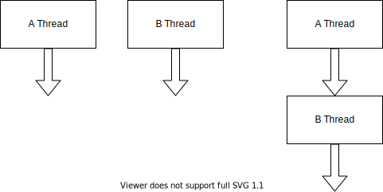

### Java基础

1. 跨平台
2. 面向对象
3. 分布式计算

### Java的运行机制

- 编程Java程序
- 编译Java文件
- JVM 读取字节码文件 运行程序

### Java的三大体系

- Java SE（J2SE）
- Java ME（J2ME）
- Java EE（J2EE）Java Web

### 配置Java环境

JRE、JDK

JRE：Java Runtime Environment运行环境

JDK：Java Development Kit 开发工具包

#### 开发

- 编译

```shell
javac HelloWorld.java
```

- 运行

```shell
java HelloWorld
```

Java IDE

NetBeans、Eclipse、IDEA

### 代码规范

- 强制性的代码规范、必须执行的
  1. Java程序的文件名与类名必须一致，若不一致，无法通过编译。
  2. main方法是程序的入口，方法的定义必须严格按照格式书写。
  3. 类是组织Java代码结构的，类中的方法是执行具体业务的。
- 非强制性的代码规范、建议按照此方法编写代码
  1. 一行只写一条语句。
  2. 在1的基础上，还要注意代码缩紧。

### 安装Java环境

- 编写Java代码

- 编译Java代码，成为字节码文件 16进制

  javac 文件名

- 让JVM执行字节码文件，运行程序

  java 文件名 （不带后缀）

IDE：集成开发环境

Eclipse、IDEA

### 注释

注释就是用通俗易懂的语言对代码进行描述解释，方便自己和他人阅读。

- 单行注释：

  ```java
  //注释内容
  ```

- 多行注释：

  ```java
  /*注释内容
  注释内容
  */
  
  //注释内容
  //注释内容
  //注释内容
  ```

- 文档注释：

  ```java
  /**
   * 注释内容
   * 注释内容
   */
  ```

### 关键字

Java语言预先定义好的，有指定意义的标识符，组成程序的基本元素。

1. abstract 表示抽象
2. boolean 基本数据类型
3. break 跳出循环
4. byte 基本数据类型 字节
5. case 与switch搭配使用 -> 流程控制
6. catch 与太容易搭配使用，表示捕获异常
7. char 基本数据类型
8. class 表示一个类
9. continue 跳出循环
10. do 与while搭配使用，表示循环
11. double 基本数据类型
12. else 与if搭配，流程控制
13. enum 枚举类型
14. extends 继承
15. final 修饰常量
16. float 基本数据类型
17. if 流程控制
18. implements 实现接口
19. import 引用某个类
20. int 基本数据类型
21. interface 表示接口
22. long 基本数据类型
23. native 表示本地方法
24. new 创建对象
25. package 表示包
26. private 私有
27. public 共有
28. return 返回值
29. short 基本数据类型
30. static 表示静态
31. super 表示父类
32. switch 与case搭配使用
33. synchronized 线程同步
34. this 表示当前实例对象
35. throw 抛出异常
36. throws 方法中主动抛出异常
37. try 与catch搭配使用
38. void 表示方法没有返回值
39. volatile 修饰变量，保证线程读取到最新值
40. while 表示循环

### 变量

- 数据类型
- 变量名
- 变量值

### 使用变量

1. 声明变量的数据类型和变量名（包含数据、字母、下划线、$，不能用关键字命名，不能以数字开头），大小写可以混用，首单词应该小写，后续单词的首字母大写。userId 驼峰式命名法。
2. 给内存空间赋值，该值就是变量值。

### Java的数据类型

- 基本数据类型

  byte、**int**、short、long、float、**double**、char、**boolean**

1. 数值类型（整数、小数）

   byte     1B、KB、MB 兆、GB、TB   2^10 ｜一个字节（8位）

   short 两个字节（16位）

   int 四个字节（32位）

   long 八个字节（64位）

   float 四个字节（32位）单精度浮点型

   double 八个字节（64位）双精度浮点型

2. 非数值类型（文本）

   char 字符 两个字节（16位）

   boolean 判断逻辑是否成立 true/falses 八分之一字节（1位）

- 引用数据类型

### 变量

- 数据类型
- 变量名
- 变量值

基本数据类型+引用数据类型

数值类型：byte 一个字节、int 四个字节、short 两个字节、long 八个字节、float 四个字节、double 八个字节

非数值类型：char 两个字节、boolean 八分之一个字节

### 数据类型转换

- 自动转换

Java可以自动对某些数据类型进行自动转换。

规则：只能由低字节向高字节进行转换，反之则不行

byte -> short -> int -> long -> float -> double

赋值运算符 “=”

- 强制类型转换

Java无法自动转换的数据类型，开发者可以通过强制手段进行转换。

一般来讲强制类型转换可能会造成精度损失。

```java
double num = 10.0;
int num2 = (int) num;
```

### 运算符

- 赋值运算符

数据类型 变量名 = 数值/变量；

```java
//1.创建变量用来记录张三的体重
double weight1 = 70.5;
//2.创建变量表示李四的体重
double weight2 = 60.5;
System.out.println("交换之前：张三的体重是"+weight1+"，李四的体重是："+weight2);
System.out.println("进行交换");
//
double temp = weight1;
weight1 = weight2;
weight2 = temp;
System.out.println("交换之后：张三的体重是"+weight1+"，李四的体重是："+weight2);
```

- 算术运算符

  - 基本算术运算符

    +、-、*、/、%、++、--

    变量1 + 变量2

    变量1 - 变量2

    变量1 * 变量2

    变量1 / 变量2

    变量1 % 变量2

    ```java
    System.out.println(10/3); // 支取整数位 -> 3
    System.out.println(10/3.0); // 3.3333333333333335
    System.out.println(10%3); // 1
    ```

    变量++、++变量： 变量 = 变量 + 1

    变量--、--变量： 变量 = 变量 - 1

    ```java
    int num = 10;
    System.out.println(num++); // 先用再加 -> 10
    System.out.println(num); // 11
    System.out.println(++num); // 先加再取值（先运算再操作）12
    ```

    ```java
    int num = 326;
    int n1 = num%1000/100;
    System.out.println(n1);
    int n2 = num%100/10;
    System.out.println(n2);
    int n3 = num%10;
    System.out.println(n3);
    ```

    

  - 复合算术运算符

    +=、-=、*=、/=、%=

    变量1 += 变量2: 先求变量1和变量2之和，再把计算结果赋值给变量1，变量1 = 变量1 + 变量2

- 关系运算符

  ==、!=、**>、<、>=、<= 数值类型比较**

- 逻辑运算符

  - 与 或 非
  - 只能用于布尔类型的数据运算，判断boolean数据之间的逻辑关系。
  - &（与）、|（或）、!（非）、&&（短路与）、||（短路或）
  - 参与逻辑运算符的变量都是boolean类型的
  - 变量1 **&** 变量2：只有当变量1和变量2都为true，结果为true，否则false。
  - 变量1**｜**变量2 : 变量1和变量2只要有一个为true，结果为true，否则为false。
  - ！变量1 : 若变量1为true，结果为false，若变量1为false，结果为true。
  - 变量1 **&&** 变量2：只有当变量1和变量2都为true，结果为true，否则false。
  - 变量1 **||** 变量2 : 变量1和变量2只要有一个为true，结果为true，否则为false。
  - &&、|| 效率更高，如果变量1决定结果，则不会算变量2

```java
int num1 = 10;
int num2 = 11;
System.out.println((num1++==num2)&(++num1==num2)); // false 判断时 (10 == 11) & (12 == 11)
System.out.println(num1); // 12
```

```java
int num1 = 10;
int num2 = 11;
System.out.println((num1++==num2)&&(++num1==num2)); // false (10 == 11) & (12 == 11)
System.out.println(num1); // 11 少一次加法运算
```

### 条件运算符

三元运算符、三目运算符、三元表达式

也是给变量赋值的，根据不同的条件给同一个变量赋不同的值， 变量 = 条件 ？ 值1 ： 值2

```java
int score = 90;
System.out.println("本次答题的得分是:"+score);
String str = score > 80 ? "恭喜您获得优惠劵一张":"很遗憾您没有中奖";
System.out.println(str);
```

### 位运算符

- 十进制和二进制的转换

  十进制转二进制：目标数除以2，若能除尽，该位计作0，若除不尽，该位计作1，再对商继续除以2，以此类推，直到商为0，然后把每一位的结果反序组合就是对应的二进制。

  2 | **10** |  0

  2 |  **5**  | 1

  2 |  **2**  | 0

  2 |  **1**  | 1

  ​      **0**

  10 -> 1010

- 二进制转十进制

  从目标数的最后侧起，本位的数值乘以本位的权重，权重就是2的第几位的位数减一次方，将每一位的值进行相加，得到的结果就是十进制。

  1010 -> 1 * 2^3 + 0 * 2^2 + 1 * 2^1 + 0 * 2^0 = 8 + 0 + 2 + 0 = 10

  ​	0 * 2^0 + 1 * 2^1 + 0 * 2^2 + 1 * 2^3 = 0 + 2 + 0 + 8 = 10

位运算符：&（按位与）、｜（按位或）、^（按位异或）、<< （左移）、>>（右移）

变量1 & 变量2 ： 先把变量1和变量2转为二进制，每一位的数字一一对应，进行比较判断，若都为1，则该位记做1，否则记做0。

变量1 ｜ 变量2 ： 先把变量1和变量2转为二进制，每一位的数字一一对应，进行比较判断，只要有一个为1，则该位记做1，否则记做0。

变量1 ^ 变量2 ： 先把变量1和变量2转为二进制，每一位的数字一一对应，进行比较判断，只要有一个为1，不同记做1，相同记做0。

变量1 << 变量2 ： 变量1乘以2的变量2次方

2 << 3 : 2 * 8 = 16

变量1 >> 变量2 ： 变量1除以2的变量2次方

2 >> 3 : 2 / 8 = 0

### 运算符的优先级

！ > 算术运算符 > 关系运算符 > 逻辑运算符（&& > ||）

### 流程控制

- if else

  用来判断某个条件是否成立，然后执行不同的逻辑运算。

  基本语法：

  ```java
  if (/*判断条件*/) {	// 条件成立的代码} else {	// 条件不成立的代码}
  ```

- 多重 if

  - if 后面必须跟条件
  - else 后面不能跟条件
  - else 后面可以跟{}，也可以跟 if

### 流程控制

- switch-case

  与if不同的是，switch-case只能完成等值判断，而无法完成判断大小。

  如果是判断两个值是否相等，可以使用switch-case，如果比较两个值的大小关系，则不能使用swtich-case。

  switch支持int、short、byte、char、枚举、String类型，不支持boolean类型。

  基本语法：

  ```java
  switch(/*变量*/){
  	case /*值1*/：
  		//业务代码
    break;
  	case /*值2*/：
  		//业务代码
    break;
    default:
    	//业务代码
    break;
  }
  ```

  case判断变量是否等于某个值，default表示所有的case都不成立的情况下所执行的代码。

  - 1奖励2000

  - 2奖励1000

  - 3奖励500

  - 否则没有奖励

    ```java
    int placing = 2;
    if (placing == 1) {
    	System.out.println("奖励2000元");
    } else if (placing == 2) {
    	System.out.println("奖励1000元");
    } else if (placing == 3) {
    	System.out.println("奖励500元");
    } else {
    	System.out.println("没有奖励");
    }
    
    switch (placing) {
    	case 1:
    		System.out.println("奖励2000元");
    		break;
    	case 2:
    		System.out.println("奖励1000元");
    		break;
      case 3:
    		System.out.println("奖励500元");
    		break;
    	default:
    		System.out.println("没有奖励");
    		break;
    }
    ```

### 循环

for、while、do-while、foreach

循环四要素：

- 初始化循环变量
- 循环条件
- 循环体
- 更新循环变量

while :

```java
//初始化循环变量
while (/*循环条件*/) {
	//循环体
	//更新循环变量
}
```

```java
//初始化循环变量
int num = 0;
//循环条件
while (num < 10) {
	System.out.println(num + "Hello World!");
	//更新循环变量
  num++;
}
```

```java
Scanner scanner = new Scanner(System.in);
String flag = "y";
while (flag.equals("y")) {
	System.out.print("请输入学生学号：");
	int id = scanner.nextInt();
	System.out.println("用户输入的学号是："+id);
	switch (id) {
		case 1:
			System.out.println("张三的成绩是98");
			break;
		case 2:
			System.out.println("李四的成绩是91");
			break;
		case 3:
			System.out.println("王五的成绩是89");
			break;
		default:
			System.out.println("请输入正确学号");
			break;
	}
	System.out.print("是否继续 y/n：");
	flag = scanner.next();
}
System.out.println("感谢使用学生成绩查询系统");
```

do-while :

```java
//初始化循环变量
int num = 0;
//循环条件
do {
  //循环体
  System.out.println("Hello World!");
  //更新循环变量
  num++;
} while (num < 10);
//循环条件
```

```java
String flag;
Scanner scanner = new Scanner(System.in);
do {
  System.out.print("请输入学生学号：");
  int id = scanner.nextInt();
  System.out.println("用户输入的学号是："+id);
  switch (id) {
    case 1:
      System.out.println("张三的成绩是98");
      break;
    case 2:
      System.out.println("李四的成绩是91");
      break;
    case 3:
      System.out.println("王五的成绩是89");
      break;
    default:
      System.out.println("请输入正确学号");
      break;
  }
  System.out.print("是否继续 y/n：");
  flag = scanner.next();
} while (flag.equals("y"));
System.out.println("感谢使用本系统");
```

先执行再判断，用do-while比较好

```java
Scanner scanner = new Scanner(System.in);
String result;
do {
  System.out.println("张三参加体能测试，跑1000米");
  System.out.print("是否合格 y/n");
  result = scanner.next();
} while (result.equals("n"));
System.out.println("合格，通过测试");
```

while do-while适合循环次数不确定的情况下

for :

```java
for (/*初始化循环变量；循环条件；更新循环变量*/) {
	//循环体
}
```

```java
int i = 0;
for (i = 5;i < 10;) {
  System.out.println("Hello World!");
  i++;
}
```

```java
for (int i = 0; i < 10; i++) {
  System.out.println("Hello World!");
}
```

while、do-while、for循环，三种循环的区别：

- 相同点：都遵循循环四要素，初始化循环变量、循环条件、循环体、更新循环变量
- 不同点：
  - while和do-while适用于循环次数不确定的业务场景：for适用于循环次数确定的场景。
  - while和for都是先判断循环条件，再执行循环体；do-while先执行循环体，再判断循环条件。

分别使用while、do-while、for循环输出10以内的所有奇数。

```java
//while循环
int num = 0;
while (num <= 10) {
  if (num % 2 != 0) {
    System.out.println(num);
  }
  num++;
}
//do-while循环
int num1 = 0;
do {
  if (num1 % 2 != 0) {
    System.out.println(num1);
  }
  num1++;
} while (num1 <= 10);
//for循环
for (int i = 0; i <= 10; i++) {
  if (i % 2 != 0) {
    System.out.println(i);
  }
}
```

for循环只能适用于循环次数确定的场景下（for也可以适用于循环次数不确定的场景，只不过一般不会用这种方式进行开发），while和do-while循环次数确定或不确定都可以使用。

```java
Scanner scanner = new Scanner(System.in);
boolean flag = true;
for (;flag;){
  String input = scanner.next();
  if (input.equals("y")){
    flag = true;
  } else {
    flag = false;
  }
}

```

非常规的用法

```java
Scanner scanner = new Scanner(System.in);
//for (String result = "n";
//     result.equals("n");
//     result = scanner.next()){
String result = "n";
for (;result.equals("n");)
  System.out.println("张三参加体能测试，跑1000米");
  System.out.print("是否合格？y/n");
	result = scanner.next();
}
System.out.println("合格，通过测试");
```

### 数组

数组就是一种可以存储大量数据类型相同的变量的数据结构，数组就是一个具有相同数据类型的数据集合。

数组的数据必须是同一种数据类型的。

### 数组的基本要素

- 数组名称
- 数组元素
- 元素下标
- 数据类型

数组本身就是一个变量，数组名称就是变量名，数组中保存的每一个数据都会有一个下标（从0开始）

```java
//声明数组
int[] array;
//分配内存空间
array = new int[6];
//给数组赋值
array[2] = 6;
System.out.println(Arrays.toString(array));
```

先创建，再赋值

```java
int[] array = new int[4];
array[0] = 179;
array[1] = 182;
array[2] = 167;
array[3] = 178;
int sum = 0;
for (int i = 0; i < array.length; i++) {
  sum = sum + array[i];
}
System.out.println((double) sum/array.length);
```

边声明，边赋值

```java
int[] array = {1, 2, 3, 4, 5, 6};
int[] array2 = new int[]{1, 2, 3, 4, 5, 6};
System.out.println(Arrays.toString(array));
```

### 数组常见的错误

- 数据类型不匹配。
- 边声明边赋值的方式，代码必须写在同一行，不能换行。
- 数组下标越界。

### 数组的常用操作及方法

- 求数组的最大值
- 求数组的最小值
- 在数组的指定位置插入数据
- 对数组进行排序

### 二维数组

二维数组简单理解即一堆数组中保存的值是另外一个一维数组。

变量、数据类型、流程控制、循环、数组。

用户管理系统

- 查询用户：将系统中保存的全部用户信息在控制台打印输出
- 添加用户：向系统中添加新的用户信息，如果添加的用户已经存在，给出提示信息。
- 删除用户：输入用户名，进行删除操作，若输入的用户名不存在，给出提示信息。
- 账号冻结：输入用户名，进行冻结操作，若输入的用户名不存在或者已经被冻结，给出相应提示。
- 账号解冻：输入用户名，进行解冻操作，若输入的用户名不存在或者该用户状态正常，给出相应提示。
- 退出系统：跳出循环，给出提示信息。

### 面向对象

万物皆对象

面向对象编程思想：将程序模块化的思想。

- 什么是面向对象？

  面向对象的编程思想诞生之前，程序开发采用的是面向过程的结构化编程方式，是一种面向功能划分的软件结构。

  最小的粒度细滑到方法这一层。

  面向过程注重的是每一个步骤，面向对象关注点在于整个事件的模块化结构。

### 类和对象

类和对象的关系

每个对象都有特定的特征：1、属性。2、方法。

属性指的是对象的静态特征；方法是用来描述对象的动态特征。

对象是用来描述客观存在的一个实体，该实体是由一组属性和方法构成。

类是与对象紧密结合的另外一个概念，类是产生对象的模版，所有的对象都是通过类来创建的。

二者的关系：类是对象的抽象化描述，这些对象都具有相同的特征和动作（属性和方法）。

对象是类的具体实例。

Java程序是以类为组织单元，程序运行时的主体是通过类创建的具体对象。

### 定义类

```java
public class /*类名*/ {
  //定义属性，属性名符合驼峰式命名法
  public /*数据类型 属性名*/;
  //定义方法，方法名符合驼峰式命名法
  public /*返回值类型 方法名*/ (/*参数列表：数据类型 参数名*/) {
    //方法体
	}
}
```

Java关于返回值的定义分为两类：有返回值和无返回值，有返回值的方法需要在方法定义时指定返回值的数据类型，并在方法体中用return将结果返回给外部调用者。

如果一个方法不需要进行返回操作，将返回值类型定义为void，

参数列表是指外部在调用该方法时需要传入到方法内部进行运算的数值。

### 构造函数、构造方法、构造器

构造函数是一种特殊的方法，普通方法是用来描述某个动作的，构造方法是用来创造对象的。

- 方法名必须与类名一致
- 不需要定义返回值类型

构造函数可以分为有参构造和无参构造，有参构造是指带参数的构造函数，无参构造是指没有参数的构造函数。

任何一个类都默认自带一个无参构造函数。如果手动在类中定义一个有参构造，则会覆盖默认的无参构造

### this关键字

this用来指代当前类的实例化对象，通过this可以调用当前对象的属性和方法，比如在有参构造中，通过this将外部传入的值赋给当前类的实例化对象。

this除了可以在类中访问属性也可以在类中调用方法，类中的方法可以分为两类：构造方法、普通方法。

用this调用这两类方的语法也不同，调用构造函数的语法是this（参数列表），不能在普通方法中使用this调用构造函数。

用this调用普通方法，this.方法名（参数列表），可以在构造函数中使用，也可以在普通方法中使用。

### 成员变量和局部变量

变量的作用域是指在程序中可以通过变量名来访问该变量的范围，变量的作用域是由变量被声明时所在的位置决定的，

Java中根据不同的作用域可以将变量分为成员变量和局部变量。

局部变量：如果一个变量在方法中声明，则该变量是局部变量。

成员变量：如果一个变量在方法外，类中声明，则该变量是成员变量。

```java
public class HelloWorld {
  int num2 = 2;
  public void test() {
    int num1 = 1;
  }
}
```

1. 成员变量和局部变量的区别在于作用域不同，成员变量的作用域在整个类中，类中的每一个方法都可以访问该变量，局部变量的作用域只在定义该变量的方法中，出了方法体就无法访问。
2. 成员变量和局部变量的初始值也不同，局部变量不会赋初始值、成员变量会赋初始值，具体的值是由成员变量的数据类型确定的。

### 封装

封装是指将类的属性隐藏在内部，外部不能直接访问和修改，通过修改成员变量的可见性，从公有变私有。

对外有公有方法，公有方法可以对值进行检查和报错或赋默认值。

封装的核心思想就是尽可能把属性都隐藏在内部，对外提供方法来访问，我们可以在这些方法中添加逻辑处理来实现过滤，以屏蔽错误数据的赋值。

封装的步骤：

1. 修改属性（成员变量）的访问权限为私有，使得外部不能直接访问。
2. 提供外部可以直接调用的方法。
3. 在该方法中加入对于属性的逻辑控制，避免出现逻辑上的错误。

什么是访问权限？

访问权限是指该属性可以被直接访问的范围，是在属性定义时设定的，访问权限的可选项一共有4种：private、默认（不写）、protected、public ，区别在于作用域范围不同。

### static

表示静态或者全局，可以用来修饰成员变量和成员方法及代码块。

使用static修饰的成员变量和成员方法独立于该类的任何一个实例化对象，访问时不依赖于该类的对象，而是直接通过类去访问，可以理解为被该类的所有实例对象所共用，所以说是全局的。

static还可以修饰代码块，被static修饰的代码块叫做静态代码块。

```java
 static {
   System.out.println(1);
 }
```

静态代码块的特点是只执行一次，什么时候执行？当这个类被加载到内存时执行，不需要开发者手动调用，会自动执行。

被加载到内存中的类叫运行时类，静态代码块就是在加载类的时候执行，一维类只加载一次，所以静态代码块也只执行一次。

### 继承

- 什么是继承

继承是用来描述类之间的关系，即一个类继承（拥有）另外一个类中的属性和方法，被继承的类叫做父类，继承父类的类叫做子类。

```java
public class /*类名*/ extends /*父类名*/ {
}
```

Java中的继承是单继承，也就是说一个子类只能有一个直接父类。

### 子类访问父类

创建一个子类对象的时候，会默认先创建一个父类对象，此时无论是通过有参构造或是无参构造来创建子类对象，都是通过无参构造来创建父类对象的。

```java
public class People {
  private int id;
  private String name;
  private int age;
  private char gender;

  public int getId() {
    return id;
  }

  public void setId(int id) {
    this.id = id;
  }

  public String getName() {
    return name;
  }

  public void setName(String name) {
    this.name = name;
  }

  public int getAge() {
    return age;
  }

  public void setAge(int age) {
    this.age = age;
  }

  public char getGender() {
    return gender;
  }

  public void setGender(char gender) {
    this.gender = gender;
  }

  public People() {
    System.out.println("通过无参构造创建了People对象");
  }

  public People(int id, String name, int age, char gender) {
    this.id = id;
    this.name = name;
    this.age = age;
    this.gender = gender;
    System.out.println("通过有参构造创建了People对象");
  }
}
```

```java
public class Student extends People {
  private double score;

  public double getScore() {
    return score;
  }

  public void setScore(double score) {
    this.score = score;
  }

  public Student() {
    System.out.println("通过无参构造创建了Student对象");
  }

  public Student(int id, String name, int age, char gender, double score) {
    super(id, name, age, gender);
    this.score = score;
    System.out.println("通过有参构造创建了Student对象");
  }
}
```

可以通过super关键字让子类创建对象时调用父类的有参构造。

```java
public Student(int id, String name, int age, char gender, double score) {
  super(id, name, age, gender);
  this.score = score;
  System.out.println("通过有参构造创建了Student对象");
}
```

子类可以访问父类的构造方法、普通方法、成员变量，都是通过super关键字来完成，具体语法：

```
构造方法：super（参数列表）
普通方法：super.（方法名）
成言变量：super.成员变量名
```

在子类的构造方法中，可以通过super访问父类的构造方法和普通方法。

在子类法普通方法中，只能通过super访问父类的普通方法。

### 子类的访问权限

访问权限修饰符：public、protected、默认修饰符、private

|            | 同一个类中 | 同一个包中 | 不同包中 | 子类（同包） | 子类（不同包） |
| ---------- | ---------- | ---------- | -------- | ------------ | -------------- |
| public     | 可以访问   | 可以访问   | 可以访问 | 可以访问     | 可以访问       |
| protected  | 可以访问   | 可以访问   | 不能访问 | 可以访问     | 可以访问       |
| 默认修饰符 | 可以访问   | 可以访问   | 不能访问 | 可以访问     | 不能访问       |
| private    | 可以访问   | 不能访问   | 不能访问 | 不能访问     | 不能访问       |

包：package，用来管理Java文件，一个项目中不可避免会出现同名的Java类，为了防止产生冲突，可以把同名的Java类分别放入不同的包中。

包的命名规范：包名由小写字母组成，不能以“.“开头或结尾，可以包含数字，但不能以数字开头，使用”.“来分层。

包的命名方式一般采用网络域名的反向输出，如：com.company.test / com.company.entity

### 方法重写

子类在继承父类方法的基础上，对父类方法重新定义并覆盖的操作叫做方法重写。

构造方法不能被重写，方法重写的规则：

1. 父子类方法名相同。
2. 父子类方法的参数列表相同。
3. 子类方法的返回值与父类方法返回值类型相同或者是其子类。（返回值子类）Object -> Integer
4. 子类方法的访问权限不能小于父类。

### 方法重写VS方法重载

位置：方法重写在子类中对父类方法进行重写，方法重载是在同一类中。

方法名：方法重写相同，方法重载相同。

参数列表：方法重写相同，方法重载不同。

返回值：方法重写相同或是其子类，方法重载没有要求。

访问权限：方法重写不能小于父类，方法重载没有要求。

### 多态

一个事物具有多种表现形态，在Java程序中，定义一个方法，在具体的生产环境中根据不同需求呈现不同的业务逻辑。多态的前提是继承

```java
public class Member {
  public void buyBook() {}
}
```

```java
public class OrdinaryMember extends Member {
  @Override
  public void buyBook() {
    System.out.println("普通会员买书打9折");
  }
}
```

```java
public class SuperMember extends Member{
  @Override
  public void buyBook() {
    System.out.println("超级会员买书打6折");
  }
}
```

```java
public class Test {
  public static void main(String[] args) {
    OrdinaryMember ordinaryMember = new OrdinaryMember();
    Cashier cashier = new Cashier();
    SuperMember superMember = new SuperMember();
    cashier.setMember(ordinaryMember);
    cashier.settlement();
    cashier.setMember(superMember);
    cashier.settlement();
  }
}
```

多态的具体使用有两种形式：

1. 定义方法时形参类型为父类，实际调用方法时传入子类类型的参数。

   ```java
   public void settlement(Member member) {
     member.buyBook();
   }
   
   OrdinaryMember ordinaryMember = new OrdinaryMember();
   Cashier cashier = new Cashier();
   cashier.settlement(ordinaryMember);
   ```

   

2. 定义方法时返回值类型为父类，实际调用方法时返回子类对象。

   ```java
   public Member getMember(String name) {
     if (name.equals("ordinary")) {
       return new OrdinaryMember();
     } else {
       return new SuperMember();
     }
   }
   ```

> !!! 以上两种形式的基本原理都是父类引用可以指向子类对象。

[CSDN 向上转型和向下转型](https://blog.csdn.net/u011630575/article/details/80072241?utm_medium=distribute.pc_relevant_t0.none-task-blog-2%7Edefault%7EBlogCommendFromMachineLearnPai2%7Edefault-1.baidujs&depth_1-utm_source=distribute.pc_relevant_t0.none-task-blog-2%7Edefault%7EBlogCommendFromMachineLearnPai2%7Edefault-1.baidujs)

### 抽象方法和抽象类

如果一个方法只有方法的声明而没有具体的方法实现，这个方法就叫做抽象方法，Java中的抽象方法需要使用abstract关键字来修饰。

```java
public abstract class Member {
  public abstract void buyBook();
}	
```

一旦类中定义了抽象方法，则该类也必须声明为抽象类，需要在类定义处添加abstract关键字。

抽象类与普通方法的区别是抽象类不能被实例化，抽象方法与普通方法的区别是抽象方法没有方法体。

抽象类中可以没有抽象方法，但是包含了抽象方法的类必须定义为抽象类。即我们可以在抽象类中定义普通方法，但在普通类中不能定义抽象方法。

如果父类是抽象类，一旦子类继承了该抽象父类，则子类必须对父类的抽象方法进行重写，否则程序报错。

```java
public abstract class Member {
  public abstract void buyBook();
}
```

```java
public class OrdinaryMember extends Member {
  @Override
  public void buyBook() {
    System.out.println("普通会员打9折");
  }
}
```

如果子类也是抽象类，则可以不用重写父类的抽象方法。

### 面向对象

三大特征：封装、继承、多态

### Object类

Object是Java官方提供的类，存放在java.lang包中，该类是所有类的直接父类或者间接父类，无论是Java提供的类还是开发者自定义的类，都是Object的直接子类或间接子类，Java中的任何一个类都会继承Object中的public和protected方法。

```java
public class People {
  public void test() throws CloneNotSupportedException, InterruptedException {
    hashCode();
    getClass();
    equals(null);
    clone();
    toString();
    notify();
    notifyAll();
    wait();
  }
}
```

Oject类中经常被子类重写的方法：

1. public String toString（）以字符串的形式返回对象的信息

   Object

   ```java
   public String toString() {
     return getClass().getName() + "@" + Integer.toHexString(hashCode());
   }
   ```

   重写之后

   ```java
   @Override
   public String toString() {
     return "People{" +
       "id=" + this.id +
       ", name='" + this.name + '\'' +
       ", score=" + this.score +
       '}';
   }
   ```

2. public boolean equals（Object obj）判断两个对象是否相等

   Object类

   ```java
   //Object类
   public boolean equals(Object obj) {
     return (this == obj);
   }
   
   @Override
   public boolean equals(Object o) {
     //this == 0 -> 比较内存地址
     return this == o;
   }
   ```

   重写

   ```java
   @Override
   public boolean equals(Object o) {
     People people = (People) o;
     if(this.id.equals(people.id)
        && this.name.equals(people.name)
        && this.score.equals(people.score)) {
       return true;
     } else {
       return false;
     }
   }
   ```

   

3. public native int hashCode（）返回对象的散列码 -> 对象的内存地址结合对象的内部信息得出来的

   Object类

   ```java
   @HotSpotIntrinsicCandidate
   public native int hashCode();
   ```

   重写

   ```java
   @Override
   public int hashCode() {
     return (int) (id*name.hashCode()*score);
   }
   ```

### 包装类

- 什么是包装类？

  包装类是Java提供的一组类，专门用来创建8种基本数据类型对应的对象，一共有8 个包装类，存放在java.lang包中，基本数据类型对应的包装类。

  | byte    | Byte     |
  | ------- | -------- |
  | short   | Short    |
  | int     | Integer  |
  | long    | Long     |
  | float   | Float    |
  | double  | Double   |
  | char    | Charater |
  | boolean | Boolean  |

  包装类结构体系

  

  ### 装箱和拆箱

  装箱和拆箱是包装类的特有名词，装箱是指将基本数据类型转为对应的包装类型，拆箱就是将包装类对象转为对应的基本类型。

  1. 装箱

     public Type（type value）

     每个包装类都提供了一个有参构造函数：public Type(type value) , 用来实例化包装类对象。

     ```java
     byte b = 1;
     Byte byt = new Byte(b);
     short s = 2;
     Short shor = new Short(s);
     int i = 3;
     Integer integer = new Integer(i);
     long l = 4;
     Long lon = new Long(l);
     float f = 5.5F;
     Float floa = new Float(f);
     double d = 6.6;
     Double doubl = new Double(d);
     char c = 'G';
     Character character = new Character(c);
     boolean bo = true;
     Boolean bool = new Boolean(bo);
     System.out.println(byt);
     System.out.println(shor);
     System.out.println(integer);
     System.out.println(lon);
     System.out.println(floa);
     System.out.println(doubl);
     System.out.println(character);
     System.out.println(bool);
     ```

  2. public Type(String value) / public Type(char value)

     每个包装类还有一个重载构造函数，Character类的重载构造函数：public Type（char value），其他包装类的重载构造函数：public Type（String value）

     ```java
     Byte byt = new Byte("1");
     Short shor = new Short("2");
     Integer integer = new Integer("3");
     Long lon = new Long("4");
     Float floa = new Float("5.5F");
     Double doubl = new Double("6.6");
     Character character = new Character('G');
     Boolean bool = new Boolean("true");
     System.out.println(byt);
     System.out.println(shor);
     System.out.println(integer);
     System.out.println(lon);
     System.out.println(floa);
     System.out.println(doubl);
     System.out.println(character);
     System.out.println(bool);
     ```

     需要注意的是，Boolean类的构造函数中，当参数为“true”时，Boolean值为true，当参数不为“true”，Boolean值为false。

### 包装类

Java官方提供的一组类，这组类的作用是将基本数据类型的数据封装成引用类型。

Byte、Integer、Short、Long、Float、Double、Boolean、Character

装箱与拆箱

装箱是指将基本数据类型转换为包装类对象

拆箱是指将包装类对象转换为基本数据类型

- 装箱

  1. public Type（type value）

  2. public Type（String value）/ public Type（char value）

  3. value Of（type value）静态方法，参数是基本数据类型的数据

     每一个包装类都有一个valueOf（type value）方法

     ```java
     byte b = 1;
     Byte byt = Byte.valueOf(b);
     short s = 2;
     Short shor = Short.valueOf(s);
     int i = 3;
     Integer integer = Integer.valueOf(i);
     long l = 4L;
     Long lon = Long.valueOf(l);
     float f = 5.5F;
     Float floa = Float.valueOf(f);
     double d = 6.6;
     Double doubl = Double.valueOf(d);
     char ch = 'J';
     Character character = Character.valueOf(ch);
     boolean bo = true;
     Boolean bool = Boolean.valueOf(bo);
     ```

  4. valueOf(String value) / valueOf(char value)专门为Character转换使用的，其他的7个包装类都可以使用

     ```java
     Byte byt = Byte.valueOf("1");
     Short sho = Short.valueOf("2");
     Integer integer = Integer.valueOf("3");
     Long lon = Long.valueOf("4");
     Float floa = Float.valueOf("5.5F");
     Double dou = Double.valueOf("6.6");
     Boolean bool = Boolean.valueOf("true");
     Character character = Character.valueOf('G');
     ```

     需要注意的是Boolean.valueOf(String value)方法中，当value为“true”时，Boolean的值为true，否则，Boolean的值为false。

- 拆箱

  1. *Value()

     每个包装类都有一个*Value()方法，通过该方法可以将包装类转为基本数据类型。

     ```java
     Byte byt = Byte.valueOf("1");
     Short sho = Short.valueOf("2");
     Integer integer = Integer.valueOf("3");
     Long lon = Long.valueOf("4");
     Float floa = Float.valueOf("5.5F");
     Double dou = Double.valueOf("6.6");
     Boolean bool = Boolean.valueOf("true");
     Character character = Character.valueOf('G');
     byte b = byt.byteValue();
     short s = sho.shortValue();
     int i = integer.intValue();
     long l = lon.longValue();
     float f = floa.floatValue();
     double d = dou.doubleValue();
     boolean bo = bool.booleanValue();
     char c = character.charValue();
     ```

  2. Parse*(String value)

     除了Character类以外的每一个包装类都有一个静态方法可以将字符串类型转为基本数据类型。

     ```java
     byte b = Byte.parseByte("1");
     short s = Short.parseShort("2");
     int i = Integer.parseInt("3");
     long l = Long.parseLong("4");
     float f = Float.parseFloat("5.5");
     double d = Double.parseDouble("6.6");
     boolean bo = Boolean.parseBoolean("true");
     ```

  3. toString(type value)

     每一个包装类都有该方法，作用是将基本数据类型转为String类型。

     ```java
     byte b = 1;
     String bstr = Byte.toString(b);
     short s = 2;
     String sstr = Short.toString(s);
     int i = 3;
     String istr = Integer.toString(i);
     long l = 4L;
     String lstr = Long.toString(l);
     float f = 5.5F;
     String fstr = Float.toString(f);
     double d = 6.6;
     String dstr = Double.toString(d);
     char c = 'G';
     String cstr = Character.toString(c);
     boolean bo = true;
     String bostr = Boolean.toString(bo);
     ```

### 接口

- 什么是接口？

  接口是由抽象类衍生出来的一个概念，并由此产生了一种编程方式：面向接口编程。

  面向接口编程就是将程序中的业务模块进行分离，以接口的形式去对接不同的业务模块。

  面向接口编程的优点：当用户需求变更时，只需要切换不同的实现类，而不需要修改串联模块的接口，减少对系统的影响。

  - 能够最大限度的实现解耦合，降低程序的耦合性。
  - 使程序易于扩展。
  - 有利于程序的后期维护

- 如何使用接口？

  接口在Java中是独立存在的一种结构，和类相似，我们需要创建一个接口文件，Java中用class关键字来标识类，用interface来标识接口，基本语法：

   ```java
  public interface /*接口名*/ {
    public /*返回值*? /*方法名*/(/*参数列表*/);
  }
   ```

  接口就是一个抽象类，极度抽象的抽象类。

  抽象类：一个类中一旦存在没有具体实现的抽象方法时，那么该类就必须被定义为抽象类，同时抽象类存在非抽象方法。

  但是接口完全不同，接口中不能存在非抽象方法，接口中必须全部都是抽象方法。

  因为接口中必须都是抽象方法，所以修饰抽象方法的关键字abstract可以省略。

  接口中允许定义成员变量，但是有如下要求：

  1. 不能定义private和protected修饰的成员变量，只能定义public和默认访问权限修饰符修饰的成员变量。

  2. 接口中的成员在定义时就必须完成初始化

  3. 接口中的成员变量都是静态常量，即可以直接通过接口访问，同时值不能被修改。

     ```java
     public interface MyInterface {
       public int ID = 0;
       String name = "张三";
     
       public void test();
     }
     ```

     使用接口时，不能直接实例化接口对象，而是必须实例化其实现类对象，实现类本身就是一个普通的Java类，创建实现类的代码如下所示。

     ```java
     public class MyInterfaceImpl implements MyInterface{
       @Override
       public void test() {
     
       }
     }
     ```

     通过implements关键字来指定实现类具体要实现的接口，在实现类的内部需要对接口的所有抽象方法进行实现，同时要求访问权限修饰符、返回值类型、方法名和参数列表必须完全一致。

     接口和继承，Java只支持单继承，但是接口可以多实现(一个实现类可以同时实现多个接口)。

### 面向接口编程的实际应用

面向接口编程是一种常用的编程方式，可以有效地提高代码的复用性，增强程序的扩展性和维护性。

- 场景

某工厂生产产品A，产品A主要是由设备A来完成生产，用程序模拟生产过程。

产品B是由设备B来生产的。

当需求发生改变时，就要频繁修改类的内部结构方法是需要避免的，因为这种结构的程序扩展性很差，如何改进？使用面向接口编程即可。

1. 创建接口Equipment

   ```java
   public interface Equipment {
     public void work();
   }
   ```

2. 创建Equipment的实现类

   ```java
   public class EquipmentA implements Equipment {
     @Override
     public void work() {
       System.out.println("设备A运行，生产产品A");
     }
   }
   ```

3. 创建Factory类

   ```java
   public class Factory {
     //注入    
     private Equipment equipment;
   
     public Equipment getEquipment() {
       return equipment;
     }
   
     public void setEquipment(Equipment equipment) {
       this.equipment = equipment;
     }
   
     public void work() {
       System.out.println("开始生产。。。");
       this.equipment.work();
     }
   }
   ```

4. Test

   ```java
   public class Test {
     public static void main(String[] args) {        
       Equipment equipmentA = new EquipmentA();
       factory.setEquipment(equipmentA);
       factory.work();
     }
   }
   ```

###  异常

- 什么是异常？

  Java中的错误大致可以分为两类：

  - 一类是编译时错误，一般是指语法错误；

  - 另一类是运行时的错误。

Try-catch-finally

```java
try {
	//可能会抛出异常的代码
} catch (Exception e) {
  //对异常进行处理
} finally {
  //一定会执行的代码
}
```

### 异常类

- Error：系统错误，程序无法处理。
- Exception：程序运行时出现的错误，程序可以处理。

Error和Exception都是Throwable的子类，Throwable、Error、Exception都是存放在java.lang包中。

- Error常见的子类：VirtualMachineError、AWTError、IOError

  - VirtualMachineError的子类：StackOverflowError、OutOfMemoryError，用来描述内存溢出等系统问题。

- Exception常见的子类：IOException和RuntimeException

  - IOException存放在java.io包中，RuntimeException存放在java.lang包中。

    - IOException常见的子类：FileLockInterruptionException、FileNotFoundException、FilerException，这些异常通常都是处理通过IO流进行文件传输的时候发生的错误。

  - RuntimeException常见的子类

    - ArithmeticException：表示数学运算异常。

    - ClassNotFoundException：表示未定义异常。

    - IllegalArgumentException：表示参数格式异常。

    - ArrayIndexOutOfBounds：表示数组下标越界。

    - NullPointException：表示空指针异常。

    - NoSuchMethodException：表示方法未定义异常。

    - NumberFormatException：表示将其他数据类型转为数值类型发生的类型不匹配异常。

      ```java
      public class Test {
        public static void main(String[] args) {
          try {
            // int num = 10/0;
            // Class clazz = Class.forName("test.Student");
            // int[] array = {1, 2, 3};
            // System.out.println(array[3]);
            // String str = null;
            // str.charAt(0);
            // Class clazz = Class.forName("com.exceptions.Student");
            // Method method = clazz.getMethod("test2", null);
            // Integer.parseInt("abc");
          } catch (Exception e) {
            e.printStackTrace();
          }
          System.out.println("Hi");
        }
      }
      ```

### 抛出异常的方式

### throw和throws

throw和throws是java在处理异常时使用的两个关键字，都可以用来抛出异常，但是使用的方法和表示的含义完全不同。

Java中抛出异常有3种方式：

- try-catch捕获异常

  捕获后，程序会接着运行

- throw是开发者主动抛出异常，即读到throw代码就一定抛出异常，基本语法：

  ```java
  throw new Exception();
  ```

  是基于代码的逻辑而主动抛出异常的方式。

  ```java
  public static void main(String[] args) {
    int[] array = {1, 2, 3};
    test(array, 2);
    System.out.println("hi");
  }
  
  private static void test(int[] array, int index) {
    try {
      if (index >= array.length || index < 0) {
        throw new Exception();
      } else {
        System.out.println(array[index]);
      }
    } catch (Exception e) {
      e.printStackTrace();
    }
  }
  ```

- try-catch和throw都是作用于具体的逻辑代码，throws是作用于方法的，用来描述方法可能会抛出的异常。

  -> 方法自己不处理，扔给调用的人

  如果方法throws的是RuntimeException异常或其子类，外部调用时可以不处理，JVM会处理。

  如果方法throws的是Exception异常或是其子类，外部调用时必须处理，否则报错。

  ```java
  public static void main(String[] args) {
    try {
      test("abc");
    } catch (NumberFormatException e) {
      e.printStackTrace();
    }
    System.out.println("Hi");
  }
  
  private static void test(String str) throws NumberFormatException {
    int num = Integer.parseInt(str);
  }
  ```


### 异常捕获

- 自动捕获try-catch
- throw主动抛出异常
- throws修饰可能抛出异常的方法

### 自定义异常

除了使用Java提供的异常之外，也可以根据需求来自定义异常。

```java
public class MyNumberException extends RuntimeException {
  public MyNumberException(String error) {
    super(error);
  }
}
```

```java
public class Test {
  public static void main(String[] args) {        
    Test test = new Test();
    System.out.println(test.add("a"));
    System.out.println("Hi");
  }    

  private int add(Object object) {
    if (object instanceof Integer) {
      int num = (int) object;
      return ++num;
    } else {
      String error = "传入的参数不是整数类型";
      MyNumberException myNumberException = new MyNumberException(error);
      throw myNumberException;
    }
  }
}
```

### 综合练习

封装、继承、多态、抽象、接口、异常完成一个汽车查询系统。

需求描述：共有3种类型的汽车：小轿车、大巴车、卡车，其中小轿车的座位数是四座，大巴车座位数是五座，卡车座位数是两座。要求使用封装、继承、抽象来完成车辆的定义。

可以对车辆信息进行修改，卡车可以运货但是载重量不能超过12吨，使用自定义异常来处理错误，小轿车和大巴车没有此功能，要求使用接口来实现。

抽象类

```java
public abstract class Car {
  private String name;
  private String color;

  public String getName() {
    return name;
  }

  public void setName(String name) {
    this.name = name;
  }

  public String getColor() {
    return color;
  }

  public void setColor(String color) {
    this.color = color;
  }

  public Car(String name, String color) {
    this.name = name;
    this.color = color;
  }

  public abstract String seatNum();
}
```

接口

```java
public interface Container {
  public int getWeight();
}
```

自定义异常

```java
public class CarException extends Exception {
  public CarException(String error) {
    super(error);
  }
}
```

轿车

```java
public class Sedan extends Car {
  public Sedan(String name, String color) {
    super(name, color);
  }

  @Override
  public String seatNum() {
    return "四座";
  }
}
```

巴士

```java
public class Bus extends Car {
  public Bus(String name, String color) {
    super(name, color);
  }

  @Override
  public String seatNum() {
    return "五十三座";
  }
}
```

卡车

```java
public class Truck extends Car implements Container {

  private int weight;

  public Truck(String name, String color, int weight) {
    super(name, color);
    this.weight = weight;
  }

  @Override
  public String seatNum() {
    return "两座";
  }

  @Override
  public int getWeight() {
    return this.weight;
  }
}
```

Test

```java
import java.util.Scanner;

public class Test {
  private static Scanner scanner;
  private static Sedan sedan;
  private static Bus bus;
  private static Truck truck;
  private static Car[] cars;

  static {
    scanner = new Scanner(System.in);
    sedan = new Sedan("小轿车", "黑色");
    bus = new Bus("大巴车", "绿色");
    truck = new Truck("卡车", "蓝色", 2);
    cars = new Car[3];
    cars[0] = sedan;
    cars[1] = bus;
    cars[2] = truck;
  }

  public void showCars() {
    String leftAlignFormatHeader = "%-4s\t\t%-4s\t\t%-4s\t\t%-4s\t\t%n";
    String leftAlignFormatAttribute = "%-4s\t\t%-4s\t\t%-4s\t\t%-4s\t\t%n";
    String leftAlignFormatTruckAttribute = "%-4s\t\t%-4s\t\t%-4s\t\t%-4d\t\t%n";
    System.out.println("欢迎使用本汽车管理系统");
    System.out.printf(leftAlignFormatHeader, "车辆名称", "车辆颜色", "座位数", "载重量");
    for (Car car:cars) {
      if (car instanceof Truck) {
        Truck truck = (Truck) car;
        System.out.printf(leftAlignFormatTruckAttribute, car.getName(), car.getColor(), car.seatNum(), truck.getWeight());
      } else {
        System.out.printf(leftAlignFormatAttribute, car.getName(), car.getColor(), car.seatNum(), "不能拉货");
      }
    }
    System.out.println("1.小轿车\t2.大巴车\t3.卡车");
    System.out.print("请选择要修改的车辆：");
    int num = scanner.nextInt();
    switch (num) {
      case 1:
        update("sedan");
        break;
      case 2:
        update("bus");
        break;
      case 3:
        update("truck");
        break;
      default:
        System.out.println("车辆不存在！");
        break;
    }
  }

  public void update(String type) {
    String name = null;
    String color = null;
    if (type.equals("sedan")) {
      System.out.print("输入车辆名称：");
      name = scanner.next();
      System.out.print("输入车辆颜色：");
      color = scanner.next();
      Sedan sedan = new Sedan(name, color);
      cars[0] = sedan;
    }
    if (type.equals("bus")) {
      System.out.print("输入车辆名称：");
      name = scanner.next();
      System.out.print("输入车辆颜色：");
      color = scanner.next();
      Bus bus = new Bus(name, color);
      cars[1] = bus;
    }
    if (type.equals("truck")) {
      System.out.print("输入车辆名称：");
      name = scanner.next();
      System.out.print("输入车辆颜色：");
      color = scanner.next();
      System.out.print("输入卡车载重量：");
      int weight = scanner.nextInt();
      if (weight > 12) {
        CarException carException = new CarException("卡车的载重量不能超过12吨");
        try {
          throw carException;
        } catch (CarException e) {
          e.printStackTrace();
          return;
        }
      }
      Truck truck = new Truck(name, color, weight);
      cars[2] = truck;
    }
    showCars();
  }

  public static void main(String[] args) {
    Test test = new Test();
    test.showCars();
  }
}
```

讲解了面向对象的高级部分、包括了Object类、包装类、接口和异常。其中Object类是所有Java类的父类，定义了Java体系的基础资料，通过传承传递给Java的每一个类，通过方法重写和多态让整个Java体系具有很强的灵活性。

包装类是Java为基本数据类型提供封装的一组类，通过包装类我们可以将基本数据类型转为对象，这一点在面向对象编程中很重要。

接口是抽象类的扩展，是Java中实现多态的重要方式，可以降低程序的耦合性，让程序变得更加灵活多变，接口就相当于零件，我们可以自由地将这些零件进行组装、集合。

异常时Java中处理错误的一种机制，同样是基于面向对象的思想，将错误抽象成对象然后进行处理，这里需要关注的是对异常相关的几个关键字的使用，try、catch、finally、throw、throws。

### 多线程

多线程是提升程序性能非常重要的一种方式，必须掌握的技术。

使用多线程可以让程序充分利用CPU的资源。

优点

- 系统资源得到更合理的利用。
- 程序设计更加简洁。
- 程序相应更快、运行效率更高。

缺点

- 需要更多的内存空间来支持多线程
- 多线程并发访问的情况可能会影响数据的准确性。
- 数据被多线程共享，可能会出现死锁的情况。

多线程并发->数据不准确->线程同步解决-> 死锁

### 进程和线程

什么是进程：进程就是计算机正在运行的一个独立的应用程序。

进程是一个动态的概念，当我们启动某个应用程序的时候，进程就产生了，当我们关闭应用的时候，进程就结束了，进程的生命周期就是我们在使用该软件的整个过程。一个应用程序可能有多于一个进程。

什么是线程？ 进程和线程都是程序运行过程中的概念。

线程是组成进程的基本单位，可以完成特定的功能，一个进程是由一个或多个线程组成的。

应用程序是静态的，进程和线程是动态的，有创建有销毁，存在是暂时的，不是永久的。

进程和线程的区别

进程在运行时拥有独立的内存空间，即每个进程所占用的内存空间都是独立的，互不干扰。

线程是共享内存空间的，但是每个线程的执行都是互相独立的，单独的线程是无法执行的，由进程来控制多个线程的执行。

### 多线程

多线程是指在一个进程中，多个线程同时执行，这里说的同时执行并不是真正意义的同时执行。

系统会为每个线程分配CPU资源，在某个具体的时间段内CPU资源会被一个线程占用，在不同的时间段内由不同的线程来占用CPU资源，**所以多个线程还是在交替执行，只不过因为CPU运行速度太快，我们感觉是在同时执行**


整个程序如果是一条回路，说明程序只有一个线程


程序有两条回路，同时向下执行，这种情况就是多线程，两个线程同时在执行。

### Java中线程的使用

可以用匿名内部类

```java
new Thread(new Runnable() {
  @Override
  public void run() {
    for (int i = 0; i < 100; i++) {
      System.out.println("-----王五-----");
    }
  }
}).start();
```

Java中使用线程有两种方式：

- 继承Thread类
- 实现Runnable接口

Java写程序三部分组成：

1. JDK系统类库

JRE：Java Runtime Environment（Java运行环境），仅供运行程序的。

JDK：Java Development Kit（Java开发工具包），如果需要进行程序开发，必须安装JDK。

- String、Scanner、包装类...
- java.lang.Thread
- javax.servlet.Servlet : Java扩展的包

2. 第三方类库

- Spring、非Java官方的组织提供的一些成熟好用的工具，C3P0数据库连接池、Spring框架、DBUtils、Dom4J...

github：全球最大同性交友网站

3. 开发者自定义的代码

- 根据具体业务需求编写的业务代码。

### Java中线程的使用 -> Thread是线程Runnable是任务 -> 线程和任务是分不开的

- 继承Thread类

  1. 创建自定义类并继承Thread类

  2. 重写Thread类中的run方法，并编写该线程的业务逻辑代码。

     创建

     ```java
     public class MyThread extends Thread {
       @Override
       public void run() {
         //定义业务逻辑
         for (int i = 0; i < 10; i++) {
           System.out.println("-----MyThread-----");
         }
       }
     }
     ```

     使用

     ```java
     public static void main(String[] args) {
       //开启两个子线程
       MyThread thread1 = new MyThread();
       MyThread2 thread2 = new MyThread2();
       thread1.start();
       thread2.start();
     }
     ```

     注意“不能通过run方法来调用线程的任务，因为run方法调用相当于普通对象的执行，并不会去抢占CPU资源。

     只有通过start方法才能开启线程，进而去抢占CPU资源，当某个线程抢占到CPU资源后，会自动调用run方法。

- 实现Runnable接口：Runnable封装了任务对象，Thread集成线程和对象 ->任务不能单独使用，必须嵌套到线程里

  1. 创建自定义类并实现Runnable接口

  2. 实现run方法，编写该线程的业务逻辑代码

     ```java
     public class MyRunnable implements Runnable {
       @Override
       public void run() {
         //任务
         for (int i = 0; i < 100; i++) {
           System.out.println("=====MyRunnable=====");
         }
       }
     }
     ```

  使用

- 线程和任务：

  线程是去抢占CPU资源的，任务是具体执行业务逻辑的，线程内部会包含一个任务，线程启动（start），当抢占到资源之后，任务就开始执行（run）。

继承Thread替换了run方法；实现Runnable替换了任务

两种方式的区别：

1. 继承Thread类的方式，直接在类中重写run方法，使用的时候，直接实例化MyThread，start即可，因为Thread内部存在Runnable。
2. MyRunnable，实现Runnable接口的方法，在实现类中重写run方法，使用的时候，需要先创建Thread对象，并将MyRunnable注入到Thread中，Thread.start。

实际开发中推荐使用第二种方式。

> 解耦合就是把东西分开。

### 线程的状态 Runnable不是线程（对象），它是线程的一个任务，Runnable没有状态

线程共有5种状态，在特定的情况下，线程可以在不同的状态之间切换，5种状态如下所示。

1. 初始(NEW)：新创建了一个线程对象，但还没有调用start()方法。
2. 运行(RUNNABLE)：Java线程中将就绪（ready）和运行中（running）两种状态笼统的称为“运行”。
   线程对象创建后，其他线程(比如main线程）调用了该对象的start()方法。该状态的线程位于可运行线程池中，等待被线程调度选中，获取CPU的使用权，此时处于就绪状态（ready）。就绪状态的线程在获得CPU时间片后变为运行中状态（running）。
3. 阻塞(BLOCKED)：表示线程阻塞于锁。
4. 等待(WAITING)：进入该状态的线程需要等待其他线程做出一些特定动作（通知或中断）。
5. 超时等待(TIMED_WAITING)：该状态不同于WAITING，它可以在指定的时间后自行返回。
6. 终止(TERMINATED)：表示该线程已经执行完毕。

- 创建状态：实例化一个新的线程对象，还未启动。

- 就绪状态：创建好的线程对象调用start()方法完成启动，进入线程池等待抢占CPU资源

- 运行状态：线程对象获取了CPU资源，在一定的时间内执行任务

- 阻塞状态：正在运行的线程暂停执行任务，释放所占用的CPU资源，**并在解除阻塞状态之后也不能直接回到运行状态，而是重新回到就绪状态，等待获取CPU资源。**

- 终止状态：线程运行完毕或者因为异常导致该线程终止运行。

  线程状态之间的转换图

  

### Java多线程的实现

- 继承Thread
- 实现Runnable

### 线程调度

- 线程休眠

  让当前的线程暂停执行，从运行状态进入阻塞状态，将CPU资源让给其他线程的调度方式，通过sleep()来实现。

  sleep(long milliseconds)，调用时需要传入休眠时间，单位为毫秒。

  ```java
  public class MyThread extends Thread {
    @Override
    public void run() {
      for (int i = 0; i < 10; i++) {
        if (i == 5) {
          try {
            sleep(2000);
          } catch (InterruptedException e) {
            e.printStackTrace();
          }
        }
        System.out.println(i+"----------MyThread");
      }
    }
  }
  ```

  也可以在类的外部调用sleep方法。在外部调用需要注意，休眠一定要放在启动之前。

  ```java
  public static void main(String[] args) {
    MyThread2 thread2 = new MyThread2();
    thread2.start();
    try {
      thread2.sleep(5000);
    } catch (InterruptedException e) {
      e.printStackTrace();
    }
  }
  ```

  主线程sleep用Thread.sleep -> sleep方法是静态的。

  如何让主线程休眠？直接通过静态方式调用sleep方法。

  ```java
  public class Test2 {
    public static void main(String[] args) {
      for (int i = 0; i < 10; i++) {
        if (i == 5) {
          try {
            Thread.sleep(5000);
          } catch (InterruptedException e) {
            e.printStackTrace();
          }
        }
        System.out.println("+++++test2+++++");
      }
    }
  }
  ```

  sleep是静态的本地方法，可以通过类调用，也可以通过对象调用，方法定义抛出InterrauptedException，InterruptedException继承自Exception，外部调用时必须手动处理异常。try-catch

  ```java
  public static native void sleep(long millis) throws InterruptedException;
  ```

- **线程合并**

  合并是指将指定的某个线程加入到当前线程中，合并为一个线程，由两个线程交替执行完成一个线程中的两个子线程 顺序执行。

  

  通过调用join方法来实现合并，具体如何合并？

  线程A和线程B，线程A在执行到某个时间点的时候调用线程B的join方法，则表示从当前时间点开始CPU资源被线程B独占，线程A进入阻塞状态，直到线程B执行完毕，线程A进入就绪状态，等待获取CPU资源进入运行状态。

  join方法重载，join()表示线程B执行完毕之后才能执行其他线程，join(long millis)表示线程B执行millis毫秒之后，无论是否执行完毕，其他线程都可以和它争夺CPU资源。

  ```java
  public class JoinRunnable2 implements Runnable {
    @Override
    public void run() {
      for (int i = 0; i < 20; i++) {
        try {
          Thread.sleep(1000);
        } catch (InterruptedException e) {
          e.printStackTrace();
        }
        System.out.println(i+"-=-=-=-=-=-=JoinRunnable2");
      }
    }
  }
  ```

  ```java
  public class JoinTest2 {
    public static void main(String[] args) {
      /**
        * 两个线程，主线程、join线程
        * 主线程的逻辑：当i == 10，join线程合并到主线程中
        */
      JoinRunnable2 joinRunnable2 = new JoinRunnable2();
      Thread thread = new Thread(joinRunnable2);
      thread.start();
      for (int i = 0; i < 100; i++) {
        if (i == 10) {
          try {
            thread.join();
          } catch (InterruptedException e) {
            e.printStackTrace();
          }
        }
        System.out.println(i+"=-=-=-=-=-main");
      }
    }
  }
  ```

### 线程礼让

线程礼让是指在某个特定的时间点，让线程暂停抢占CPU资源的行为，运行状态/就绪-->阻塞状态，将CPU资源让给其他线程来使用。

假如线程A和线程B在交替执行，某个时间点线程A做出了礼让，所以在这个时间节点线程B拥有CPU资源，执行业务逻辑，但不代表线程A一直暂停执行。

线程A只是在特定的时间节点礼让，过了时间节点，线程A再次进入就绪状态，和线程B争夺CPU资源。

通过yield方法实现。

```java
public class YieldThread1 extends Thread {
  @Override
  public void run() {
    for (int i = 0; i < 10; i++) {
      if (i == 5) {
        yield();
      }
      System.out.println(Thread.currentThread().getName()+"----------"+i);
    }
  }
}
```

```java
public class YieldThread2 extends Thread {
  @Override
  public void run() {
    for (int i = 0; i < 10; i++) {
      System.out.println(Thread.currentThread().getName()+"=========="+i);
    }
  }
}
```

```java
public class Test {
  public static void main(String[] args) {
    YieldThread1 yieldThread1 = new YieldThread1();
    yieldThread1.setName("线程-1");
    yieldThread1.start();
    YieldThread2 yieldThread2 = new YieldThread2();
    yieldThread2.setName("线程-2");
    yieldThread2.start();
  }
}
```

### 线程中断

> 也是线程礼让的一种方式。

有很多种情况会造成线程停止运行：

- 线程执行完毕会自动停止
- 线程执行过程中遇到错误抛出异常并停止
- 线程在执行过程中根据需求手动停止

Java中实现线程中断有如下几个常用方法：

- public void stop()
- public void interrupt()
- public boolean isInterrupted()

stop方法在新版本中的JDK( >= 1.8)已经不推荐使用，重点关注后面两个方法。

interrupt是一个实例方法，当一个线程对象调用该方法时，表示中断当前线程对象。

每一个线程对象都是通过一个标志位来判断当前是否为中断状态。

isInterrupted就是用来获取当前线程对象的标志位：true表示清除了标志位，当前线程已经中断；false表示没有清除标志位，当前对象没有中断。

当一个线程对象处于不同的状态时，中断机制也是不同的。

创建状态：实例化线程对象，不启动。

```java
public class Test {
  public static void main(String[] args) {
    Thread thread = new Thread();
    System.out.println(thread.getState());
    thread.interrupt();
    System.out.println(thread.isInterrupted());
  }
}
```

```shell
NEW
false
```

NEW表示当前线程对象为创建状态，false表示当前线程并未中断，因为当前线程没有启动，（中断时一个动态的状态），不存在中端，不需要清除标志位。

匿名内部类

```java
public class Test2 {
  public static void main(String[] args) {
    Thread thread = new Thread(new Runnable() {
      @Override
      public void run() {
        for (int i = 0; i < 100; i++) {
          System.out.println(i+"+++++匿名内部类");
        }
      }
    });
    thread.start();
    System.out.println(thread.getState());
    thread.interrupt();
    System.out.println(thread.isInterrupted());
    System.out.println(thread.getState());
  }
}
```

### 线程同步

Java中允许多线程并行访问，同一时间段内多个线程同时完成各自的操作。

多个线程同时操作**同一个共享数据**时，可能会导致数据不准确的问题。

使用线程同步可以解决上述问题。

可以通过synchronized关键字修饰方法实现线程同步，每个Java对象都有一个内置锁，内置锁会保护使用synchronized关键字修饰的方法，要调用该方法就必须先获得锁，否则就处于阻塞状态。

非线程同步

```java
public class Account implements Runnable {

  private static int num;

  @Override
  public void run() {
    //1.num++操作
    //num++不是原子性操作，num+1之后会在下一步将这个值付给nu，所以会出现输出都为1
    num++;
    //2.休眠1毫秒 --> 休眠就会让CPU资源
    try {
      Thread.currentThread().sleep(1);
    } catch (InterruptedException e) {
      e.printStackTrace();
    }
    //3.打印输出
    System.out.println(Thread.currentThread().getName()+"是当前的第"+num+"访客");
  }
}
```

```java
public class Test {
  public static void main(String[] args) {
    Account account = new Account();
    for (int i = 0; i < 10; i++) {
      Thread thread = new Thread(account, "线程"+i);
      thread.start();
    }
  }
}
```

线程同步

```java
public class Account implements Runnable {

    private static int num;

    @Override
    public synchronized void run() {
        //1.num++操作
        //num++不是原子性操作，num+1之后会在下一步将这个值付给nu，所以会出现输出都为1
        num++;
        //2.休眠1毫秒 --> 休眠就会让CPU资源
        try {
            Thread.currentThread().sleep(1);
        } catch (InterruptedException e) {
            e.printStackTrace();
        }
        //3.打印输出
        System.out.println(Thread.currentThread().getName()+"是当前的第"+num+"访客");
    }
}
```

```java
public class Test {
  public static void main(String[] args) {
    Account account = new Account();
    for (int i = 0; i < 10; i++) {
      Thread thread = new Thread(account, "线程"+i);
      thread.start();
    }
  }
}
```

synchronized关键字可以修饰实例方法，也可以修饰静态方法，两者在使用时是有区别的。

```java
public class SynchronizedTest {
  public static void main(String[] args) {
    for (int i = 0; i < 5; i++) {
      Thread thread = new Thread(new Runnable() {
        @Override
        public void run() {
          SynchronizedTest.test();
        }
      });
      thread.start();
    }
  }

  /**
     * 先输出start...
     * 间隔1s
     * 输出......end
     * 再输出start...
     */
  public synchronized static void test() {
    System.out.println("start...");
    try {
      Thread.currentThread().sleep(1000);
    } catch (InterruptedException e) {
      e.printStackTrace();
    }
    System.out.println(".....end");
  }
}

```

synchronized修饰非静态方法

```java
public class SynchronizedTest2 {
  public static void main(String[] args) {
    for (int i = 0; i < 5; i++) {
      Thread thread = new Thread(new Runnable() {
        @Override
        public void run() {
          SynchronizedTest2 synchronizedTest2 = new SynchronizedTest2();
          synchronizedTest2.test(); //这个方法并没有被所有线程所共享
        }
      });
      thread.start();
    }
  }

  public synchronized void test() {
    System.out.println("start...");
    try {
      Thread.currentThread().sleep(1000);
    } catch (InterruptedException e) {
      e.printStackTrace();
    }
    System.out.println(".....end");
  }
}
```

给实例方法（非静态方法）添加synchronized关键字并不能实现线程同步。

线程同步的本质是锁定多个线程所共享的资源，synchronized还可以修饰代码块，会为代码块加入内置锁，从而实现同步。

```java
public class SynchronizedTest3 {
  public static void main(String[] args) {
    for (int i = 0; i < 5; i++) {
      Thread thread = new Thread(new Runnable() {
        @Override
        public void run() {
          SynchronizedTest3.test();
        }
      });
      thread.start();
    }
  }

  public static void test() {
    //锁类;锁从类来
    synchronized (SynchronizedTest3.class) {
      System.out.println("Start...");
      try {
        Thread.currentThread().sleep(1000);
      } catch (InterruptedException e) {
        e.printStackTrace();
      }
      System.out.println(".....end");
    }
  }
}
```

如何判断线程同步或是不同步？

找到关键点：锁定的资源在内存中是一份还是多份？一份大家需要排队，线程同步，多份（一人一份），线程不同步。

无论是锁定方法还是锁定对象，锁定类，只需要分析这个方法、对象、类在内存中有几份即可。

对象一般多份；类一定是一份。

方法就看是静态方法还是非静态方法，静态方法一定是一份，非静态方法一般是多份。

### 线程安全的单例模式

单例模式是一种常见的软件设计模式，核心思想是一个类只一个实例对象。

JVM：栈内存、堆内存；

- 变量：基本数据类型直接存储到栈内存
- 引用类型（通过new创建的对象）：需要栈内存和堆内存结合起来进行存储

> 栈里面只能存数字数值
>
> 通过地址去间接引用，故此叫做引用类型

- SingletonDemo singleton -->开辟栈内存空间，来放地址
- new SingletonDemo() -->开辟堆内存空间


单线程模式下的单例模式

```java
public class SingletonDemo {
  private static SingletonDemo singletonDemo;

  private SingletonDemo() {
    System.out.println("创建了SingletonDemo...");
  }

  public static SingletonDemo getInstance() {
    // if (singletonDemo == null) {
    //   singletonDemo = new SingletonDemo();
    //   return singletonDemo;
    // } else {
    //   return singletonDemo;
    // }
    return singletonDemo == null
      ? singletonDemo = new SingletonDemo()
      : singletonDemo;
  }
}

```

```java
public class Test {
  public static void main(String[] args) {
    SingletonDemo singletonDemo = SingletonDemo.getInstance();
    SingletonDemo singletonDemo2 = SingletonDemo.getInstance();
    SingletonDemo singletonDemo3 = SingletonDemo.getInstance();
    System.out.println(singletonDemo.hashCode() == singletonDemo2.hashCode());
    System.out.println(singletonDemo2.hashCode() == singletonDemo3.hashCode());
  }
}
```

线程安全，多线程模式下的单例模式

```java
public class SingletonDemo {
  private static SingletonDemo singletonDemo;

  private SingletonDemo() {
    System.out.println("创建了SingletonDemo...");
  }

  public synchronized static SingletonDemo getInstance() {
    // if (singletonDemo == null) {
    //   singletonDemo = new SingletonDemo();
    //   return singletonDemo;
    // } else {
    //   return singletonDemo;
    // }
    //如果这里有其他业务代码，会变的慢-->需要优化
    //如果这里有其他业务代码，会变的慢-->需要优化
    //如果这里有其他业务代码，会变的慢-->需要优化
    //如果这里有其他业务代码，会变的慢-->需要优化
    return singletonDemo == null
      ? singletonDemo = new SingletonDemo()
      : singletonDemo;
  }
}
```

```java
public class Test2 {
  public static void main(String[] args) {
    //这种写法没用栈内存，直接使用堆内存，直接在堆里面操作，节省了内存空间
    new Thread(new Runnable() {
      @Override
      public void run() {
        SingletonDemo singletonDemo = SingletonDemo.getInstance();
      }
    }).start();

    //这种写法开辟了栈内存
    Thread thread = new Thread(new Runnable() {
      @Override
      public void run() {
        SingletonDemo singletonDemo = SingletonDemo.getInstance();
      }
    });
    thread.start();
  }
}
```

双重检测，synchronized关键字修饰代码块，同步代码块；没必要锁getInstance方法，只要锁核心创建单例的代码就好（没有必要锁整个商场，只需要锁厕所）

- 如果厕所没人-->进去锁住门-->在看一眼确定真的没人-->然后执行

```java
public class SingletonDemo {
  private static SingletonDemo singletonDemo;

  private SingletonDemo() {
    System.out.println("创建了SingletonDemo...");
  }

  public static SingletonDemo getInstance() {
    if (singletonDemo == null) {
      synchronized (SingletonDemo.class) {
        if (singletonDemo == null) {
          singletonDemo = new SingletonDemo();
        }
      }
    }
    return singletonDemo;
  }
}
```

1. 线程同步是为了实现线程安全，如果只创建一个对象，那么线程就是安全的
2. 如果synchronize锁定的是多个线程共享的数据（同一个对象），那么线程就是安全的。

```java
public class SingletonDemo {
  private static SingletonDemo singletonDemo;

  private SingletonDemo() {
    System.out.println("创建了SingletonDemo...");
  }

  public static SingletonDemo getInstance(Integer i) {
    //i创建在这里也可以
    if (singletonDemo == null) {
      //            Integer i = Integer.parseInt("1");
      synchronized (i) {
        if (singletonDemo == null) {
          singletonDemo = new SingletonDemo();
        }
      }
    }
    return singletonDemo;
  }
}
```

```java
public class Test2 {
  public static void main(String[] args) {
    //        User user = new User();
    //这种写法没用栈内存，直接使用堆内存，直接在堆里面操作，节省了内存空间
    new Thread(new Runnable() {
      @Override
      public void run() {
        Integer num1 = Integer.parseInt("1");
        SingletonDemo singletonDemo = SingletonDemo.getInstance(num1);
      }
    }).start();

    //这种写法开辟了栈内存
    Thread thread = new Thread(new Runnable() {
      @Override
      public void run() {
        //如果数字不一样就不是线程安全了，看锁的是不是同一个对象
        //Integer值一样，就是一个对象，Integer的优化。（常量池）
        Integer num2 = Integer.parseInt("1");
        SingletonDemo singletonDemo = SingletonDemo.getInstance(num2);
      }
    });
    thread.start();
  }
}
```

加volatile关键字-->让程序更加严谨-->100%安全了

```java
private volatile static SingletonDemo singletonDemo;
```

volatile关键字的作用可以使内存中的数据对线程可见。

> JMM-->Java内存模型，一个线程在访问内存数据的时候，其实拿到的并不是该数据本身，而是将数据复制并保存在工作内存中的数据。

主内存对线程是不可见的，-->直接访问主内存；添加volatile关键字之后，主内存对线程可见。

```java
//singletonDemo这里是工作内存的数据，并不是主内存的，更新主内存的singletonDemo时锁已经被释放了
singletonDemo = new SingletonDemo();
```


# 线程同步

## 并发、并行

使用并发编程的目的？为了充分利用计算机的资源，提高性能，企业以盈利为目的。

并发：多个线程访问同一个共享资源，前提是计算机是单核CPU，多个线程不是同时在访问，而是交替进行，只是因为CPU运行速度太快，看起来是同时在运行。

并行：多核CPU、多个线程是真正的同时在运行，各自占用不同的CPU，相互之间没有影响，也不会争夺资源。

Java默认线程有两个，main（主线程），GC（垃圾回收机制）

synchronized关键字来实现线程同步，让在访问同一个资源的多个线程排队去完成业务，避免出现数据错乱的情况。

double check、volatile


### 死锁 Deadlock

前提：一个线程完成业务需要同时访问两个资源。

死锁：多个线程同时在完成业务，出现争抢资源的情况。

```java
public class ChopSticks {
}
```

资源类

```java
public class DeadlockRunnable implements Runnable {
  //编号
  protected int num;
  //资源
  private static ChopSticks chopSticks1 = new ChopSticks();
  private static ChopSticks chopSticks2 = new ChopSticks();

  /**
     * num = 1 拿到chopstick1，等待chopstick2
     * num = 2 拿到chopstick2，等待chopstick1
     */
  @Override
  public void run() {
    if (num == 1) {
      System.out.println(Thread.currentThread().getName()+"拿到了chopstick1，等待获取chopstick2");
      synchronized (chopSticks1) {
        try {
          Thread.sleep(100);
        } catch (InterruptedException e) {
          e.printStackTrace();
        }
        synchronized (chopSticks2) {
          System.out.println(Thread.currentThread().getName()+"用餐完毕");
        }
      }
    }

    if(num == 2) {
      System.out.println(Thread.currentThread().getName()+"拿到了chopstick2，等待获取chopstick1");
      synchronized (chopSticks2) {
        try {
          Thread.sleep(100);
        } catch (InterruptedException e) {
          e.printStackTrace();
        }
        synchronized (chopSticks1) {
          System.out.println(Thread.currentThread().getName()+"用餐完毕");
        }
      }
    }
  }
}
```

```java
public class DeadlockTest {
  public static void main(String[] args) {
    DeadlockRunnable deadlockRunnable1 = new DeadlockRunnable();
    deadlockRunnable1.num = 1;
    DeadlockRunnable deadlockRunnable2 = new DeadlockRunnable();
    deadlockRunnable2.num = 2;

    new Thread(deadlockRunnable1, "张三").start();
    new Thread(deadlockRunnable2, "李四").start();
  }
}
```

### 如何破解死锁

不要让多线程并发访问

```java
public class DeadlockTest {
  public static void main(String[] args) {
    DeadlockRunnable deadlockRunnable1 = new DeadlockRunnable();
    deadlockRunnable1.num = 1;
    DeadlockRunnable deadlockRunnable2 = new DeadlockRunnable();
    deadlockRunnable2.num = 2;

    new Thread(deadlockRunnable1, "张三").start();
    //主线程休眠来防止死锁，两个子线程相当于非并发-->单线程
    try {
      Thread.currentThread().sleep(1000);
    } catch (InterruptedException e) {
      e.printStackTrace();
    }
    new Thread(deadlockRunnable2, "李四").start();
  }
```

### 使用lambda表达式简化代码开发

```java
public class Test3 {
  public static void main(String[] args) {
    //lambda表达式 JDK1.8以上
    //@FunctionalInterface => 函数式接口才支持lambda表达式
    //Thead怎么知道是那个函数式接口呢。
    //Thread类定义：Thread(Runnable target)
    new Thread(() -> {
      //这里就写Runnable抽象方法的实现
      for (int i = 0; i < 100; i++) {
        System.out.println("==========lambda");
      }
    }).start();
  }
}
```

```java
public Thread(Runnable target) {
  this(null, target, "Thread-" + nextThreadNum(), 0);
}
```

```java
new Thread(() -> {for (int i = 0; i < 100; i++) System.out.println("==lambda1");}).start();
new Thread(() -> {for (int i = 0; i < 100; i++) System.out.println("==lambda2");}).start();
```

### Lock

TimeUnit

```java
System.out.println(1);
try {
  Thread.currentThread().sleep(1000);
} catch (InterruptedException e) {
  e.printStackTrace();
}
System.out.println(2);
try {
  TimeUnit.SECONDS.sleep(1);
} catch (InterruptedException e) {
  e.printStackTrace();
}
System.out.println(3);
```

JUC --> java.util.concurrent

Lock是一个接口，用来实现线程同步的，功能与synchronized一样。

Lock使用频率最高的实现类是ReentranLock（重入锁），可以重复上锁。

```java
import java.util.concurrent.TimeUnit;
import java.util.concurrent.locks.Lock;
import java.util.concurrent.locks.ReentrantLock;

public class Test2 {
  public static void main(String[] args) {
    Account account = new Account();
    new Thread(account, "A").start();
    new Thread(account, "B").start();
  }
}

//不是内部类，非public；public类只能有一个
class Account implements Runnable {
  private static int num;
  private Lock lock = new ReentrantLock();

  @Override
  public void run() {
    try {
      TimeUnit.SECONDS.sleep(1);
    } catch (InterruptedException e) {
      e.printStackTrace();
    }
    lock.lock();
    num++;
    System.out.println(Thread.currentThread().getName()+"是当前的第"+num+"位访客");
    lock.unlock();
  }
}
```

实现资源和Runnable接口的解耦合。

```java
import java.util.concurrent.TimeUnit;
import java.util.concurrent.locks.Lock;
import java.util.concurrent.locks.ReentrantLock;

public class Test2 {
  public static void main(String[] args) {
    Account account = new Account();
    //资源和Runnable的解耦合
    new Thread(() -> {
      //真正的业务在这里实现
      account.count();
    }, "A").start();
    new Thread(() -> {
      account.count();
    }, "B").start();
  }
}

//把单纯的资源给分离出来了
class Account {
  private int num;
  private Lock lock = new ReentrantLock();
  public void count() {
    try {
      TimeUnit.SECONDS.sleep(1);
    } catch (InterruptedException e) {
      e.printStackTrace();
    }
    lock.lock();
    num++;
    System.out.println(Thread.currentThread().getName()+"是当前的第"+num+"位访客");
    lock.unlock();
  }
}
```

## 重入锁

### JUC （勾UC）

java.util.concurrent

Java并发编程工具包，Java官方提供的一套专门用来处理并发编程的工具集合（接口+类）

并发：在单核CPU情况下，多个线程“同时”运行，实际是交替执行，只不过速度太快，看起来是同时执行。

- 两个厨师一口锅

并行：多核CPU，真正的多个线程同时运行。

- 两个厨师两口锅

重入锁是JUC使用频率非常高的一个类ReentrantLock

ReentrantLock就是对synchronized的升级，用类锁资源，目的也是为了实现线程同步。

- ReentrantLock是一个类，synchronized是一个关键字。
- ReentrantLock是JDK实现的，synchronized是虚拟机JVM实现的。
- synchronized可以自动释放锁，ReentrantLock需要手动释放。

ReentranLock是Lock接口的实现类

公平锁和非公平锁的区别

公平锁：线程同步时，多个线程排队，依次执行

非公平锁：线程同步时，可以插队

```java
/**
 * Creates an instance of {@code ReentrantLock}.
 * This is equivalent to using {@code ReentrantLock(false)}.
 */
public ReentrantLock() {
  sync = new NonfairSync();
}

/**
 * Creates an instance of {@code ReentrantLock} with the
 * given fairness policy.
 *
 * @param fair {@code true} if this lock should use a fair ordering policy
 */
public ReentrantLock(boolean fair) {
  sync = fair ? new FairSync() : new NonfairSync();
}
```

## 解耦

- Runnable：是一个需要执行的任务（Runnable）（取快递）

- Thread：执行任务者（张三、A、李四、B）（去执行任务的张三）

- 资源：（Account）（电动车）

线程的实现有两种方式

- 继承Thread类
- 实现Runnable接口

实现Runnable接口的耦合度更低

```java
import java.util.concurrent.TimeUnit;
import java.util.concurrent.locks.ReentrantLock;

public class Test {
  public static void main(String[] args) {
    Account account = new Account();
    new Thread(() -> {
      account.count();
    }).start();
    new Thread(() -> {
      account.count();
    }).start();
  }
}

/**
 * 将资源和Runnable进行解耦合
 */
class Account {
  private static int num;

  public void count() {
    num++;
    //为什么一加休眠就不对？
    //因为一休眠，线程就需要让出资源
    try {
      TimeUnit.SECONDS.sleep(1);
    } catch (InterruptedException e) {
      e.printStackTrace();
    }
    System.out.println(Thread.currentThread().getName()+"是当前的第"+num+"访客");
  }
}
```

没有接偶Runnable和资源

```java
import java.util.concurrent.TimeUnit;

public class Test2 {
  public static void main(String[] args) {
    Account2 account2 = new Account2();
    new Thread(account2, "A").start();
    new Thread(account2, "B").start();
  }
}

class Account2 implements Runnable {
  private static int num;

  @Override
  public void run() {
    num++;
    try {
      TimeUnit.SECONDS.sleep(1);
    } catch (InterruptedException e) {
      e.printStackTrace();
    }
    System.out.println(Thread.currentThread().getName()+"是当前的第"+num+"访客");
  }
}
```

Runnable和资源混在一起

---

```java
class Account {
  private static int num; //Integer
  private Integer id = 0;
  public void count() {
    //锁id可以。锁num不行
    synchronized (Account.class) {
      //num值变了-->另外一个
      num++;
      //为什么一加休眠就不对？
      //因为一休眠，线程就需要让出资源
      try {
        TimeUnit.SECONDS.sleep(1);
      } catch (InterruptedException e) {
        e.printStackTrace();
      }
      System.out.println(Thread.currentThread().getName() + "是当前的第" + num + "访客");
    }
  }
}
```

如果锁定id则可以同步，锁定num不能同步，原因是什么？

synchronized必须锁定唯一的元素才可以实现同步

num的值每次在变，所以num所指向的引用一直在变，所以不是唯一的元素，肯定无法实现同步。id的值永远不变，所以唯一的元素，可以实现同步。

### ReentrantLock

```java
import java.util.concurrent.TimeUnit;
import java.util.concurrent.locks.ReentrantLock;

public class Test {
  public static void main(String[] args) {
    Account account = new Account();
    new Thread(() -> {
      account.count();
    }).start();
    new Thread(() -> {
      account.count();
    }).start();
  }
}

class Account {
  private static int num;
  private ReentrantLock lock = new ReentrantLock();
  public void count() {
    try {
      TimeUnit.SECONDS.sleep(1);
    } catch (InterruptedException e) {
      e.printStackTrace();
    }
    //上锁
    lock.lock();
    num++;
    //解锁
    lock.unlock();
    System.out.println(Thread.currentThread().getName() + "是当前的第" + num + "访客");
  }
}
```

- Lock的上锁和解锁都需要开发者手动完成。
- 可以重复上锁，上几把所就需要解几把所。

ReentrantLock除了可以重入之外，还有一个可以中断的特点，可中断是指某个线程在等待获取锁的过程中可以主动终止线程。

```java
import java.util.concurrent.TimeUnit;
import java.util.concurrent.locks.ReentrantLock;

public class Test3 {
  public static void main(String[] args) {
    StopLock stopLock = new StopLock();
    Thread thread1 = new Thread(() -> {
      stopLock.service();
    }, "A");
    Thread thread2 = new Thread(() -> {
      stopLock.service();
    }, "B");
    thread1.start();
    thread2.start();
    try {
      TimeUnit.SECONDS.sleep(1);
      thread2.interrupt();
    } catch (InterruptedException e) {
      e.printStackTrace();
    }
  }
}

class StopLock {
  private ReentrantLock lock = new ReentrantLock();

  public void service() {
    try {
      lock.lockInterruptibly();
      System.out.println(Thread.currentThread().getName()+"拿到了锁");
      try {
        TimeUnit.SECONDS.sleep(5);
      } catch (InterruptedException e) {
        e.printStackTrace();
      }
    } catch (InterruptedException e) {
      e.printStackTrace();
    } finally {
      lock.unlock();
    }
  }
}
```

---

ReentrantLock限时性：判断某个线程在一定时间内是否能获取锁，通过tryLock方法来实现

tryLock(long time, TimeUnit unit)

time指时间数值

unit时间单位

```java
import java.util.concurrent.TimeUnit;
import java.util.concurrent.locks.ReentrantLock;

public class Test4 {
  public static void main(String[] args) {
    TimeLock timeLock = new TimeLock();
    /**
         * A拿到锁，执行业务代码，休眠5秒钟
         * B尝试拿锁，需要在3秒中之内拿到锁
         */
    new Thread(()->{
      timeLock.lock();
    }, "A").start();
    new Thread(()->{
      timeLock.lock();
    }, "B").start();
  }
}

class TimeLock {
  private ReentrantLock lock = new ReentrantLock();

  public void lock() {
    /**
         * 尝试在3s内获取锁
         */
    try {
      if (lock.tryLock(3, TimeUnit.SECONDS)) {
        System.out.println(Thread.currentThread().getName()+"拿到锁");
        TimeUnit.SECONDS.sleep(5);
      } else {
        System.out.println(Thread.currentThread().getName()+"没拿到锁");
      }
    } catch (InterruptedException e) {
      e.printStackTrace();
    } finally {
      if (lock.isHeldByCurrentThread()) {
        lock.unlock();
      }
    }
  }
}
```

## 生产者消费者模式

在一个生产环境中，生产者和消费者在同一时间段内共享同一快缓冲区，生产者负责向缓冲区添加数据，消费者负责从缓冲区取出数据。

汉堡类

```java
public class Hamburger {
  private int id;

  public int getId() {
    return id;
  }

  public void setId(int id) {
    this.id = id;
  }

  public Hamburger(int id) {
    this.id = id;
  }

  @Override
  public String toString() {
    return "Hamburger{" +
      "id=" + id +
      '}';
  }
}
```

容器类

```java
public class Container {
  public Hamburger[] hamburgers = new Hamburger[6];
  public int index = 0; //下一个空位置的下标

  /**
     * 向容器中添加汉堡
     * 并发操作，不能同时填、同时取
     */
  public synchronized void push(Hamburger hamburger) {
    while (this.index == this.hamburgers.length) {
      //当前线程暂停
      //wait让正在访问当前资源的线程暂停
      try {
        this.wait();
      } catch (InterruptedException e) {
        e.printStackTrace();
      }
    }
    this.notify();

    this.hamburgers[index] = hamburger;
    this.index++;
    System.out.println("装了一个汉堡"+hamburger+"@"+(this.index - 1));
  }

  /**
     * 从容器中取出汉堡
     */
  public synchronized Hamburger pop() {
    while (this.index == 0) {
      //当前线程暂停
      //wait让正在访问当前资源的线程暂停
      try {
        this.wait();
      } catch (InterruptedException e) {
        e.printStackTrace();
      }
    }
    //唤醒之前暂停的线程
    this.notify();

    this.index--;
    System.out.println("取出一个汉堡"+hamburgers[index]+"@"+this.index);
    return this.hamburgers[index];
  }
}
```

生产者

```java
import java.util.concurrent.TimeUnit;

/**
 * 生产者
 */
public class Producer {
  private Container container;

  public Producer(Container container) {
    this.container = container;
  }

  public void produce() {
    for (int i = 0; i < 30; i++) {
      Hamburger hamburger = new Hamburger(i);
      this.container.push(hamburger);
      try {
        TimeUnit.SECONDS.sleep(1);
      } catch (InterruptedException e) {
        e.printStackTrace();
      }
    }
  }
}
```

消费者

```java
import java.util.concurrent.TimeUnit;

public class Consumer {
  private Container container;

  public Consumer(Container container) {
    this.container = container;
  }

  public void consume() {
    for (int i = 0; i < 30; i++) {
      this.container.pop();
      try {
        TimeUnit.SECONDS.sleep(1);
      } catch (InterruptedException e) {
        e.printStackTrace();
      }
    }
  }
}
```

测试类

```java
public class Test {
  public static void main(String[] args) {
    Container container = new Container();
    Producer producer = new Producer(container);
    Consumer consumer = new Consumer(container);
    new Thread(() -> {
      producer.produce();
    }, "生产者线程1").start();
    new Thread(() -> {
      producer.produce();
    }, "生产者线程2").start();
    new Thread(() -> {
      consumer.consume();
    }, "消费者线程1").start();
    new Thread(() -> {
      consumer.consume();
    }, "消费者线程2").start();
  }
}
```

### 多线程并发买票

一场球赛的球票分3个窗口出售，共15张票，用多线程并发来模拟3个窗口的售票情况

```java
import java.util.concurrent.TimeUnit;

public class Ticket {
  //剩余的球票
  private static int surplusCount = 15;
  //已售出的球票
  private static int outCount = 0;

  public synchronized void sale() {
    while(surplusCount > 0) {
      try {
        TimeUnit.MILLISECONDS.sleep(500);
      } catch (InterruptedException e) {
        e.printStackTrace();
      }
      if (surplusCount == 0) {
        return;
      }
      surplusCount--;
      outCount++;
      if (surplusCount == 0) {
        System.out.println(Thread.currentThread().getName()+"售出"+outCount+"张票，球票已售罄");
      } else {
        System.out.println(Thread.currentThread().getName()+"售出"+outCount+"张票，剩余"+surplusCount+"张票");
      }
    }
  }
}
```

```java
import java.util.concurrent.TimeUnit;
import java.util.concurrent.locks.Lock;
import java.util.concurrent.locks.ReentrantLock;

public class Ticket {
  //剩余的球票
  private int surplusCount = 15;
  //已售出的球票
  private int outCount = 0;

  private Lock lock = new ReentrantLock();

  public void sale() {
    while (surplusCount > 0) {
      try {
        TimeUnit.MILLISECONDS.sleep(500);
      } catch (InterruptedException e) {
        e.printStackTrace();
      }
      if (surplusCount == 0) {
        return;
      }
      lock.lock();
      surplusCount--;
      outCount++;
      if (surplusCount == 0) {
        System.out.println(Thread.currentThread().getName() + "售出" + outCount + "张票，球票已售罄");
      } else {
        System.out.println(Thread.currentThread().getName() + "售出" + outCount + "张票，剩余" + surplusCount + "张票");
      }
      lock.unlock();
    }

  }
}
```

```java
public class Test {
  public static void main(String[] args) {
    Ticket ticket = new Ticket();
    new Thread(() -> {
      ticket.sale();
    }, "A").start();
    new Thread(() -> {
      ticket.sale();
    }, "B").start();
    new Thread(() -> {
      ticket.sale();
    }, "C").start();
  }
}
```

# Java并发编程

---

### 为什么很重要

并发编程可以重复利用计算机的资源，把计算机的性能发挥到最大，提供更多效率，最大程度的节约成本。

## 1. 什么是高并发

### 并发VS并行的区别

- 并发：concurrency，多线程“同时”操作同一个资源，并不是真正的同时操作，而是交替操作，单核CPU的情况下，资源按照时间段分配给多个线程。张三李四王五使用一口锅，交替使用。
- 并行：parallelism，是真正的多个线程同时执行，多核CPU，每个线程使用一个CPU资源来运行。张三李四王五使用三口锅，同时进行。

并发-->系统允许多个任务，可以在重叠的时间段内执行的一种设计结构

> 并发编程描述的是一种可以使系统允许多个任务可以在重叠的时间段内执行的设计结构，不是指多个任务在同一时间段内执行，而是指系统具备处理多个任务在同一时间段内同时执行的能力。

高并发使指我们设计的程序，可以支持海量任务的执行在时间段上的重叠的情况。

### 高并发的标准

- QPS：每秒响应HTTP请求数量，QPS不是并发数（在某一时刻，多少请求过来）
- 吞吐量：单位时间内处理的请求数，由QPS和并发数来决定。
- 平均响应时间：系统对一个请求作出响应的平均时间

QPS=并发数/平均响应时间

- 并发用户数：同时承载正常使用系统的用户人数。

### 提高系统并发能力的方式

互联网分布式架构设计，提高系统并发能力的方式：

- 垂直扩展
- 水平扩展

#### 垂直扩展

提升单机处理能力：

##### 提升单机的硬件设备

增加CPU的核数，升级网卡，硬板扩容，升级内存。

##### 提升单机的架构性能

（软件性能），使用cache（缓存）提高效率（减少数据库访问），使用异步请求来增加单服务吞吐量，NoSQL提升数据库访问能力。

#### 水平扩展

##### 集群

一个厨师搞不定，多雇几个厨师一起炒菜。

1. 站点层扩展

Nginx反向代理，多个Tomcat，负载均衡。一个Tomcat跑不动，那就十个Tomcat去跑。集群。

##### 分布式

给厨师雇两个助手，一个负责洗菜，一个负责切菜，厨师只负责炒菜，一个事情拆分成多个步骤，由不同的人去完成。

2. 服务层扩展

RPC框架实现远程调用，Spring Cloud/Spring Boot，Dubbo，分布式架构，将业务逻辑拆分到不同的RPC Client，各自完成对应的业务，如果某项业务并发量很大，添加新的RPC Client，就能扩展服务层的性能，做到理论上的无限高并发。

3. 数据层扩展

在数据量很大的情况下，将原来的一台数据库服务器，拆分成多台，以达到扩充系统性能的目的，主从复制，读写分离，分表分库。

## 2. JUC

JDK提供的一个工具包，专门用来帮助开发者完成Java并发编程。

### 进程和线程

进程是正在运行的程序（动态的），启动的应用程序。

Java中默认的线程数，2个

- main主线程
- GC垃圾回收机制

Java本身是无法开启线程的，Java无法操作硬件，只能通过调用本地方法，C++编写的动态函数库。

```java
public synchronized void start() {
  /**
   * This method is not invoked for the main method thread or "system"
   * group threads created/set up by the VM. Any new functionality added
   * to this method in the future may have to also be added to the VM.
   *
   * A zero status value corresponds to state "NEW".
   */
  if (threadStatus != 0)
    throw new IllegalThreadStateException();

  /* Notify the group that this thread is about to be started
   * so that it can be added to the group's list of threads
   * and the group's unstarted count can be decremented. */
  group.add(this);

  boolean started = false;
  try {
    start0();
    started = true;
  } finally {
    try {
      if (!started) {
        group.threadStartFailed(this);
      }
    } catch (Throwable ignore) {
      /* do nothing. If start0 threw a Throwable then
                  it will be passed up the call stack */
    }
  }
}
```

本地方法

```java
private native void start0();
```

### Java中实现多线程有几种方式？

- 继承Thread类
- 实现Runnable接口：run方法没有返回值、java.lang包里
- 实现Callable接口：call方法有返回值、java.util.concurrent包里（JUC）

Runnable --> RunnableFuture --> FutureTask

FutureTask是Runnable的实现类


```java
import java.util.concurrent.Callable;
import java.util.concurrent.ExecutionException;
import java.util.concurrent.FutureTask;

public class Test {
  public static void main(String[] args) {
    MyCallable myCallable = new MyCallable();
    FutureTask<String> futureTask = new FutureTask<>(myCallable);
    new Thread(
      futureTask
    ).start();
    try {
      String value = futureTask.get();
      System.out.println(value);
    } catch (InterruptedException e) {
      e.printStackTrace();
    } catch (ExecutionException e) {
      e.printStackTrace();
    }
  }
}

class MyCallable implements Callable<String> {

  @Override
  public String call() throws Exception {
    System.out.println("Callable");
    return "Hello";
  }
}
```

### 为什么使用JUC的Callable和FutureTask

Callable可以抛异常，可以拿到一个FutureTask对象 --> 线程属于异步计算模型，因此我们没有办法从正在运行的线程当中去拿到函数的返回值，必须等线程完成之后拿到。这种情况下我们可以监视目标线程调用call方法的情况。get方法会阻塞线程 -->异步地获取执行结果。FutureTask可以控制异步任务，对Runnable的一个继承和扩展。get一般放到后面去调用（不然一上来就阻塞）。

Callable有缓存

```java
import java.util.concurrent.TimeUnit;
import java.util.concurrent.locks.Lock;
import java.util.concurrent.locks.ReentrantLock;

public class Test2 {
  public static void main(String[] args) {
    Account2 account2 = new Account2();
    //        new Thread(new Runnable() {
    //            @Override
    //            public void run() {
    //                account2.count();
    //            }
    //        }, "A").start();
    //        new Thread(new Runnable() {
    //            @Override
    //            public void run() {
    //                account2.count();
    //            }
    //        }, "B").start();
    new Thread(account2::count, "A").start();
    new Thread(() -> {
      account2.count();
    }, "B").start();
  }
}

class Account2 {
  private static int num = 0;
  private Lock lock = new ReentrantLock();

  public void count() {
    try {
      TimeUnit.SECONDS.sleep(1);
    } catch (InterruptedException e) {
      e.printStackTrace();
    }
    lock.lock();
    num++;
    System.out.println(Thread.currentThread().getName()+"是当前第"+num+"访客");
    lock.unlock();
  }
}
```

## 3. sleep和wait

sleep是让当前线程休眠，wait是让访问当前对象的线程休眠。

sleep不会释放锁，wait会释放锁

## 4.synchronized锁定的是什么

1. synchronized修饰非静态方法，锁定方法的调用者

   ```java
   import java.util.concurrent.TimeUnit;
   
   public class Test {
     public static void main(String[] args) {
       // synchronized锁的是data
       //        Data data = new Data();
       //        new Thread(data::func1).start();
       //        new Thread(data::func2).start();
   
       //        Data data = new Data();
       //        Data data1 = new Data();
       //        new Thread(data::func1).start();
       //        new Thread(data1::func2).start();
   
       Data data = new Data();
       new Thread(data::func1).start();
       new Thread(data::func3).start();
     }
   }
   
   class Data {
     // synchronized锁的是Data实例对象
     public synchronized void func1() {
       try {
         TimeUnit.SECONDS.sleep(3);
       } catch (InterruptedException e) {
         e.printStackTrace();
       }
       System.out.println("func1......");
     }
   
     public synchronized void func2() {
       System.out.println("func2......");
     }
   
     public void func3() {
       System.out.println("func3......");
     }
   }
   ```

2. synchronized修饰静态方法，锁定的是类

3. synchronized静态方法和实例方法同时存在，静态方法锁定的是类，实例方法锁定的是对象

# Java并发编程

## Lock

JUC提供的一种锁机制，功能和synchronized类似，是对synchronized的升级，它是一个接口。

```java
/**
 * 源码
 */
public interface Lock {
  //...
}
```

它的常用的实现类是

- ReentrantLock
- synchronized是通过JVM实现锁机制，ReentrantLock是通过JDK实现锁机制。
- synchronized是一个关键字，ReentrantLock是一个类。
- 重入锁：可以给同一个资源添加多把锁。
- synchronized是线程执行完毕之后自动释放锁，ReentrantLock需要手动解锁。

用synchronized实现买票

```java
import java.util.concurrent.TimeUnit;

public class Test {
  public static void main(String[] args) {
    Ticket ticket = new Ticket();
    new Thread(() -> {
      for (int i = 0; i < 40; i++) {
        ticket.sale();
      }
    }, "A").start();
    new Thread(() -> {
      for (int i = 0; i < 40; i++) {
        ticket.sale();
      }
    }, "B").start();
  }
}

class Ticket {
  private Integer saleNum = 0;
  private Integer lastNum = 30;

  public synchronized void sale() {
    if (this.lastNum > 0) {
      this.saleNum++;
      this.lastNum--;
      try {
        TimeUnit.SECONDS.sleep(1);
      } catch (InterruptedException e) {
        e.printStackTrace();
      }
      System.out.println(Thread.currentThread().getName()+"卖出类第"+this.saleNum+"张票，还剩"+this.lastNum+"张票");
    }
  }
}
```

用Lock买票

```java
import java.util.concurrent.TimeUnit;
import java.util.concurrent.locks.Lock;
import java.util.concurrent.locks.ReentrantLock;

public class Test2 {
  public static void main(String[] args) {
    Ticket2 ticket2 = new Ticket2();
    new Thread(() -> {
      for (int i = 0; i < 40; i++) {
        ticket2.sale();
      }
    }, "A").start();
    new Thread(() -> {
      for (int i = 0; i < 40; i++) {
        ticket2.sale();
      }
    }, "B").start();
  }
}

class Ticket2 {
  private Integer saleNum = 0;
  private Integer lastNum = 30;
  private Lock lock = new ReentrantLock();

  public void sale() {
    lock.lock();
    if (this.lastNum > 0) {
      this.saleNum++;
      this.lastNum--;
      try {
        TimeUnit.MILLISECONDS.sleep(500);
      } catch (InterruptedException e) {
        e.printStackTrace();
      }
      System.out.println(Thread.currentThread().getName()+"卖出类第"+this.saleNum+"张票，还剩"+this.lastNum+"张票");
    }
    lock.unlock();
  }
}
```

## synchronized和Lock的区别

1. synchronized自动上锁，自动释放锁；Lock手动上锁，手动释放锁。

2. synchronized无法判断是否获取到了锁；Lock可以判断是否拿到了锁。

3. synchronized拿不到锁就会一直等待；Lock不一定会一直等待。

4. synchronized是Java关键字；Lock是接口。

5. synchronized是非公平锁；Lock可以设置是否为公平锁。

   公平锁：很公平，排队，当锁没有被占用时，当前线程需要判断列队中是否有其他等待线程。

   非公平锁：不公平，插队，当锁没有被占用时，当前线程可以直接占用，而不需要判断当前列队中是否有等待线程。

实际开发中推荐使用Lock的方式。

ReentrantLock具备限时性的特点，可以判断某个线程在一定的时间段内能否获取到锁，使用tryLock方法，返回值是boolean类型，true表示可以获取到锁，false表示无法获取到锁。

---

```java
import java.util.concurrent.TimeUnit;
import java.util.concurrent.locks.ReentrantLock;

public class Test {
  public static void main(String[] args) {
    TimedLock timedLock = new TimedLock();
    new Thread(timedLock::getLock, "A").start();
    new Thread(timedLock::getLock, "B").start();
  }
}

class TimedLock {
  private ReentrantLock lock = new ReentrantLock();

  public void getLock() {
    try {
      if (this.lock.tryLock(3, TimeUnit.SECONDS)) {
        System.out.println(Thread.currentThread().getName()+"拿到了锁");
        TimeUnit.SECONDS.sleep(5);
      } else {
        System.out.println(Thread.currentThread().getName()+"拿不到锁");
      }
    } catch (InterruptedException e) {
      e.printStackTrace();
    } finally {
      if (lock.isHeldByCurrentThread())
        lock.unlock();
    }
  }
}
```

## 生产者消费者模式

生产者和消费者共享一份内存空间或共享内存区域 --> 线程通信

- sleep处理线程；wait处理资源

synchronized

```java
import java.util.concurrent.TimeUnit;

public class Test {
  public static void main(String[] args) {
    Data data = new Data();
    new Thread(() -> {
      for (int i = 0; i < 30; i++) {
        data.increment();
      }
    }, "A").start();
    new Thread(() -> {
      for (int i = 0; i < 30; i++) {
        data.decrement();
      }
    }, "B").start();
  }
}

class Data {
  private Integer num = 0;

  public synchronized void increment() {
    while (num != 0) {
      try {
        this.wait();
      } catch (InterruptedException e) {
        e.printStackTrace();
      }
    }
    try {
      TimeUnit.MILLISECONDS.sleep(300);
    } catch (InterruptedException e) {
      e.printStackTrace();
    }
    num++;
    this.notify();
    System.out.println(Thread.currentThread().getName()+"生产了"+num);
  }

  public synchronized void decrement() {
    while (num == 0) {
      try {
        this.wait();
      } catch (InterruptedException e) {
        e.printStackTrace();
      }
    }
    num--;
    this.notify();
    System.out.println(Thread.currentThread().getName()+"消费了"+num);
  }
}
```

必须使用while判断，不能用if，因为if会存在线程虚假唤醒的问题，虚假唤醒就是一些wait方法会在除了notify的其他情况下被唤醒，不是真正的唤醒，使用while完成多重检测，避免这一问题。

使用Lock

```java
import java.util.concurrent.TimeUnit;
import java.util.concurrent.locks.Condition;
import java.util.concurrent.locks.Lock;
import java.util.concurrent.locks.ReentrantLock;

public class Test {
  public static void main(String[] args) {
    Data data = new Data();
    new Thread(() -> {
      for (int i = 0; i < 30; i++) data.increment();
    }, "A").start();
    new Thread(() -> {
      for (int i = 0; i < 30; i++) data.decrement();
    }, "B").start();
  }
}

class Data {
  private Integer num = 0;

  private Lock lock = new ReentrantLock();
  private Condition condition = lock.newCondition();

  public void increment() {
    lock.lock();
    while (num != 0) {
      try {
        condition.await();
      } catch (InterruptedException e) {
        e.printStackTrace();
      }
    }
    try {
      TimeUnit.MILLISECONDS.sleep(300);
    } catch (InterruptedException e) {
      e.printStackTrace();
    }
    num++;
    condition.signal();
    System.out.println(Thread.currentThread().getName()+"生产了"+num);
    lock.unlock();
  }

  public synchronized void decrement() {
    lock.lock();
    while (num == 0) {
      try {
        condition.await();
      } catch (InterruptedException e) {
        e.printStackTrace();
      }
    }
    num--;
    condition.signal();
    System.out.println(Thread.currentThread().getName()+"消费了"+num);
    lock.unlock();
  }
}
```

使用Lock锁，就不能通过wait和notify来暂停线程和唤醒线程，二应该使用Condition和await和signal来暂停和唤醒线程。

## ConcurrentModificationException

并发修改异常（并发访问异常） --> 多个线程同时并发修改某一个数据时

```java
import java.util.ArrayList;
import java.util.List;
import java.util.concurrent.TimeUnit;

public class Test {
  public static void main(String[] args) {
    //ArrayList线程不安全
    List<String> list = new ArrayList<>();
    for (int i = 0; i < 10; i++) {
      new Thread(() -> {
        try {
          TimeUnit.MILLISECONDS.sleep(1);
        } catch (InterruptedException e) {
          e.printStackTrace();
        }
        //单独存在不会抛异常
        //-> 同时读和写会抛异常ConncurrentModifficationException
        // ==========
        //写 --> Vector写时锁起来
        list.add("e");
        //读
        System.out.println(list);
        // ==========
      }, String.valueOf(i)).start();
    }
  }
}
```

### 如何解决？使用线程安全的集合

#### Vector

```java
/**
 * Vector源码
 */
public synchronized boolean add(E e) {
  modCount++;
  add(e, elementData, elementCount);
  return true;
}
```

```java
/**
 * ArrayList源码
 */
public boolean add(E e) {
  modCount++;
  add(e, elementData, size);
  return true;
}
```

#### Collections.synchronizedList

工具类

```java
import java.util.ArrayList;
import java.util.Collections;
import java.util.List;
import java.util.concurrent.TimeUnit;

public class Test {
  public static void main(String[] args) {
    //ArrayList线程不安全
    List<String> list = Collections.synchronizedList(new ArrayList<>());
    for (int i = 0; i < 10; i++) {
      new Thread(() -> {
        try {
          TimeUnit.MILLISECONDS.sleep(1);
        } catch (InterruptedException e) {
          e.printStackTrace();
        }
        //单独存在不会抛异常
        //-> 同时读和写会抛异常ConncurrentModifficationException
        // ==========
        //写
        list.add("e");
        //读
        System.out.println(list);
        // ==========
      }, String.valueOf(i)).start();
    }
  }
}
```

#### JUC: CopyOnWriteArrayList

CopyOnWwrite写时复制，当我们往一个容器添加元素的时候，不是直接给容器添加，而是先将当前容器复制一份，向新的容器中添加数据，添加完成之后，再将原容器的引用指向新的容器。

##### ArrayList

```java
import java.util.List;
import java.util.concurrent.CopyOnWriteArrayList;
import java.util.concurrent.TimeUnit;

public class Test2 {
  public static void main(String[] args) {
    List<String> list = new CopyOnWriteArrayList<>();
    for (int i = 0; i < 10; i++) {
      new Thread(() -> {
        try {
          TimeUnit.MILLISECONDS.sleep(10);
        } catch (InterruptedException e) {
          e.printStackTrace();
        }
        list.add("e");
        System.out.println(list);
      }).start();
    }
  }
}
```

读写分离

```java
/**
 * CoypOnWriteArray源码
 */
public boolean add(E element) {
  synchronized (lock) {
    checkForComodification();
    CopyOnWriteArrayList.this.add(offset + size, element);
    expectedArray = getArray();
    size++;
  }
  return true;
}
```

##### Set

```java
import java.util.Set;
import java.util.concurrent.CopyOnWriteArraySet;
import java.util.concurrent.TimeUnit;

public class Test2 {
  public static void main(String[] args) {
    Set<String> set = new CopyOnWriteArraySet<>();
    for (int i = 0; i < 10; i++) {
      final int finalI = i;
      new Thread(() -> {
        try {
          TimeUnit.MILLISECONDS.sleep(10);
        } catch (InterruptedException e) {
          e.printStackTrace();
        }
        set.add(String.valueOf(finalI)+"a");
        System.out.println(set);
      }).start();
    }
    try {
      TimeUnit.SECONDS.sleep(1);
    } catch (InterruptedException e) {
      e.printStackTrace();
    }
    System.out.println(set);
  }
}
```

##### Map

```java
import java.util.Map;
import java.util.UUID;
import java.util.concurrent.ConcurrentHashMap;
import java.util.concurrent.TimeUnit;

public class Test2 {
  public static void main(String[] args) {
    Map<String, String> map = new ConcurrentHashMap<>();
    for (int i = 0; i < 10; i++) {
      final int finalI = i;
      new Thread(() -> {
        try {
          TimeUnit.MILLISECONDS.sleep(10);
        } catch (InterruptedException e) {
          e.printStackTrace();
        }
        map.put(String.valueOf(finalI), UUID.randomUUID().toString().substring(0, 3));
        System.out.println(map);
      }).start();
    }
    try {
      TimeUnit.SECONDS.sleep(1);
    } catch (InterruptedException e) {
      e.printStackTrace();
    }
    System.out.println(map);
  }
}
```

# JUC工具类

## CountDownLatch

CountDownLatch：减法计数器

```java
// latch
// 闩锁
// Shuān suǒ
```

可以用来倒计时，如果我们要确保一个线程优先执行，计数器清零时让另外一个线程执行

当两个线程同时执行时，如果要确保一个线程优先执行，可以使用计数器，当计数器清零时，再让另一个线程执行。

```java
import java.util.concurrent.CountDownLatch;

public class Test {
  public static void main(String[] args) {
    //创建一个CountDownLatch
    CountDownLatch countDownLatch = new CountDownLatch(100);

    new Thread(() -> {
      for (int i = 0; i < 100; i++) {
        System.out.println("++++++Thread");
        countDownLatch.countDown();
      }
    }).start();

    try {
      countDownLatch.await();
    } catch (InterruptedException e) {
      e.printStackTrace();
    }

    for (int i = 0; i < 100; i++) {
      System.out.println("main----------");
    }
  }
}
```

countDown：计数器减一

await()：计数器停止，唤醒其他线程

`CountDownLatch countDownLatch = new CountDownLatch();`和`countDownLatch.countDown();`和`countDownLatch.await();`必须配合起来使用，创建对象的时候赋的值是多少，`countDown()`就必须执行多少次，否则计数器没有清零的，计数器就不会停止，其他线程也无法唤醒，所以必须保证计数器清零，`countDown()`的调用次数必须大于构造函数的参数值。

## CyclicBarrier

CyclicBarrier：加法计数器

```java
import java.util.concurrent.BrokenBarrierException;
import java.util.concurrent.CyclicBarrier;

public class CyclicBarrierTest {
  public static void main(String[] args) {
    CyclicBarrier cyclicBarrier = new CyclicBarrier(100, () -> {
      System.out.println("放行");
    });

    for (int i = 0; i < 100; i++) {
      int finalI = i;
      new Thread(() -> {
        System.out.println(Thread.currentThread().getName()+"-->"+ finalI);
        try {
          cyclicBarrier.await();
        } catch (InterruptedException e) {
          e.printStackTrace();
        } catch (BrokenBarrierException e) {
          e.printStackTrace();
        }
      }, String.valueOf(i)).start();
    }
  }
}
```

await()：在其他线程中试图唤醒当前线程，当其他线程执行次数达到计数器的临界值时，则唤醒计数器线程，而且计数器线程可以重复使用的，当计数器的线程执行完成一次之后，计数器自动清零，等待下一次执行。

new CyclicBarrier(30)，for执行90次，则计数器的任务会执行3次

## Semaphore

计数信号量

实际开发中主要使用它来完成限流操作，限制可以访问某些资源的线程数量。

Semaphore只有三个操作：

- 初始化
- 获取许可
- 释放

```java
import java.util.concurrent.Semaphore;
import java.util.concurrent.TimeUnit;

public class SemaphoreTest {
  public static void main(String[] args) {
    //初始化
    Semaphore semaphore = new Semaphore(5);
    for (int i = 0; i < 15; i++) {
      new Thread(() -> {
        try {
          //获得许可
          semaphore.acquire();
          System.out.println(Thread.currentThread().getName()+"进店购物");
          TimeUnit.SECONDS.sleep(2);
          System.out.println(Thread.currentThread().getName()+"出店");
        } catch (InterruptedException e) {
          e.printStackTrace();
        } finally {
          //释放
          semaphore.release();
        }
      }, String.valueOf(i)).start();
    }
  }
}
```

每个线程在执行的时候，首先需要去获取信号量，只有获取到资源才可以执行，执行完毕之后需要释放资源，留给下一个线程。

## 读写锁

接口ReadWriteLock，实现类是ReentrantReadWriteLock，可以多线程同时读，但是同一时间内只能有一个线程进行写入操作。

读写锁也是为了实现线程同步，只不过粒度更细，可以分别给读和写的操作设置不同的锁。

```java
import java.util.HashMap;
import java.util.Map;
import java.util.concurrent.locks.ReadWriteLock;
import java.util.concurrent.locks.ReentrantReadWriteLock;

public class ReadWriteLockTest {
  public static void main(String[] args) {
    Cache cache = new Cache();
    for (int i = 0; i < 5; i++) {
      final int temp = i;
      new Thread(() -> {
        cache.write(temp, String.valueOf(temp));
      }).start();
    }

    for (int i = 0; i < 5; i++) {
      final int temp = i;
      new Thread(() -> {
        cache.read(temp);
      }).start();
    }
  }
}

class Cache {
  private Map<Integer, String> map = new HashMap<>();
  private ReadWriteLock readWriteLock = new ReentrantReadWriteLock();

  /**
     * 写操作
     */
  public void write(Integer key, String value) {
    readWriteLock.writeLock().lock();
    System.out.println(key+"开始写入");
    map.put(key, value);
    System.out.println(key+"写入完毕");
    readWriteLock.writeLock().unlock();
  }

  /**
     * 读操作
     */
  public void read(Integer key) {
    readWriteLock.readLock().lock();
    System.out.println(key+"开始读取");
    map.get(key);
    System.out.println(key+"读取完毕");
    readWriteLock.readLock().unlock();
  }
}
```

写入锁也叫独占锁，只能被一个线程占用，读取锁也叫共享锁，多个线程可以同时占用。

## 线程池

预先创建好一定数量的线程对象，存入缓冲池中，需要的时候直接从缓存池中取出，用完之后不要销毁，还回到缓冲池中，为了提高资源的利用率。

优势：

- 提高线程的利用率
- 提高响应速度
- 便于统一管理线程对象
- 可以控制最大的并发数

1. 线程池初始化的时候创建一定数量的线程对象
2. 如果缓冲池中没有空闲的线程对象，则新来的任务进入等待队列。
3. 如果缓冲池中没有空闲的线程对象，等待列队也已经填满，可以申请再创建一定数量的新线程对象，直到到达线程池的最大值，这时候如果还有新的任务进来，只能选择拒绝。

无论哪种线程池，都是工具类Executors封装的，底层代码都一样，都是通过创建ThreadPoolExecutor对象来完成线程池的创建。

```java
public ThreadPoolExecutor(int corePoolSize,
                          int maximumPoolSize,
                          long keepAliveTime,
                          TimeUnit unit,
                          BlockingQueue<Runnable> workQueue,
                          ThreadFactory threadFactory,
                          RejectedExecutionHandler handler) {
  if (corePoolSize < 0 ||
      maximumPoolSize <= 0 ||
      maximumPoolSize < corePoolSize ||
      keepAliveTime < 0)
    throw new IllegalArgumentException();
  if (workQueue == null || threadFactory == null || handler == null)
    throw new NullPointerException();
  this.corePoolSize = corePoolSize;
  this.maximumPoolSize = maximumPoolSize;
  this.workQueue = workQueue;
  this.keepAliveTime = unit.toNanos(keepAliveTime);
  this.threadFactory = threadFactory;
  this.handler = handler;
}
```

- corePoolSize：核心池大小，初始化的线程数。
- maximumPoolSize：线程池的最大线程数，它决定了线程池的容量上限

corePoolSize就是线程池的大小，maximumPoolSize是一种补救措施，任务量突然增大的时候的一种补救措施

- keepAliveTime：线程对象（maximumPoolSize开启的线程）的存活时间
- unit：线程对象存活时间单位
- workQueue：等待队列
- threadFactory：线程工厂，用来创建线程对象
- handler：拒绝策略

Java并发编程

集合框架JavaSE List Set Map

XML解析

IO流

网络编程

反射机制（动态代理）

JavaWEB

HTML、CSS、JS

Servlet、JSP、

---

企业级框架

SSM

Spring Boot

Spring Cloud

Spring Data JPA

Spring Data Redis

Spring Data MongoDB

Spring Security

Shiro

Spring Boot + Vue

---

自己手写框架

# 线程池

池化技术、池化思想

优势：

- 提高线程的利用率
- 提高响应速度
- 便于统一管理线程对象
- 可控制最大并发数

线程池的具体设计思想：

- 核心池的大小
- 线程池最大容量
- 等待队列
- 拒绝策略

线程池启动的时候会按照核心池的数值来创建初始化的线程对象2个，

开始分配任务，如果同时来了多个任务，2个线程对象都被占用来，第3个以及之后的任务进入等待列队，当前有线程完成任务恢复空闲状态的时候，等待列队中的任务获取线程对象。

如果等待列队也占满了，又有新的任务进来，需要去协调，让线程池再创建新的线程对象，但是线程池不可能无限去创建线程对象，一定会有一个最大上限，就是线程池的最大容量。

如果线程池已经达到了最大上限，并且等待队列也占满了，此时如果有新的任务进来，只能选择拒绝，并且需要根据拒绝策略来选择对应的方案。

> ThreadPoolExecutor

直接实例化ThreadPoolExecutor，实现定制化的线程池，而不推荐使用Executors提供的封装好的方法，因为这种方式代码不够灵活，无法实现定制化。

### ThreadPoolExecutor核心参数

一个有7个

- int corePoolSize：核心池的大小（线程数下限）
- int maximumPoolSize：线程池的最大容量
- long keepAliveTime：线程存活时间（在没有任务执行的情况下），必须是线程池中的数量大于corePoolSize，才会生效
- TimeUnit unit：存活时间单位
- BlockingQueue<Runnable> workQueue：等待队列，存储等待执行的任务
- ThreadFactory threadFactory：线程工厂，用来创建线程对象。
- RejectedExecutionHandler handler：拒绝策略
  - AbortPolicy：直接抛出异常
  - DiscardPolicy：放弃任务，不抛出异常
  - DiscardOldesPolicy：尝试与等待队列中最前面的任务去争夺，不抛出异常
  - CallerRunsPolicy：谁调用谁处理

单例-->AbortPolicy

```java
public static ExecutorService newSingleThreadExecutor() {
  return new FinalizableDelegatedExecutorService
    (new ThreadPoolExecutor(1, 1,
                            0L, TimeUnit.MILLISECONDS,
                            new LinkedBlockingQueue<Runnable>()));
}
```

固定-->AbortPolicy

```java
public static ExecutorService newFixedThreadPool(int nThreads) {
  return new ThreadPoolExecutor(nThreads, nThreads,
                                0L, TimeUnit.MILLISECONDS,
                                new LinkedBlockingQueue<Runnable>());
}
```

缓存-->AbortPolicy

```java
public static ExecutorService newCachedThreadPool() {
  return new ThreadPoolExecutor(0, Integer.MAX_VALUE,
                                60L, TimeUnit.SECONDS,
                                new SynchronousQueue<Runnable>());
}
```

new ThreadPoolExecutor.AbortPolicy()

```java
java.util.concurrent.RejectedExecutionException: Task com.anasiangangster.demo070.Test$$Lambda$14/0x0000000800b42840@3e3abc88 rejected from java.util.concurrent.ThreadPoolExecutor@6ce253f1[Running, pool size = 3, active threads = 3, queued tasks = 2, completed tasks = 0]
at java.base/java.util.concurrent.ThreadPoolExecutor$AbortPolicy.rejectedExecution(ThreadPoolExecutor.java:2055)
at java.base/java.util.concurrent.ThreadPoolExecutor.reject(ThreadPoolExecutor.java:825)
at java.base/java.util.concurrent.ThreadPoolExecutor.execute(ThreadPoolExecutor.java:1355)
at com.anasiangangster.demo070.Test.main(Test.java:23)
```

new ThreadPoolExecutor.CallerRunsPolicy()

```shell
main办理业务
pool-1-thread-3办理业务
pool-1-thread-3办理业务
pool-1-thread-3办理业务
pool-1-thread-2办理业务
pool-1-thread-1办理业务
```

new ThreadPoolExecutor.DiscardPolicy()

拿不到放弃，不会抛异常

new ThreadPoolExecutor.DiscardOldestPolicy()

拿不到放弃，不会抛异常

new ThreadPoolExecutor()

```java
import java.util.concurrent.*;

public class Test {
  public static void main(String[] args) {
    ExecutorService executorService = null;
    try {
      /**
             * 自己写7大参数，完全指定化
             */
      executorService = new ThreadPoolExecutor(
        2,
        3,
        1L,
        TimeUnit.SECONDS,
        new ArrayBlockingQueue<>(2),
        Executors.defaultThreadFactory(),
        new ThreadPoolExecutor.AbortPolicy()
      );

      for (int i = 0; i < 6; i++) {
        executorService.execute(() -> {
          //可以休眠，这里不影响
          System.out.println(Thread.currentThread().getName()+"办理业务");
        });
      }
    } catch (Exception  e) {
      e.printStackTrace();
    } finally {
      executorService.shutdown();
    }
  }
}
```

## 线程池三大考点

1. Executors工具类的3种实现

   ```java
   //单例线程池
   ExecutorService executorService = Executors.newSingleThreadExecutor();
   //数量固定线程池
   ExecutorService executorService = Executors.newFixedThreadPool(5);
   //缓存线程池,线程池的线程实例数量随机，由电脑配置决定
   ExecutorService executorService = Executors.newCachedThreadPool();
   ```

2. ThreadPoolExecutor7个参数

   ```java
   - int corePoolSize：核心池的大小（线程数下限）
   - int maximumPoolSize：线程池的最大容量
   - long keepAliveTime：线程存活时间（在没有任务执行的情况下），必须是线程池中的数量大于corePoolSize，才会生效
   - TimeUnit unit：存活时间单位
   - BlockingQueue<Runnable> workQueue：等待队列，存储等待执行的任务
   - ThreadFactory threadFactory：线程工厂，用来创建线程对象。
   - RejectedExecutionHandler handler：拒绝策略
   ```

3. 4种拒绝策略

   ```java
   - AbortPolicy：直接抛出异常
   - DiscardPolicy：放弃任务，不抛出异常
   - DiscardOldesPolicy：尝试与等待队列中最前面的任务去争夺，不抛出异常
   - CallerRunsPolicy：谁调用谁处理
   ```

# ForkJoin框架

ForkJoin是JDK1.7后发布的多线程并发处理框架，功能上和JUC类似(也在JUC包里)，JUC更多时候是使用单个类完成操作。ForkJoin使用多个类同时完成某项工作，处理上比JUC更加丰富，实际开发中使用的场景并不是很多，互联网公司真正有高并发需求的情况才会使用。**面试的时候会加分**

本质上是对线程池的一种补充，对线程池功能的一种扩展，基于线程池的。 它的核心思想就是将一个大型的任务拆分成很多个小任务，分别执行，最终将小任务的结果进行汇总，生成最终的结果。


本质就是把一个线程的任务拆分成多个小任务，然后由多个线程并发执行，最终将结果进行汇总。

比如A、B两个线程同时执行，A的任务比较多，B的任务相对比较少，B先执行完毕，这时候B去帮助A完成任务（将A的一部分任务拿过来替A执行，执行完毕之后再把结果进行汇总），从而提高效率。

## 工作窃取

ForkJoin框架，核心是两个类

- ForkJoinTask（描述任务）
- ForkJoinPool（线程池）提供多线程并发工作窃取。

使用ForkJoinTask最重要的就是要搞清楚如何拆分任务，这里用的是**递归**思想。

1. 需要创建一个ForkJoinTask任务，ForkJoinTask是一个抽象类,不能直接创建ForkJoinTask的实例化对象，开发者需要自定义一个类，继承ForkJoinTask的子类RecursiveTask，Recursive是递归的意思，该类就提供了实现递归的功能。

   ```java
   import java.util.concurrent.RecursiveTask;
   
   /**
    * 10亿求和, Integer不够大
    */
   public class ForkJoinDemo extends RecursiveTask<Long> {
     private Long start;
     private Long end;
     private Long temp = 1_000_000L; //下划线可以分割
   
     public ForkJoinDemo(Long start, Long end) {
       this.start = start;
       this.end = end;
     }
   
     @Override
     protected Long compute() {
       if ((end - start) < temp) {
         Long sum = 0L;
         for (Long i = start; i <= end; i++) {
           sum += i;
         }
         return sum;
       } else {
         //大于临界值
         Long avg = (start + end) / 2;
         ForkJoinDemo task1 = new ForkJoinDemo(start, avg);
         task1.fork();
         ForkJoinDemo task2 = new ForkJoinDemo(avg, end);
         task2.fork();
         return task1.join()+task2.join();
       }
     }
   }
   ```

   ```java
   import java.util.concurrent.ExecutionException;
   import java.util.concurrent.ForkJoinPool;
   import java.util.concurrent.ForkJoinTask;
   
   public class Test {
     public static void main(String[] args) {
       Long startTime = System.currentTimeMillis();
       ForkJoinPool forkJoinPool = new ForkJoinPool();
       ForkJoinTask<Long> task = new ForkJoinDemo(0L, 1_000_000_000L);
       forkJoinPool.execute(task);
       Long sum = 0L;
       try {
         sum = task.get();
       } catch (InterruptedException e) {
         e.printStackTrace();
       } catch (ExecutionException e) {
         e.printStackTrace();
       }
       Long endTime = System.currentTimeMillis();
       System.out.println(sum+", 共耗时"+(endTime - startTime));
     }
   }
   ```

   ```java
   500000511999999744, 共耗时4389
   ```

   ```java
   public class Test2 {
     public static void main(String[] args) {
       Long sum = 0L;
       Long startTime = System.currentTimeMillis();
       for (Long i = 0L; i <= 1_000_000_000L; i++) {
         sum += i;
       }
       Long endTime = System.currentTimeMillis();
       System.out.println(sum+"， 共耗时"+(endTime - startTime));
     }
   }
   ```

   ```java
   500000000500000000， 共耗时6291
   ```

## volatile关键字

volatile是JVM提供的轻量级同步机制，**可见性**，主内存对线程可见

跳过工作内存

> 一个线程执行完任务之后，会把变量存回到主线程中，并且从主内存中读取当前最新的值。如果是一个空的任务，则不会重新读取主内存中的值。

```java
import java.util.concurrent.TimeUnit;

public class Test2 {
  //空任务、非volatile不会停
  private static int num = 0;

  public static void main(String[] args) {
    new Thread(() -> {
      while (num == 0) {
        //空任务不会停
        System.out.println("---Thread---");
      }
    }).start();

    try {
      TimeUnit.SECONDS.sleep(1);
    } catch (InterruptedException e) {
      e.printStackTrace();
    }

    num = 1;
    System.out.println(num);
  }
}
```

## 线程池的队列workQueue

一个阻塞队列，用来储存等待执行的任务，常用的阻塞队列有一下几种：

- ArrayBlockingQueue：基于数组的**先进先出**队列，创建时必须指定大小
  - 有寻址公式，查找块
- LinkedBlockingQueue：基于链表的**先进先出**列队，创建时可以不指定大小，默认值是Integer.MAX_VALUE
  - 增删快

- SynchronousQueue：它不会保存提交的任务，而是直接新建一个线程来执行新来的任务。
- PriorityBlockingQueue：具有优先级的阻塞队列。

## 递归

- 二叉树的遍历，深度优先搜索。

什么是递归？

常规的定义：编程语言中，函数func直接或者间接调用函数本身，则该函数称为递归函数。

所有的递归问题都可以用递推公式来表示，所以要用递归解决问题，关键就是先找到递推公式。

```java
f(n) = f(n - 1) + 1;
f(n) = 1;
```

f(n)表示你当前是第几排，f(n - 1)前面一排所在的排数。f(1) = 1表示第一排的人知道自己是第一排。

```java
int f(int n) {
  if (n == 1) return 1;
  return f(n - 1) + 1;
}
```

递归需要满足3要素：

1. 一个父问题可以拆分成若干个子问题，并且若干子问题的结果汇总起来就是父问题的答案。
2. 父问题和子问题，解题思路必须完全一致，只是数据规模不同。
3. 终止条件

问题在不断拆分的同时，一定要在某个节点终止拆分，得到一个明确的答案。

---

## 递归（recursion）算法问题

问题：假设有n个台阶，每次可以跨1个台阶或者两个台阶，请问走完这n个台阶一共有多少中走法。

1. 假设有一个台阶，一共有（1）种走法
2. 假设有两个台阶，一共有（2）种走法
3. 假设有三个台阶，一共有（3）种走法

可以根据第一步的走法进行分类

第一类是第一步走了一个台阶

第二类是第一步走了二个台阶

所以n个台阶的走法就等于先走一个台阶后，n-1g个台阶的走法+先走二个台阶后，n-2个台阶的走法。

```java
f(n) = f(n - 1) + f(n - 2);
f(1) = 1;
f(2) = 2;
```

n = 2, f(2) = f(1) + f(0)，如果终止条件只有一个f(1) = 1, f(2)就无法求解，因为f(0)的值无法确定。把f(2) = 2作为一个终止条件。

终止条件有两个：

1. f(1) = 1
2. f(2) = 2
3. n = 3, f(3) = f(2) + f(1) = 3
4. n = 4, f(4) = f(3) + f(2) = 3 + 2 = 5

递推公式

```java
f(1) = 1;
f(2) = 2;
f(n) = f(n - 1) + f(n - 2);
```

```java
int f(int n) {
  if (n == 1) return 1;
  if (n == 2) return 2;
  return f(n - 1) + f(n - 2);
}
```

```java
public class Test {
  public static void main(String[] args) {
    //        System.out.println(f(10));
    for (int i = 1; i <= 10; i++) {
      System.out.println(f2(i));
    }
  }

  public static int f(int n) {
    if (n == 1) return 1;
    return f(n - 1) + 1;
  }

  public static int f2(int n) {
    if (n == 1) return 1;
    if (n == 2) return 2;
    return f2(n - 1) + f2(n - 2);
  }
}
```

### 集合框架

为什么要使用集合框架？

1. 数组的长度是固定的
2. 数组无法同时存储多个不同的数据类型

集合简单理解就是一个长度可以改变，可以保持任意数据类型的动态数组

集合本身是数据结构的基本概念之一，我们这里说的是集合是Java语言对这种数据结果的具体实现

Java中的集合不是由一个类来完成的，而是由一组接口和类构成了一个框架体系。大致可分为3层，最上层一组接口，继而是接口的实现类。

### 接口

Collection：集合框架最基础的接口，最顶层的接口。

List：Collection的子接口、存储有序、不唯一（元素可重复）的对象，最常用的接口

Set：Collection的子接口、存储无需、唯一（元素不可重复）的对象

Map：独立于Collection的另外一个接口，最顶层的接口。与Collection同级。存储一组键值对象，提供键到值的映射。

Iterator：输出集合元素的接口，一般适用于无序集合，单向输出，从前往后输出。

ListIterator：Iterator子接口，可以双向输出集合中的元素。

Enumeration：传统的输出接口，已经被Iterator取代。

SortedSet：Set的子接口，可以对集合中的元素进行排序。

SortedMap：Map的子接口，可以对集合中的元素进行排序。

Queue：队列接口。

Map.Entry：Map的内部接口，描述Map中储存一组键对值元素。

### Collection接口

Collection是集合框架中最基础的父接口，可以存储一组无序，不唯一的对象。

```java
/**
 * @since 1.2
 */
public interface Collection<E> extends Iterable<E>
```

Collection接口可以存储一组无序，不唯一（可重复）的对象，一般不直接使用该接口，也不能被实例化，只是用来提供规范。

Collection是Iterable接口的子接口。

| 方法                              | 解释                                   |
| --------------------------------- | -------------------------------------- |
| int size()                        | 获取集合长度                           |
| boolean isEmpty()                 | 判断集合是否为空                       |
| boolean contains(Object o)        | 判断集合中是否存在某个对象             |
| iterator<E> iterator()            | 实例化Iterator接口，遍历集合           |
| Ojbect[] toArray()                | 将集合转为一个数组                     |
| T[] toArray(T[] a)                | 将集合转为一个指定数据类型的数组       |
| boolean add(E e)                  | 向集合中添加元素                       |
| boolean containsAll(Collection c) | 判断集合中是否存在另一个集合的所有元素 |
| boolean addAll(Collection c)      | 向集合中添加某个集合的所有元素         |
| boolean removeAll(Collection c)   | 从集合中删除某个集合的所有元素         |
| void clear()                      | 清除集合中的所有元素                   |
| int hashCode()                    | 返回集合的哈希值                       |

### Collection子接口

- List：存放有序，不唯一的元素
- Set：存放无序，唯一的元素
- Queue：列队接口

### List接口

```java
/**
 * @since 1.2
 */
public interface List<E> extends Collection<E>
```

| List常用的扩展方法                          |                                          |
| ------------------------------------------- | ---------------------------------------- |
| T get(int index)                            | 通过下标返回集合中对应位置的元素         |
| T set(int index, T element)                 | 在集合中的指定位置存入对象               |
| int indexOf(Object o)                       | 从前向后，查找某个对象在集合中的位置     |
| int lastIndexOf(Object o)                   | 从后向前，查找某个对象在集合中的位置     |
| ListIterator<E> listIterator()              | 实例化ListIterator接口，用来遍历List集合 |
| List<E> subList(int fromIndex, int toIndex) | 通过下标截取List集合                     |

### List接口的实现类

ArrayList --> 读取比较快 --> 业务逻辑中90%是对数据的读取

Java --> DB --> 集合

ArrayList是开发中使用频率最高的List实现类，实现了长度可变的数组，在内存中分配连续的空间，所以读取快，增删慢。

```java
public class Test {
  public static void main(String[] args) {
    ArrayList arrayList = new ArrayList();
    arrayList.add("Hello");
    arrayList.add("World");
    arrayList.add("JavaSE");
    arrayList.add("JavaME");
    arrayList.add("JavaEE");
    System.out.println("list:"+arrayList);
    System.out.println("list长度:"+arrayList.size());
    System.out.println("list是否包含Java:"+arrayList.contains("JavaEE"));
    for (int i = 0; i < arrayList.size(); i++) {
      System.out.println(arrayList.get(i));
    }
    Iterator iterator = arrayList.iterator();
    while(iterator.hasNext()) {
      System.out.println(iterator.next());
    }
    arrayList.remove("Hello");
    arrayList.remove(0);
    System.out.println(arrayList);
    arrayList.add(0, "Spring"); //移动元素效率比较低
    System.out.println(arrayList); //添加
    arrayList.add(0, "Spring Boot");
    System.out.println(arrayList);
    arrayList.set(0, "Spring Cloud"); //替换
    System.out.println(arrayList);
    System.out.println("*****************");
    System.out.println(arrayList.indexOf("Spring"));
    System.out.println(arrayList.subList(1, 3));
  }
}
```

### List接口的实现类

ArrayList：基于数组的实现，非线程安全，效率比较高，所有的方法都没有synchronized修饰

Vector：线程安全，效率低，实现线程安全直接通过synchronized方式修饰来完成

```java
import java.util.Vector;
import java.util.concurrent.TimeUnit;

public class Test {
    public static void main(String[] args) {
        Vector list = new Vector();
        for (int i = 0; i < 10; i++) {
            int finalI = i;
            new Thread(() -> {
                try {
                    TimeUnit.MILLISECONDS.sleep(100);
                } catch (InterruptedException e) {
                    e.printStackTrace();
                }
                list.add(String.valueOf(finalI));
                System.out.println(list);
            }).start();
        }
    }
}
```

Stack：Vector的子类，实现了栈的数据结构，（后劲先出）

- push：入栈方法
- peek：偷看栈顶元素，将栈顶复制一份取出，取完之后栈内数据不变。
- pop：取出栈顶元素，直接取出栈顶元素，取完之后栈内的数据减一。

```java
import java.util.Stack;

public class Test {
  public static void main(String[] args) {
    Stack stack = new Stack();
    stack.push("Hello");
    stack.push("JavaSE");
    stack.push("JavaME");
    stack.push("JavaEE");
    System.out.println(stack);
    for (int i = 0; i < stack.size(); i++) {
      System.out.println(stack.get(i));
    }
    //peek偷看栈顶元素
    System.out.println("栈顶元素"+stack.peek());
    System.out.println(stack);
    //pop取出栈顶元素
    System.out.println(stack.pop());
    System.out.println(stack);
  }
}
```

LinkedList：实现了先进先出的列队，采用链表的形式存储。

ArrayList和LinkedList区别：内存中储存的形式不同，ArrayList采用的数组的方式，LinkedList采用的是链表的形式。

- 都是线程不安全

数组在内存中存储的空间是连续的，读取快，增删慢

- 因为数组在内存中是连续的，所以取数据可以通过寻址公式很快求出目标元素的内存地址，因为内存是连续的，所以新增或者删除元素，必然需要移动数据，而且数组长度越长，需要移动的元素越多，操作就越慢。

链表在内存中存储空间是不连续的，读取慢，增删快

- 链表在内存中是不连续的，没有固定的公式可以使用，要读取只能从第一位开始一直遍历到目标元素，数据规模越大，操作越慢。
- 增删快，因为只需要从新设置目标元素前后两个节点的后置指针即可，与数据规模无关。


```java
import java.util.LinkedList;

public class Test {
  public static void main(String[] args) {
    LinkedList linkedList = new LinkedList();
    linkedList.add("Hello");
    linkedList.add("World");
    linkedList.add("Java");
    System.out.println(linkedList);
    linkedList.offer("JavaSE");
    System.out.println(linkedList);
    linkedList.push("JavaME");
    System.out.println(linkedList);
    linkedList.addFirst("First");
    System.out.println(linkedList);
    linkedList.addLast("Last");
    System.out.println(linkedList);
    System.out.println(linkedList.peek());
    System.out.println(linkedList.peekFirst());
    System.out.println(linkedList.peekLast());
    System.out.println(linkedList.pop());
    System.out.println(linkedList);
    System.out.println(linkedList.poll());
    System.out.println(linkedList);
  }
}
```

LinkedList和Stack都有pop方法，有什么区别和相同点？

pop方法都是取出集合中的第一个元素，但是两者的顺序是相反的，Stack是“后进先出”，所以pop取出的是最后一个元素，LInkedList是“先进先出”，所以pop取出的是第一个元素。

LInkedList实现了Deque接口，而Deque接口是Queue的子接口，Queue就是队列，底层实现了队列的数据结构。

实际开发中，不能直接实例化Queue对象。

Queue的实现类是AbstractQueue，它是一个抽象类，不能直接实例化，开发中需要实现他的子类PriorityQueue。

Queue中添加的数据必须是有顺序的。

```java
import java.util.PriorityQueue;

public class Test {
  public static void main(String[] args) {
    PriorityQueue queue = new PriorityQueue();
    //        queue.add(1);
    //        queue.add(2);
    //        queue.add(3);
    //        System.out.println(queue);
    queue.add(new A(1));
    queue.add(new A(2));
    A a = new A(1);
    A b = new A(2);
    System.out.println(queue);
  }
}

class A implements Comparable {
  private int num;

  public A(int num) {
    this.num = num;
  }

  @Override
  public int compareTo(Object o) {
    A a = (A) o;
    if (this.num == a.num)
      return 0;
    return this.num > a.num ? 1 : -1;
  }

  @Override
  public String toString() {
    return "A{" +
      "num=" + num +
      '}';
  }
}
```

Queue默认给元素进行生序排列，即自然排序

# Java集合框架

- List（有序不唯一）

- Set

- Map

List Set：存储单种数据，List可以存储重复的数据，Set数据不能重复

Set：单点登录/Token（令牌）

Map：存储一对数据

list.add(1)

list.add(2)

set.add(1)

map.put("name", "aobo") 映射、键值对、key value


## Set

跟List一样，Set是Collection的子接口，Set集合是以散列的形式存储数据，所以元素是没有顺序的，可以存储一组无序且唯一的数据。

```java
public interface Set<E> extends Collection<E> {
  //源码
}
```

Set常用实现类：

- HashSet
- LinkedHashSet
- TreeSet

### Hashset

HashSet是开发中经常使用的一个实现类，存储一组无序且唯一的对象。

无序：元素的存储和遍历顺序不一样。

```java
import java.util.HashSet;
import java.util.Iterator;

public class Test {
  public static void main(String[] args) {
    HashSet<String> set = new HashSet<>();
    for (int i = 0; i < 100; i++) {
      set.add(String.valueOf(i));
    }
    set.remove("88");
    System.out.println(set.contains("88"));
    System.out.println(set.contains("16"));
    //        System.out.println(set);
    Iterator<String> iterator = set.iterator();
    while (iterator.hasNext()) {
      System.out.println(iterator.next());
    }
    //        for (String s :
    //                set) {
    //            System.out.println(s);
    //        }
  }
}
```

### LinkedHashSet

LinkedHashSet是Set的另外一个实现类，可以存储一组有序且唯一的元素

有序：元素的存储顺序的遍历顺序一致。

```java
import java.util.Iterator;
import java.util.LinkedHashSet;

public class Test2 {
  public static void main(String[] args) {
    LinkedHashSet linkedHashSet = new LinkedHashSet();
    linkedHashSet.add("hello");
    linkedHashSet.add("world");
    linkedHashSet.add("java");
    linkedHashSet.add("hello");
    System.out.println("linkedHashSet的长度是"+linkedHashSet.size());
    System.out.println("=====遍历linkedHashSet======");
    Iterator iterator = linkedHashSet.iterator();
    while (iterator.hasNext()) {
      System.out.println(iterator.next());
    }
    linkedHashSet.remove("Java");
    System.out.println(linkedHashSet);
    linkedHashSet.remove("java");
    System.out.println(linkedHashSet);
    System.out.println(linkedHashSet.contains("hello"));
    System.out.println("hello".equals("hello"));
    System.out.println("hello" == "hello");

    System.out.println("==========");
    LinkedHashSet set = new LinkedHashSet();
    Data data1 = new Data(1);
    set.add(data1);
    Data data2 = new Data(1);
    set.add(data2);
    set.add(1);
    set.add(1);
    System.out.println(set);
    System.out.println(data1.equals(data2));
  }
}

class Data {
  private int num;

  public Data(int num) {
    this.num = num;
  }

  @Override
  public String toString() {
    return "Data{" +
      "num=" + num +
      '}';
  }
}
```

## equals和==的区别？

所有类中的equals都是继承自Object类，Object类中原生的equals方法就是在通过==进行判断

```java
public boolean equals(Object obj) {
  return (this == obj);
}
```

但是每个类都可以对equals方法进行重写，覆盖掉之前使用==进行判断的逻辑，该用新的逻辑进行判断是否相等。


LinkedhashSet如何判断两个对象是否相等？

首先判断两个对象和hashCode是否相等

什么是hashCode？

将对象的内部信息（内存地址、属性值），通过某种特定规则转换成一个散列值，就是该对象的hashCode。

- 两个不同对象的hashCode值可能相等。
- hashCode不相等的两个对象一定不是同一个对象。

集合在判断两个对象是否相等的时候，会先比较它们的hashCode，如果hashCode不相等，则认为不是同一个对象，可以添加

如果hashCode值相等，还不能认为两个对象是相等的，需要通过equals进行进一步的判断，equals相等，则两个对象相等，否则两个对象不相等。

```java
import java.util.LinkedHashSet;

public class Test2 {
  public static void main(String[] args) {
    LinkedHashSet set = new LinkedHashSet();
    Data data1 = new Data(1);
    set.add(data1);
    Data data2 = new Data(1);
    set.add(data2);
    set.add(1);
    set.add(1);
    System.out.println(set);
    System.out.println(data1.equals(data2));
    System.out.println(data1 == data2);
  }
}

class Data {
  private int num;

  public Data(int num) {
    this.num = num;
  }

  @Override
  public String toString() {
    return "Data{" +
      "num=" + num +
      '}';
  }

  @Override
  public boolean equals(Object o) {
    if (this == o) return true;
    //instanceof判断对象是否属于某个类
    if (o instanceof Data) {
      Data data = (Data) o;
      if (this.num == data.num) return true;
    }
    return false;
  }

  @Override
  public int hashCode() {
    return 1;
  }
}
```

==：判断的是栈内存中的值

引用类型的数据：如果栈内存中存储的是地址，所以说此时==判断的是引用地址。

基本数据类型：栈内存中存储的是具体的数值。

栈里面存储的是变量

Data data;

int num;

引用类型具体的对象（属性）存储在堆中的，再将堆中对象的内存地址赋值给栈中的变量data，data中存储的就是地址。

基本数据类型不需要用到堆内存，变量在栈中，变量的值直接存储在变量中。

## Treeset

LinkedHashSet和TreeSet都是存储一组有序且唯一的数据，但是这里的两个有序是有区别的。

LinkedHashSet的有序是指元素的存储顺序和遍历顺序是一致的。

6, 3, 4, 5, 1, 2 --> 6, 3, 4, 5, 1, 2

TreeSet的有序是指集合的内部会自动对所有的元素按照生序进行排列，无论存入的顺序的什么，遍历的时候一定按照生序输出。

```java
import java.util.Iterator;
import java.util.TreeSet;

public class Test {
  public static void main(String[] args) {
    TreeSet treeSet = new TreeSet();
    //        treeSet.add(1);
    //        treeSet.add(3);
    //        treeSet.add(6);
    //        treeSet.add(2);
    //        treeSet.add(5);
    //        treeSet.add(4);
    //        treeSet.add(1);
    //        treeSet.add('b');
    //        treeSet.add('a');
    //        treeSet.add('q');
    //        treeSet.add('s');
    //        treeSet.add('a');
    //根据第一字母排序
    treeSet.add("b11");
    treeSet.add("e22");
    treeSet.add("a33");
    treeSet.add("c44");
    treeSet.add("d55");
    System.out.println("treeSet的长度是"+treeSet.size());
    System.out.println("tree遍历");
    //迭代器
    Iterator iterator = treeSet.iterator(); //没有下标，不能用for
    while (iterator.hasNext()) {
      System.out.println(iterator.next());
    }
    System.out.println(treeSet);
  }
}
```

自定义数据类型

```java
import java.util.TreeSet;

public class Test2 {
  public static void main(String[] args) {
    TreeSet treeSet = new TreeSet();
    treeSet.add(new Data(1));
    treeSet.add(new Data(3));
    treeSet.add(new Data(6));
    treeSet.add(new Data(2));
    treeSet.add(new Data(5));
    treeSet.add(new Data(4));
    treeSet.add(new Data(1));
    System.out.println(treeSet.size());
    System.out.println(treeSet); //用Iterator
  }
}

class Data implements Comparable {
  private int num;

  public Data(int num) {
    this.num = num;
  }

  /**
     * A.compareTo(B)
     * 返回值：
     *  1 表示A大于B
     *  0 表示A等于B
     * -1 表示A小于B
     * @param o
     * @return
     */
  @Override
  public int compareTo(Object o) {
    if (o instanceof Data) {
      Data data = (Data) o;
      if (this.num > data.num) return 1;
      else if (this.num == data.num) return 0;
      else return -1;
    }
    return 0;
  }

  @Override
  public String toString() {
    return "Data{" +
      "num=" + num +
      '}';
  }
}
```

## Map

key-value映射，数据字典

List、Set接口都是Collection，Map接口是与Collection完全独立的另外一个体系。

List & Set VS Map

List & Set & Collection只能操作单个元素，Map可以操作一对元素，因为Map存储结构是key-value映射。

Map接口定义时使用了泛型，并且定义了两个泛型K和V，K表示key，规定键元素的数据类型，V表示value，规定值元素的数据类型。

| 方法                                | 描述                                      |
| ----------------------------------- | ----------------------------------------- |
| int size()                          | 获取集合长度                              |
| boolean isEmpty()                   | 判断集合是否为空                          |
| boolean containsKey(Object key)     | 判断集合中是否存在某个key                 |
| boolean containsValue(Object value) | 判断集合中是否存在某个value               |
| V get(Object key)                   | 取出集合中key对应的value                  |
| V put(K key, V value)               | 向集合中存入一组key-value的元素           |
| V remove(Object key)                | 删除集合中key对应的value                  |
| Void putAll(Map map)                | 向集合中添加另外一个Map                   |
| void clear()                        | 清除集合中所有元素                        |
| Set<K> keySet()                     | 取出集合中所有的key，返回一个Set          |
| Collection<V> values()              | 取出集合中所有的value，返回一个Collection |
| Set<Map,Entry<K, V>> entrySet()     | 将Map以Set形式输出                        |
| int hashCode()                      | 获取集合的散列值                          |
| boolean equals(Object o)            | 比较两个集合是否相等                      |

### Map接口的实现类

- HashMap：存储一组无序，key不可以重复，value可以重复的元素。
- Hashtable：存储一组无序，key不可以重复，value可以重复的元素。
- TreeMap：存储一组有序，key不可以重复，value可以重复的元素，可以按照key进行排序。

HashMap常规使用

```java
import java.util.Collection;
import java.util.HashMap;
import java.util.Iterator;
import java.util.Set;

public class Test {
  public static void main(String[] args) {
    HashMap hashMap = new HashMap();
    hashMap.put("h", "Hellow");
    hashMap.put("w", "World");
    hashMap.put("j", "Java");
    hashMap.put("s", "JavaSE");
    hashMap.put("m", "JavaME");
    hashMap.put("e", "JavaEE");
    System.out.println(hashMap);
    hashMap.remove("e");
    System.out.println(hashMap);
    hashMap.put("m", "Model"); //覆盖/修改操作
    System.out.println(hashMap);
    if (hashMap.containsKey("a")) System.out.println("集合中存在key=a");
    else System.out.println("集合中不存在key=a");
    if (hashMap.containsValue("Java")) System.out.println("集合中存在value=Java");
    else System.out.println("集合中不存在value=Java");
    Set keys = hashMap.keySet();
    System.out.println("集合中的key");
    //        System.out.println(keys);
    Iterator iterator = keys.iterator();
    while (iterator.hasNext()) System.out.println(iterator.next());
    Collection values = hashMap.values();
    for (Object value :
         values) {
      System.out.println(value);
    }
    System.out.println("==========");
    iterator = keys.iterator(); //迭代从新赋值
    while (iterator.hasNext()){
      String key = (String) iterator.next();
      System.out.println(key+"-"+hashMap.get(key));
    }
  }
}
```

### Hashtable

Hashtable用法与HashMap基本一样，它们的区别是，Hashtable是线程安全的，但是性能较低。HashMap是非线程安全的，但是性能比较高。HashMap，方法没有用synchronized修饰，所以是非线程安全的。

```java
/**
 * Hashtable源码
 */
public synchronized V put(K key, V value) {
  // Make sure the value is not null
  if (value == null) {
    throw new NullPointerException();
  }

  // Makes sure the key is not already in the hashtable.
  Entry<?,?> tab[] = table;
  int hash = key.hashCode();
  int index = (hash & 0x7FFFFFFF) % tab.length;
  @SuppressWarnings("unchecked")
  Entry<K,V> entry = (Entry<K,V>)tab[index];
  for(; entry != null ; entry = entry.next) {
    if ((entry.hash == hash) && entry.key.equals(key)) {
      V old = entry.value;
      entry.value = value;
      return old;
    }
  }

  addEntry(hash, key, value, index);
  return null;
}
```

Hashtable，方法用synchronized修饰，所以是线程安全的。

Hashtable的使用

```java
import java.util.Collection;
import java.util.Hashtable;
import java.util.Set;

public class Test {
  public static void main(String[] args) {
    Hashtable hashtable = new Hashtable();
    hashtable.put("h", "Hello");
    hashtable.put("w", "World");
    hashtable.put("j", "Java");
    hashtable.put("s", "JavaSE");
    hashtable.put("m", "JavaME");
    hashtable.put("e", "JavaEE");
    System.out.println(hashtable);
    hashtable.remove("e");
    System.out.println(hashtable);
    System.out.println(hashtable.containsKey("a"));
    System.out.println(hashtable.containsValue("JavaME"));
    Set keys = hashtable.keySet();
    System.out.println(keys);
    Collection values = hashtable.values();
    System.out.println(values);
  }
}
```

### HashMap和Hashtable

HashMap和Hashtable，保存的数据都是无序的。Map的另外一个实现类TreeMao主要功能是按照key对集合中的元素进行排序。

## TreeMap

```java
import java.util.Iterator;
import java.util.Set;
import java.util.TreeMap;

public class Test2 {
  public static void main(String[] args) {
    TreeMap treeMap = new TreeMap();
    treeMap.put(3, "Java");
    treeMap.put(5, "JavaME");
    treeMap.put(1, "Hello");
    treeMap.put(6, "JavaEE");
    treeMap.put(2, "World");
    treeMap.put(4, "JavaSE");
    System.out.println(treeMap);
    Set<Integer> keys = treeMap.keySet();
    Iterator<Integer> iterator = keys.iterator();
    while (iterator.hasNext()){
      Integer key = iterator.next();
      System.out.println(
        key + "-" +
        treeMap.get(key)
      );
    }
  }
}
```

```java
import java.util.Iterator;
import java.util.Set;
import java.util.TreeMap;

public class Test3 {
  public static void main(String[] args) {
    TreeMap treeMap = new TreeMap();
    treeMap.put(new User(3, "Java"), "Java");
    treeMap.put(new User(5, "JavaME"), "JavaME");
    treeMap.put(new User(1, "Hello"), "Hello");
    treeMap.put(new User(6, "JavaEE"), "JavaEE");
    treeMap.put(new User(2, "World"), "World");
    treeMap.put(new User(4, "JavaSE"), "JavaSE");
    System.out.println(treeMap);
    Set set = treeMap.keySet();
    Iterator iterator = set.iterator();
    while (iterator.hasNext()) {
      Object key = iterator.next();
      System.out.println(key+"-"+treeMap.get(key));
    }
  }
}

class User implements Comparable {
  private int id;
  private String name;

  public int getId() {
    return id;
  }

  public void setId(int id) {
    this.id = id;
  }

  public String getName() {
    return name;
  }

  public void setName(String name) {
    this.name = name;
  }

  public User(int id, String name) {
    this.id = id;
    this.name = name;
  }

  @Override
  public String toString() {
    return "User{" +
      "id=" + id +
      ", name='" + name + '\'' +
      '}';
  }

  @Override
  public int compareTo(Object o) {
    if (o instanceof User) {
      User user = (User) o;
      if (this.id > user.id) return 1;
      else if (this.id == user.id) return 0;
      else return -1;
    }
    return 0;
  }
}
```

## Collections工具类

Collection接口，List和Set的父接口

Collections不是接口，它是一个工具类，专门提供了一些对集合的操作，方便开发者去使用，完成相应的业务功能。

Collections针对与集合的工具类。Collection

Arrays针对数组的工具类。Array

| 方法                                                         | 描述                                                |
| ------------------------------------------------------------ | --------------------------------------------------- |
| public static sort()                                         | 对集合进行排序                                      |
| public static int binarySearch(List list, Object v)          | 查找v在list中的位置，集合必须是生序排列，二分查找法 |
| public static Object get(List list, int index)               | 返回list中index位置对值                             |
| public static void reverse(List list)                        | 对list进行反序输出                                  |
| public static void swap(List list, int i, int j)             | 交换集合中指定位置的两个元素                        |
| public static void fill(List list, Object obj)               | 将集合中所有元素替换成obj                           |
| public static Object min(List list)                          | 返回集合中的最小值                                  |
| public static Object max(List list)                          | 返回集合中的最大值                                  |
| public static boolean replaceAll(List list, Object old, Object new) | 在list集合中用new替换old                            |
| Public static boolean addAll(List list, Object... obj)       | 向集合中添加元素（"..."可变参数，多个、一个、零个） |

可变参数，在调用方法的时候，参数可以是任意个数，但类型必须匹配。

```java
public static void test(int... args) {

}
```

但是下面这种写法，可以传任意类型，任意数量的参数，多态的一种具体表现形式

```java
public static void test(Object... args) {
  
}
```

java中默认输出对象的格式：对象所属的全类名（全限定类名）带着包名的类名+@+对象的哈希值

断点breakpoint

JavaScript，脚本语言，弱语言类型

JavaScript逐行执行，执行一行算一行，假如有10行JavaScript代码，一行一行开始执行，执行到第5行报错，那么后续6-10就不再执行，但是已经执行的前5行结果不变。

Java是必须全部编译之后，统一执行，假如有10行Java代码，必须先对这10行代码进行编译，通过之后，再交给JVM执行。

Java更加严谨，JavaScript更加随意。

Java是强语言类型，JavaScript是弱语言类型。

```java
import java.util.ArrayList;
import java.util.Collections;

public class Test {
  public static void main(String[] args) {
    ArrayList list = new ArrayList();
    //        list.add("Hello");
    //        list.add("World");
    //        Collections.addAll(list, "Java", "JavaSE", "JavaEE", "JavaME");
    //        System.out.println("排序之前"+list);
    //        //进行排序-->生序
    //        Collections.sort(list);
    //        System.out.println("排序之后"+list);
    //        //查找元素在集合中的下标,二分查找法（集合中的元素必须生序排列）
    //        int index = Collections.binarySearch(list, "Hello");
    //        System.out.println("Hello在list中的下标"+index);
    //        //相同直接返回。
    //
    //        Collections.replaceAll(list, "Java", "Collections");
    //        System.out.println(list);
    Collections.addAll(
      list,
      new User(2, "李四", 30),
      new User(1, "张三", 26),
      new User(3, "王五", 18)
    );
    System.out.println(list);
    Collections.sort(list);
    System.out.println(list);
  }
}

class User implements Comparable {
  private Integer id;
  private String name;
  private Integer age;

  public User(Integer id, String name, Integer age) {
    this.id = id;
    this.name = name;
    this.age = age;
  }

  @Override
  public String toString() {
    return "User{" +
      "id=" + id +
      ", name='" + name + '\'' +
      ", age=" + age +
      '}';
  }

  @Override
  public int compareTo(Object o) {
    if (o instanceof User) {
      User user = (User) o;
      if (this.id > user.id) return 1;
      else if (this.id == user.id) return 0;
      else return -1;
    }
    return 0;
  }
}
```

### 泛型

泛型（generics），是指在类的定义是不指定类中信息的具体的数据类型，而是暂时用一个表示符来替代，当外部实例化对象的时候再来指定具体的数据类型。

```java
//定义A类的时候就指定类属性是B类型
public class A {
  private B b;
  
  public C test(D d) {
  	return new C();
  }
}
```

```java
//定义A类的时候不指定属性的类型
public class A<T, E, M> {
  private T b;
  
  public E test(M d) {
    return E;
  }
}

A<B, C, D> a = new A();
A<C> a1 = new A();
A<D> a2 = new A();
```

优点：这让做可以极大的提升程序的灵活性，提升类的扩展性，泛型可以指代类中成员变量的数据类型，包括方法的返回值类型以及方法的参数类型。

> 泛型在ArrayList存储数据时，限制入口数据类型，把ArrayList变得像数组一样。

### 泛型的应用

自定义类中添加哦泛型

```java
public class /*类名*/</*泛型1，泛型2，泛型3...*/> {
  private /*泛型1*/ /*属性名*/;
  public /*泛型2*/ /*方法名*/(/*泛型3*/ /*参数名*/) {
    //方法体
  }
}
```

```java
public class TimeFucker<Fuck>{
  private Fuck Fucker;

  public Fuck getFucker() {
    return Fucker;
  }

  public void setFucker(Fuck fucker) {
    Fucker = fucker;
  }
}
```

```java
public class Test {
  public static void main(String[] args) {
    TimeFucker<Integer> time1 = new TimeFucker<>();
    time1.setFucker(10);
    System.out.println("现在的时间是："+time1.getFucker());
    TimeFucker<String> time2 = new TimeFucker<>();
    time2.setFucker("十点整");
    System.out.println("现在的时间是："+time2.getFucker());
  }
}
```

泛型用那个字母都可以，关键是类定义处的字母和类中信息的字母一致。

```java
public class Time<H, M, S> {
    private H hour;
    private M minute;
    private S second;

    public H getHour() {
        return hour;
    }

    public void setHour(H hour) {
        this.hour = hour;
    }

    public M getMinute() {
        return minute;
    }

    public void setMinute(M minute) {
        this.minute = minute;
    }

    public S getSecond() {
        return second;
    }

    public void setSecond(S second) {
        this.second = second;
    }
}
```

```java
public class Test {
  public static void main(String[] args) {
    Time<String, Integer, Float> time = new Time<>();
    time.setHour("十点");
    time.setMinute(10);
    time.setSecond(10.0F);
    System.out.println("现在的时间是"+time.getHour()+":"+ time.getMinute()+":"+ time.getSecond());
  }
}
```

### 泛型通配符

有一个参数为ArrayList的方法，希望这个方法既可以接收泛型是String的集合，又可以接收泛型是Integer的集合，怎么实现。

多态在泛型中不适用

```java
import java.util.ArrayList;

public class Test {
  public static void main(String[] args) {
    ArrayList<String> list1 = new ArrayList<>();
    ArrayList<Integer> list2 = new ArrayList<>();
    test(list1);
    test(list2);
  }

  public static void test(ArrayList<?> list){
    System.out.println(list);
  }
}
```

ArrayList<?>表示可以使用任意的泛型类型对象，这样test方法具备通用性了。

### 泛型的上限和下限

上限：表示实例化时具体的数据类型，可以是上限类型的子类或者是上限类型本身， 用extends表示

- 类名<泛型标识 extends 上限类名>

下限：表示实例化时具体的数据类型，可以是下限类型的父类或者是下限类型本身，用super表示

- 类名<泛型标识 super 下限类名>

```java
public class Time<T> {
  public static void main(String[] args) {
    test(new Time<Float>());
    test(new Time<Integer>());
    test(new Time<Number>());
    test2(new Time<Object>());
    test2(new Time<String>());
    test2(new Time<java.io.Serializable>());
  }

  /**
     * 泛型上限
     * @param time
     */
  public static void test(Time<? extends Number> time) {}

  /**
     * 泛型下限
     * @param time
     */
  public static void test2(Time<? super String> time) {}
}
```

### 泛型接口

接口<?>

```java
public interface MyInterface<T> {
  public T getValue();
}
```

实现泛型接口有两种方式：

```java
public interface MyInterface<T> {
  public T getValue();
}
```

- 实现类在定义时继续使用泛型标识

```java
public class MyInterfaceImpl<T> implements MyInterface<T> {

  private T obj;

  public MyInterfaceImpl(T obj) {
    this.obj = obj;
  }

  @Override
  public T getValue() {
    return this.obj;
  }
}
```

- 实现类在定义时直接给出具体的数据类型

```java
public class MyInterfaceImpl2 implements MyInterface<String> {
  private String obj;

  public MyInterfaceImpl2(String obj) {
    this.obj = obj;
  }

  @Override
  public String getValue() {
    return this.obj;
  }
}
```

使用

```java
public class test {
  public static void main(String[] args) {
    MyInterfaceImpl myInterface = new MyInterfaceImpl<String>("接口");
    String val = (String) myInterface.getValue();

    MyInterfaceImpl2 myInterfaceImpl2 = new MyInterfaceImpl2("接口");
    val = myInterfaceImpl2.getValue();
  }
}
```

### Java实用类

Arrays、Collections、String

- 枚举

> 实例化对象的数量是有限的

枚举Enum，是一种有确定值区间的数据类型，本质上就是一个类，具有简洁、安全、方便等特点。

枚举的值被约束到了一个特定的范围内，只能从这个范围内取值。

为什么要有枚举？

因为在描述某些对象的属性时，该属性的值不能随便定义，必须在某个特定的区间内取值。

> 星期一、星期二...
>
> 性别：男、女
>
> 季节：春、夏、秋、冬

出于对数据的安全性考虑，类似这种有特定去值范围的数据，我们可以使用枚举来描述。

枚举是值一组常量组成的类型，指定一个取值的区间，我们只能从该区间中取值。

```java
//大概语法，编译期，编译成
final class Week extends Enum {
  public static final Week MONDAY;
  public static final Week TUESDAY;
  //...
  public static Week $VALUES[];

  static {
    MONDAY = new Week("MONDAY", 0);
  }
}
// =================
public class UnderLyingEnumWeek extends Enum {
  public static final UnderLyingEnumWeek MONDAY;
  private static final UnderLyingEnumWeek $VALUES[];

  static {
    MONDAY = new UnderLyingEnumWeek("MONDAY", 0);
    $VALUES[] = (new UnderLyingEnumWeek[]{
      MONDAY,
    });
  }

  public static UnderLyingEnumWeek[] values() {
    return $VALUES.clone();
  }

  public static UnderLyingEnumWeek valueOf(String s) {
    return Enum.valueOf(s);
  }

  private UnderLyingEnumWeek(String s, int i) {
    super(s, i);
  }
}
```

# Math

Math类为开发者提供了一系列的数学方法，同时还提供了两个静态常量E（自然对数的底数）和PI（圆周率）。

```java
public class Test {
  public static void main(String[] args) {
    System.out.println("常量E"+Math.E);
    System.out.println("常量PI"+Math.PI);
    System.out.println("9的平方根"+Math.sqrt(9));
    System.out.println("8的立方根"+Math.cbrt(8));
    System.out.println("2的3次方"+Math.pow(2, 3));
    System.out.println("较大值"+Math.max(6.3, 3.5));
    System.out.println("-10.3的绝对值"+Math.abs(-10.3));
    System.out.println(Math.ceil(10.00001));
    System.out.println(Math.floor(10.9999));
    System.out.println((int) (Math.random()*10));
    System.out.println(Math.rint(5.5)); //四舍五入
  }
}
```

# Random

用来产生随机数的类，并且可以任意指定一个区间，在此区间范围内随机产生一个随机数。

| 方法                         | 描述                                                 |
| ---------------------------- | ---------------------------------------------------- |
| public Random()              | 创建一个无参的随机数构造器，使用系统时间作为默认种子 |
| public Random(long seed)     | 使用long数据类型的种子创建一个随机数构造器           |
| public boolean nextBoolean() | 返回一个布尔类型的随机数                             |
| public double nextDouble()   | 返回一个double类型的随机数,，0.0 - 1.0之间           |
| public float nextFloat()     | 返回一个float类型的随机数，0.0 - 1.0之间             |
| public int nextInt()         | 返回一个int类型的随机数                              |
| public int nextInt(int n)    | 返回一个int类型的随机数， 0 - n之间 [0, n)           |
| public long nextLong()       | 返回一个long类型的随机数，0-1之间                    |

> 生成订单编号（时间戳+随机数）
>
> 1970.1.1 00:00:00-->System.currentTimeMillis()

```java
//开发场景
System.currentTimeMillis()+random.nextInt(100_000)+1_000_000
```

# String

Java通过String类来创建和操作字符串数据。

- String实例化

  1. 直接赋值

     ```java
     String str = "Hello World";
     ```

  2. 通过构造函数创建对象

     ```java
     String str = new String("Hello World");
     ```

     1、2在内存存储方式不一样


三目运算符

## String常用方法

| 方法                                                  | 描述                                                         |
| ----------------------------------------------------- | ------------------------------------------------------------ |
| public String()                                       | 创建一个空的字符串对象                                       |
| public String(String value)                           | 创建一个值为value的字符串对象                                |
| public String(char value[])                           | 将一个char类型的数组转换为字符串对象                         |
| public String(char value[], int offset, int count)    | 将一个指定范围的char数组转为字符串对象                       |
| public String(byte value[])                           | 将一个byte类型的数组转换为字符串对象                         |
| public String(byte value[], int offset, int count)    | 将一个指定范围的byte数组转为字符串对象                       |
| public int length()                                   | 获取字符串的长度                                             |
| public boolean isEmpty()                              | 判断字符串是否为空                                           |
| public char charAt(int index)                         | 返回指定下标的字符                                           |
| public byte[] getBytes()                              | 返回字符串对应的bytes数组                                    |
| public boolean equals(Object anObject)                | 判断两个字符串值是否相等                                     |
| public boolean equalsIgnoreCase(Object anObject)      | 判断两个字符串值是否相等（忽略大小写）                       |
| public int compareTo(String value)                    | 对字符串进行排序                                             |
| public int compareToIgnoreCase(String value)          | 忽略大小写进行排序                                           |
| public boolean startsWith(String value)               | 判断字符串是否以value开头                                    |
| public boolean endsWith(String value)                 | 判断字符串是否以value结尾                                    |
| public int hashCode()                                 | 返回字符串的哈希值                                           |
| public int indexOf(String str)                        | 返回str在字符串中的下标                                      |
| public int indexOf(String str, int fromIndex)         | 从指定位置开始查找字符串的下标                               |
| public String subString(int beginIndex)               | 从指定位置开始截取字符串                                     |
| public String subString(int beginIndex, int endIndex) | 截取指定区间的字符串 [beginIndex, endIndex)，左开右闭，取到左边，取不到右边。 |
| public String concat(String str)                      | 追加字符串                                                   |
| public String replaceAll(String o, String n)          | 将字符串中所有的o替换成n                                     |
| public String[] split(String regex)                   | 用指定的字符串对目标进行分割，返回数组                       |
| public String toLowerCase()                           | 转小写                                                       |
| public String toUpperCase()                           | 转大写                                                       |
| public char[] toCharArray()                           | 将字符串转为字符数组                                         |

`null`和`空`是两个概念

- null是指对象不存在，引用地址为空
- 空是指对象存在，没有内容，长度为零


# StringBuffer

String对象一旦创建，值不能修改（原来的值不能修改，一旦修改，就是一个新的对象，只要一改动，就会创建一个新的对象）。

修改之后会重新开辟内存空间来存储新的对象，会修改String的引用。


String的值为什么不能修改？修改之后会创建一个新的对象？而不是在原有对象的基础上进行修改？

> 因为String底层是数组，数组长度不可变。新的String，就是创建新的数组

因为String底层使用数组来存值的，数组的长度一旦创建就不可修改，所以导致上述问题。

StringBuffer可以解决String频繁修改造成的空间资源浪费的问题。

StringBuffer底层也是使用数组来存值。

StringBuffer底层数组的特点：

- StringBuffer默认的长度为16，使用无参构造函数来创建对象。

  ```java
  //StringBuffer源码
  @HotSpotIntrinsicCandidate
  public StringBuffer() {
    super(16);
  }
  ```

  ```java
  //AbstractStringBuilder源码
  AbstractStringBuilder(int capacity) {
    if (COMPACT_STRINGS) {
      value = new byte[capacity];
      coder = LATIN1;
    } else {
      value = StringUTF16.newBytesFor(capacity);
      coder = UTF16;
    }
  }
  ```

- 使用有参构造创建对象，数组长度=值的长度+16

  ```java
  //StringBuffer源码
  @HotSpotIntrinsicCandidate
  public StringBuffer(String str) {
    super(str);
  }
  ```

  ```java
  //AbstractStringBuilder源码
  AbstractStringBuilder(String str) {
    int length = str.length();
    int capacity = (length < Integer.MAX_VALUE - 16)
      ? length + 16 : Integer.MAX_VALUE;
    final byte initCoder = str.coder();
    coder = initCoder;
    value = (initCoder == LATIN1)
      ? new byte[capacity] : StringUTF16.newBytesFor(capacity);
    append(str);
  }
  ```

  .length()方法返回的并不是底层数组的长度，而是它的有效长度（值的长度）

  StringBuffer一旦创建，默认会有16个字节的空间去修改，但是一旦追加的字符串长度超过16，如何处理？

  StringBuffer不会重新开辟一块新的内存区域，而是在原有的基础上进行扩容，通过调用父类ensureCapacityInternal()方法对底层数组进行扩容，保持引用不变。

## StringBuffer常用方法

StringBuffer是线程安全的，但是效率较低，StringBuilder是线程不安全的，但效率较高。

HashMap：线程不安全，效率高

Hashtable：线程安全，效率低

| 方法                                                         | 描述                              |
| ------------------------------------------------------------ | --------------------------------- |
| public StringBuffer()                                        | 创建一个空的StringBuffer对象      |
| public StringBuffer(String str)                              | 创建一个值为str的StringBuffer对象 |
| public synchronized int length()                             | 返回StringBuffer值的长度          |
| public synchronized char charAt(int index)                   | 返回指定位置的字符                |
| public synchronized StringBuffer append(String str)          | 追加内容                          |
| public synchronized StringBuffer delete(int start, int end)  | 删除指定区间的值，左开右闭        |
| public synchronized StringBuffer deleteCharAt(int index)     | 删除指定位置的字符                |
| public synchronized StringBuffer replace(int start, int end, String str) | 将指定区间的值替换成str           |
| public synchronized String substring(int start)              | 截取字符串从指定位置到结尾        |
| public synchronized String substring(int start, int end)     | 截取字符串从start开始，到end结束  |
| public synchronized StringBuffer insert(int offset, String str) | 在指定位置插入str                 |
| public int indexOf(String str)                               | 从头开始查找指定字符的位置        |
| public int indexOf(String str, int fromIndex)                | 从fromIndex开始查找指定字符的位置 |
| public synchronized StringBuffer reverse()                   | 进行反转                          |
| public synchronized String toString()                        | 转为String                        |

读取数据不需要考虑线程安全问题，因为这种操作不存在安全隐患。

# 日期类

- java.util.Date

  Data对象表示当前的系统时间

- java.util.Calendar

  Calendar用来完成日期数据的逻辑运算

  运算思路：

  1. 将日期数据传给Calendar（Calendar提供了很大静态常量，专门用来记录日期数据）

| 常量                                 | 描述           |
| ------------------------------------ | -------------- |
| public static final int YEAR         | 年             |
| public static final int MONTH        | 月             |
| public static final int DAY_OF_MONTH | 天，以月为单位 |
| public static final int DAY_OF_YEAR  | 天，以年为单位 |
| public static final int HOUR_OF_DAY  | 小时           |
| public static final int MINIUTE      | 分钟           |
| public static final int SECOND       | 秒             |
| public static final int MILLISECOND  | 毫秒           |

​		2. 调用相关方法进行运算

| 方法                                  | 描述                   |
| ------------------------------------- | ---------------------- |
| public static Calendar getInstance()  | 获取Calendar实例化对象 |
| public void set(int field, int value) | 给静态常量赋值         |
| public int get(int field)             | 获取静态常量的值       |
| public final Date getTime()           | 将Calendar转为Date对象 |

```java
import java.text.SimpleDateFormat;
import java.util.Calendar;
import java.util.Date;

public class Test {
  public static void main(String[] args) {
    Date date = new Date();
    SimpleDateFormat simpleDateFormat = new SimpleDateFormat("yyyy-MM-dd hh:mm:ss");
    String dateStr = simpleDateFormat.format(date);
    Calendar.getInstance();
    System.out.println(dateStr);
    System.out.println("=============");
    //计算今天所在的周是2021年的第几周
    Calendar calendar = Calendar.getInstance();
    calendar.set(Calendar.YEAR, 2021);
    //1月为0
    calendar.set(Calendar.MONTH, 5);
    calendar.set(Calendar.DAY_OF_MONTH, 11);
    int numOfWeekInYear = calendar.get(Calendar.WEEK_OF_YEAR);
    System.out.println(numOfWeekInYear);
    //今天只后的63天是几月几号
    int days = calendar.get(Calendar.DAY_OF_YEAR);
    System.out.println(days);
    days += 63;
    calendar.set(Calendar.DAY_OF_YEAR, days);
    Date date63 = calendar.getTime();
    SimpleDateFormat simpleDateFormat1 = new SimpleDateFormat("yyyy-MM-dd");
    System.out.println(simpleDateFormat1.format(date63));
    //今天之前的63天是几月几号
    calendar.set(Calendar.DAY_OF_YEAR, 162);
    calendar.set(Calendar.DAY_OF_YEAR, calendar.get(Calendar.DAY_OF_YEAR)-63);
    date = calendar.getTime();
    System.out.println(simpleDateFormat1.format(date));
    System.out.println("==========");
    Calendar calendar1 = Calendar.getInstance();
    System.out.println(calendar1.getTime());
  }
}
```

# File类

Java.io.File，使用该类的构造函数就可以创建文件对象，将硬盘中的一个具体的文件以Java对象的形式来表示。

| 方法                               | 描述                           |
| ---------------------------------- | ------------------------------ |
| public File(String pathname)       | 根据路径创建对象               |
| public String getName()            | 获取文件名                     |
| public String getParent()          | 获取文件所在的目录             |
| public File getParentFile()        | 获取文件所在目录对应的File对象 |
| public String getPath()            | 获取文件路径                   |
| public boolean exists()            | 判断文件是否存在               |
| public boolean isDirectory()       | 判断对象是否为目录             |
| public boolean isFile()            | 判断对象是否为文件             |
| public long length()               | 获取文件的大小                 |
| public boolean createNewFile()     | 根据当前对象创建新文件         |
| public boolean delete()            | 删除对象                       |
| public boolean mkdir()             | 根据当前对象创建目录           |
| public boolean renameTo(File file) | 为已存在的对象重命名           |

# 异常

方法定义时的异常如果直接继承自Exception，实际调用的时候需要手动处理（捕获异常/丢给虚拟机去处理）

方法定义时的异常如果继承自RuntimeException，调用的时候不需要处理。

# 输入输出流IO流

File类

# IO流

- 按照方向分，可以分为输入流和输出流
- 按照单位分，可以分为字节流和字符流
- 按照功能分，可以分为节点流和处理流

## 字节流

按照方向可以分为输入字节流和输出字节流。

InputStream、OutputStream

1 byte = 8 为二进制数

### InputStream常用方法

| 方法                                 | 描述                                                         |
| ------------------------------------ | ------------------------------------------------------------ |
| int read()                           | 以字节为单位来读取数据                                       |
| int read(byte b[])                   | 将数据存入byte类型的数组中，并返回数组长度，返回数组中有效数据的长度 |
| int read(byte b[], int off, int len) | 将数据存入byte数组的指定的区间内，返回数据长度               |
| byte[] readAllBytes()                | 将所有数据存入byte数组并返回                                 |
| int available()                      | 返回当前数据流中未读取的数据个数                             |
| void close()                         | 关闭数据流                                                   |

### OutputStream

| 方法                                   | 描述                           |
| -------------------------------------- | ------------------------------ |
| void write(int b)                      | 以字节为单位输出数据           |
| void write(byte b[])                   | 将byte数组中的数据输出         |
| void write(byte b[], int off, int len) | 将byte数组中指定区间的数据输出 |
| void close()                           | 关闭数据流                     |
| void flush()                           | 将缓冲流中的数据同步到输出流中 |
|                                        |                                |

## 字符流

字节流是单位时间内处理一个字节的数据（输入+输出）

字符流是单位时间内处理一个字符的数据（输入+输出） --> JVM 数据

字符流：

- 输入字符流Reader
- 输出字符流Writer

### Reader

```java
//Reader源码
public abstract class Reader implements Readable, Closeable {}
```

是一个抽象类

Readable接口的作用？

可以将数据以字符的形式读入缓冲区

```java
// Reader <--- InputStreamReader <--- FileReader 继承关系
```

- 方向：输入+输出
- 单位：字节+字符
- 功能：节点流（字节流）+处理流（对节点流进行处理，生产其他类型的流）

InputStream（字节输入流），Reader（字符输入流）

InputStreamReader的功能是将字节输入流转换为字符输入流


英文、数组、符号

1个字符=1个字节

a 1个字符， 1个字节

汉字

1个字符=3个字节

啊 1个字符，3个字节

```java
Reader reader = new FileReader("/Users/anasiangangster/Desktop/Java培训/楠哥/javaBeginner104/src/com/anasiangangster/demo113/test2.txt");
char[] chars = new char[8];
// reader.read()返回字节
int length = reader.read(chars);
System.out.println("数据流的长度是"+length);
System.out.println("遍历数组");
for (char aChar : chars) {
  System.out.println(aChar);
}
```

read()返回的是int，直接将字符转成字节（1-1， 1-3）

read(char[], chars)返回的是char数组，直接就返回字符，不会转成字节的。

```java
import java.io.*;

public class Test {
  public static void main(String[] args) throws IOException {
    Reader reader = new FileReader("/Users/anasiangangster/Desktop/Java培训/楠哥/javaBeginner104/src/com/anasiangangster/demo113/test2.txt");
    char[] chars = new char[8];
    // reader.read()返回字节
    int length = reader.read(chars, 2, 4);
    System.out.println("数据流的长度是"+length);
    System.out.println("遍历数组");
    for (char aChar : chars) {
      System.out.println(aChar);
    }
  }
}
```

### Writer

```java
//Writer源码
public abstract class Writer implements Appendable, Closeable, Flushable {}
```

Appendable接口可以将char类型的数据读入到数据缓冲区

```java
// Writer <--- OutputStreamWriter <--- FileReader 继承关系
```

OutputStreamWriter 处理流

OutputStreamWriter的功能是将输出字节流转成输出字符流，与InputStreamReader向对应的，将输入字节流转成输入字符流。


```java
import java.io.FileWriter;
import java.io.IOException;
import java.io.Writer;

public class Test {
  public static void main(String[] args) throws IOException {
    Writer writer = new FileWriter("/Users/anasiangangster/Desktop/Java培训/楠哥/javaBeginner104/src/com/anasiangangster/demo118/test.txt");
    //        writer.write("Hello World!你好");
    //        char[] chars = {'你', '好', '世', '界'};
    //        writer.write(chars, 2, 2);
    String str = "HelloWorld, 你好世界";
    writer.write(str, 10, 6);
    writer.flush();
    writer.close();
  }
}
```

## 处理流

```java
import java.io.*;

public class Test2 {
  public static void main(String[] args) throws IOException {
    //基础管道
    InputStream inputStream = new FileInputStream("/Users/anasiangangster/Desktop/Java培训/楠哥/javaBeginner104/src/com/anasiangangster/demo118/test.txt");
    //处理流
    InputStreamReader inputStreamReader = new InputStreamReader(inputStream);
    char[] chars = new char[1024];
    int length = inputStreamReader.read(chars);
    inputStreamReader.close();
    System.out.println(chars);
    String result = new String(chars, 0, length);
    //        result = result.substring(0, length);
    System.out.println(result);
  }
}
```

```java
import java.io.*;

public class Test3 {
  public static void main(String[] args) throws IOException {
    String str = "你好，世界";
    OutputStream outputStream = new FileOutputStream("/Users/anasiangangster/Desktop/Java培训/楠哥/javaBeginner104/src/com/anasiangangster/demo118/test.txt");
    OutputStreamWriter outputStreamWriter = new OutputStreamWriter(outputStream);
    outputStreamWriter.write(str);
    outputStreamWriter.flush();
    outputStreamWriter.close();
  }
}
```

# 缓冲流

```java
// 字节流 --> 字符流 --> 缓冲流  （嵌套）
```

flush

flushable接口

无论是字节流还是字符流，使用的时候都会频繁访问硬盘，对硬盘是一种损伤，同时效率不高，如何解决？

可以使用缓冲流，缓冲流自带缓冲区，可以一次性从硬盘中读取部分数据存入缓冲区，再写入内存，这样就可以有效减少对硬盘的直接访问。

```java
// Java程序 --> 缓冲区 --> 硬盘
```

缓冲流属于处理流，如何来区分节点流（字节流？）和处理流？

- 节点流使用的时候可以直接对接到文件对象File
- 处理流使用的时候可以不直接对接到文件对象File，必须要建立在字节流的基础上才能创建

```java
import java.io.*;

public class Test {
  public static void main(String[] args) throws IOException {
    File file = null;
    //节点流
    InputStream inputStream = new FileInputStream(file);
    OutputStream outputStream = new FileOutputStream(file);

    Reader reader = new FileReader(file);
    Writer writer = new FileWriter(file);

    //处理流
    InputStreamReader inputStreamReader = new InputStreamReader(file); //错
  }
}
```

缓冲流又可以分为字节缓冲流和字符缓冲流，按照方向再细分，又可以分为字节输入缓冲流和字节输入缓冲流，以及字符输入缓冲流和字符输出缓冲流。

```java
import java.io.*;

public class Test4 {
  public static void main(String[] args) throws IOException {
    Reader reader = new FileReader("/Users/anasiangangster/Desktop/Java培训/楠哥/javaBeginner104/src/com/anasiangangster/demo120/test.txt");
    BufferedReader bufferedReader = new BufferedReader(reader);
    char[] chars = new char[1024];
    int length = bufferedReader.read(chars);
    System.out.println(length);
    for (char aChar : chars) {
      System.out.println(aChar);
    }
    bufferedReader.close();
    reader.close();
  }
}
```

## 字节输入缓冲流

```java
import java.io.*;

public class Test {
  public static void main(String[] args) throws IOException {
    //1.创建节点流
    InputStream inputStream = new FileInputStream("/Users/anasiangangster/Desktop/Java培训/楠哥/javaBeginner104/src/com/anasiangangster/demo120/test.txt");
    //2.创建缓冲流
    BufferedInputStream bufferedInputStream = new BufferedInputStream(inputStream);
    //        int temp = 0;
    //        while ((temp = bufferedInputStream.read()) != -1) {
    //            System.out.println(temp);
    //        }

    byte[] bytes = new byte[1024];
    int length = bufferedInputStream.read(bytes, 0, bytes.length);
    for (byte aByte : bytes) {
      System.out.println(aByte);
    }
    bufferedInputStream.close();
    inputStream.close();
  }
}
```

## 字符输入缓冲readline()方法

```java
import java.io.*;

public class Test2 {
  public static void main(String[] args) throws IOException {
    //1.创建字符流（节点流）
    Reader reader = new FileReader("/Users/anasiangangster/Desktop/Java培训/楠哥/javaBeginner104/src/com/anasiangangster/demo120/test.txt");
    //2.创建缓冲流（处理流）
    BufferedReader bufferedReader = new BufferedReader(reader);
    //        bufferedReader.lines().forEach(System.out::println);
    String str = null;
    while ((str = bufferedReader.readLine()) != null) {
      System.out.println(str);
    }
    bufferedReader.close();
    reader.close();
  }
}
```

## 字节输出缓冲流

BufferedOutputStream

```java
import java.io.*;
import java.nio.charset.StandardCharsets;

public class Test {
  public static void main(String[] args) throws IOException {
    OutputStream outputStream = new FileOutputStream("/Users/anasiangangster/Desktop/Java培训/楠哥/javaBeginner104/src/com/anasiangangster/demo121/test.txt");
    BufferedOutputStream bufferedOutputStream = new BufferedOutputStream(outputStream);
    String str = "Spring核心技术详解(一)\n" +
      "一、Sring简介\n" +
      "Spring是一个分层的Java SE/EE应用一站式的轻量级开源框架。Spring核心是IOC和AOP。\n" +
      "Spring主要优点包括：\n" +
      "\n" +
      "方便解耦，简化开发，通过Spring提供的IoC容器，我们可以将对象之间的依赖关系交由Spring进行控制，避免硬编码造成的程序耦合度高。\n" +
      "AOP编程的支持，通过Spring提供的AOP功能，方便进行面向切面编程。\n" +
      "声明式事务的支持，在Spring中，我们可以从单调烦闷的事务管理代码中解脱出来，通过声明式方式灵活地进行事务的管理，提高开发效率和质量。\n" +
      "方便程序的测试，可以用非容器依赖的编程方式进行几乎所有的测试工作。\n" +
      "方便集成各种优秀框架，Spring提供了对各种优秀框架的直接支持。";
    bufferedOutputStream.write(str.getBytes(StandardCharsets.UTF_8));
    bufferedOutputStream.write(str.getBytes(StandardCharsets.UTF_8), 9, 9);
    bufferedOutputStream.flush();
    bufferedOutputStream.close();
    outputStream.close();
  }
}
```

## 字符输出缓冲流

BufferedWriter

```java
import java.io.BufferedWriter;
import java.io.FileWriter;
import java.io.IOException;
import java.io.Writer;

public class Test2 {
  public static void main(String[] args) throws IOException {
    Writer writer = new FileWriter("/Users/anasiangangster/Desktop/Java培训/楠哥/javaBeginner104/src/com/anasiangangster/demo121/test2.txt");
    BufferedWriter bufferedWriter = new BufferedWriter(writer);
    String str = "Spring核心技术详解(一)\n" +
      "一、Sring简介\n" +
      "Spring是一个分层的Java SE/EE应用一站式的轻量级开源框架。Spring核心是IOC和AOP。\n" +
      "Spring主要优点包括：\n" +
      "\n" +
      "方便解耦，简化开发，通过Spring提供的IoC容器，我们可以将对象之间的依赖关系交由Spring进行控制，避免硬编码造成的程序耦合度高。\n" +
      "AOP编程的支持，通过Spring提供的AOP功能，方便进行面向切面编程。\n" +
      "声明式事务的支持，在Spring中，我们可以从单调烦闷的事务管理代码中解脱出来，通过声明式方式灵活地进行事务的管理，提高开发效率和质量。\n" +
      "方便程序的测试，可以用非容器依赖的编程方式进行几乎所有的测试工作。\n" +
      "方便集成各种优秀框架，Spring提供了对各种优秀框架的直接支持。";
    bufferedWriter.write(str);
    char[] chars = {'J', 'a', 'v', 'a'}; //字符串底层是字符数组
    bufferedWriter.write(chars);
    bufferedWriter.write(22909); //“好”字
    bufferedWriter.flush();
    bufferedWriter.close();
    writer.close();
  }
}
```

输入流没有flush方法，但不代表没有缓冲流，输出流是有flush方法的，实际开发中在关闭输出缓冲流之前，需要调用flush方法。

# 序列化和反序列化

> 文件读取到内存中以byte、数组、char、String的形式展示。

序列化就是将内存中的对象输出到硬件文件中保存。

反序列化就是相反的操作，从文件中读取数据并还原成内存中的对象。

- 序列化：
  - 对象 --> 序列化 --> 输出到文件中

- 反序列化：
  - 文件 --> 还原成内存中的对象

## 序列化

1. 实体类需要实现序列化接口，Serializable

   ```java
   import java.io.Serializable;
   
   public class User implements Serializable {
     private Integer id;
     private String name;
     private Integer age;
   
     public Integer getId() {
       return id;
     }
   
     public void setId(Integer id) {
       this.id = id;
     }
   
     public String getName() {
       return name;
     }
   
     public void setName(String name) {
       this.name = name;
     }
   
     public Integer getAge() {
       return age;
     }
   
     public void setAge(Integer age) {
       this.age = age;
     }
   
     public User(Integer id, String name, Integer age) {
       this.id = id;
       this.name = name;
       this.age = age;
     }
   
     @Override
     public String toString() {
       return "User{" +
         "id=" + id +
         ", name='" + name + '\'' +
         ", age=" + age +
         '}';
     }
   }
   ```

2. 实体类对象进行序列化处理，通过数据流写入到文件中，ObjectOutputStream。

   ```java
   import com.anasiangangster.entity.User;
   
   import java.io.*;
   
   public class Test3 {
     public static void main(String[] args) throws IOException {
       User user = new User(1, "奥博", 25);
       OutputStream outputStream = new FileOutputStream("/Users/anasiangangster/Desktop/Java培训/楠哥/javaBeginner104/src/com/anasiangangster/demo121/test3.txt");
       ObjectOutputStream objectOutputStream = new ObjectOutputStream(outputStream);
       objectOutputStream.writeObject(user);
       objectOutputStream.flush();
       objectOutputStream.close();
       outputStream.close();
     }
   }
   ```

## 反序列化

```java
import com.anasiangangster.entity.User;

import java.io.*;

public class Test4 {
  public static void main(String[] args) throws IOException, ClassNotFoundException {
    InputStream inputStream = new FileInputStream("/Users/anasiangangster/Desktop/Java培训/楠哥/javaBeginner104/src/com/anasiangangster/demo121/test3.txt");
    ObjectInputStream objectInputStream = new ObjectInputStream(inputStream);
    User user = (User) objectInputStream.readObject();
    System.out.println(user);
    objectInputStream.close();
    inputStream.close();
  }
}
```

# IO流的应用

IO流就是完成文件传输（上传文件：发朋友圈、换头像；文件下载：CSDN下载源码、文档）

```java
import java.io.*;

public class Test {
  public static void main(String[] args) throws IOException {
    //1.通过输入流将文件读入到Java程序中
    InputStream inputStream = new FileInputStream("/Users/anasiangangster/Desktop/error handling.jpg");
    //2.通过输出流将文件从Java写入到路径中
    OutputStream outputStream = new FileOutputStream("/Users/anasiangangster/Desktop/Java培训/楠哥/javaBeginner104/src/com/anasiangangster/demo122/error handling.jpg");
    int temp = 0;
    while ((temp = inputStream.read()) != -1) {
      outputStream.write(temp);
    }
    outputStream.flush();
    outputStream.close();
    inputStream.close();
  }
}
```

```java
import java.io.*;

//不能读写图，只能用于文本文件（字符文件）
public class Test2 {
  public static void main(String[] args) throws IOException {
    Reader reader = new FileReader("/Users/anasiangangster/Desktop/error handling.jpg");
    Writer writer = new FileWriter("/Users/anasiangangster/Desktop/Java培训/楠哥/javaBeginner104/src/com/anasiangangster/demo122/error handling.jpg");
    int temp = 0;
    while ((temp = reader.read()) != -1) {
      writer.write(temp);
    }
    writer.flush();
    writer.close();
    reader.close();
  }
}
```

```java
import java.io.*;

//不能读写图，只能用于文本文件（字符文件）
public class Test3 {
  public static void main(String[] args) throws IOException {
    Reader reader = new FileReader("/Users/anasiangangster/Desktop/error handling.jpg");
    BufferedReader bufferedReader = new BufferedReader(reader);

    Writer writer = new FileWriter("/Users/anasiangangster/Desktop/Java培训/楠哥/javaBeginner104/src/com/anasiangangster/demo122/error handling.jpg");
    BufferedWriter bufferedWriter = new BufferedWriter(writer);

    String str;
    while ((str = bufferedReader.readLine()) != null) {
      bufferedWriter.write(str);
    }
    bufferedWriter.flush();
    bufferedWriter.close();
    bufferedReader.close();
  }
}
```

