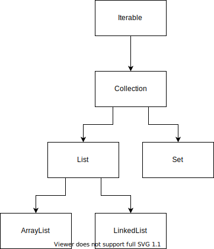

# Java集合框架

- List（有序不唯一）

- Set

- Map

List Set：存储单种数据，List可以存储重复的数据，Set数据不能重复

Set：单点登录/Token（令牌）

Map：存储一对数据

list.add(1)

list.add(2)

set.add(1)

map.put("name", "aobo") 映射、键值对、key value



## Set

跟List一样，Set是Collection的子接口，Set集合是以散列的形式存储数据，所以元素是没有顺序的，可以存储一组无序且唯一的数据。

```java
public interface Set<E> extends Collection<E> {
  //源码
}
```

Set常用实现类：

- HashSet
- LinkedHashSet
- TreeSet

### Hashset

HashSet是开发中经常使用的一个实现类，存储一组无序且唯一的对象。

无序：元素的存储和遍历顺序不一样。

```java
import java.util.HashSet;
import java.util.Iterator;

public class Test {
  public static void main(String[] args) {
    HashSet<String> set = new HashSet<>();
    for (int i = 0; i < 100; i++) {
      set.add(String.valueOf(i));
    }
    set.remove("88");
    System.out.println(set.contains("88"));
    System.out.println(set.contains("16"));
    //        System.out.println(set);
    Iterator<String> iterator = set.iterator();
    while (iterator.hasNext()) {
      System.out.println(iterator.next());
    }
    //        for (String s :
    //                set) {
    //            System.out.println(s);
    //        }
  }
}
```

### LinkedHashSet

LinkedHashSet是Set的另外一个实现类，可以存储一组有序且唯一的元素

有序：元素的存储顺序的遍历顺序一致。

```java
import java.util.Iterator;
import java.util.LinkedHashSet;

public class Test2 {
  public static void main(String[] args) {
    LinkedHashSet linkedHashSet = new LinkedHashSet();
    linkedHashSet.add("hello");
    linkedHashSet.add("world");
    linkedHashSet.add("java");
    linkedHashSet.add("hello");
    System.out.println("linkedHashSet的长度是"+linkedHashSet.size());
    System.out.println("=====遍历linkedHashSet======");
    Iterator iterator = linkedHashSet.iterator();
    while (iterator.hasNext()) {
      System.out.println(iterator.next());
    }
    linkedHashSet.remove("Java");
    System.out.println(linkedHashSet);
    linkedHashSet.remove("java");
    System.out.println(linkedHashSet);
    System.out.println(linkedHashSet.contains("hello"));
    System.out.println("hello".equals("hello"));
    System.out.println("hello" == "hello");

    System.out.println("==========");
    LinkedHashSet set = new LinkedHashSet();
    Data data1 = new Data(1);
    set.add(data1);
    Data data2 = new Data(1);
    set.add(data2);
    set.add(1);
    set.add(1);
    System.out.println(set);
    System.out.println(data1.equals(data2));
  }
}

class Data {
  private int num;

  public Data(int num) {
    this.num = num;
  }

  @Override
  public String toString() {
    return "Data{" +
      "num=" + num +
      '}';
  }
}
```

## equals和==的区别？

所有类中的equals都是继承自Object类，Object类中原生的equals方法就是在通过==进行判断

```java
public boolean equals(Object obj) {
  return (this == obj);
}
```

但是每个类都可以对equals方法进行重写，覆盖掉之前使用==进行判断的逻辑，该用新的逻辑进行判断是否相等。



LinkedhashSet如何判断两个对象是否相等？

首先判断两个对象和hashCode是否相等

什么是hashCode？

将对象的内部信息（内存地址、属性值），通过某种特定规则转换成一个散列值，就是该对象的hashCode。

- 两个不同对象的hashCode值可能相等。
- hashCode不相等的两个对象一定不是同一个对象。

集合在判断两个对象是否相等的时候，会先比较它们的hashCode，如果hashCode不相等，则认为不是同一个对象，可以添加

如果hashCode值相等，还不能认为两个对象是相等的，需要通过equals进行进一步的判断，equals相等，则两个对象相等，否则两个对象不相等。

```java
import java.util.LinkedHashSet;

public class Test2 {
  public static void main(String[] args) {
    LinkedHashSet set = new LinkedHashSet();
    Data data1 = new Data(1);
    set.add(data1);
    Data data2 = new Data(1);
    set.add(data2);
    set.add(1);
    set.add(1);
    System.out.println(set);
    System.out.println(data1.equals(data2));
    System.out.println(data1 == data2);
  }
}

class Data {
  private int num;

  public Data(int num) {
    this.num = num;
  }

  @Override
  public String toString() {
    return "Data{" +
      "num=" + num +
      '}';
  }

  @Override
  public boolean equals(Object o) {
    if (this == o) return true;
    //instanceof判断对象是否属于某个类
    if (o instanceof Data) {
      Data data = (Data) o;
      if (this.num == data.num) return true;
    }
    return false;
  }

  @Override
  public int hashCode() {
    return 1;
  }
}
```

==：判断的是栈内存中的值

引用类型的数据：如果栈内存中存储的是地址，所以说此时==判断的是引用地址。

基本数据类型：栈内存中存储的是具体的数值。

栈里面存储的是变量

Data data;

int num;

引用类型具体的对象（属性）存储在堆中的，再将堆中对象的内存地址赋值给栈中的变量data，data中存储的就是地址。

基本数据类型不需要用到堆内存，变量在栈中，变量的值直接存储在变量中。