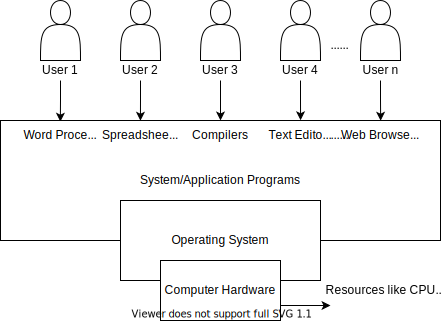
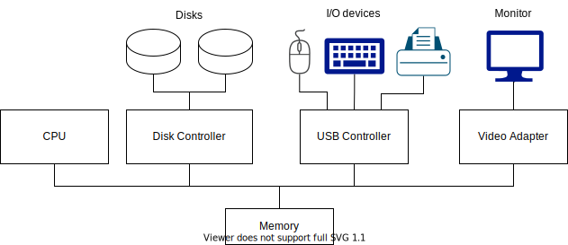

# Operating System

### Introduction to operating system

Windows, Linux, Ubuntu, Max OSX IOS, Android

- An Operating System(OS) is a program that manages the computer hardware
- It also provides a basis for Application Programs and acts as an **intermediary** between computer **User** and **Hardware**

Types of OS:

- Batch OS
- Time Sharing OS
- Distributed OS
- Network OS
- Real Time OS
- Multi Programming/Processing/Tasking OS

Goals of OS:

- Convenience
- Efficiency
- Both

Functions of OS:

- IT is an interface between User & Hardware
- Allocation of Resources
- Management of Memory, Security, etc.

### Basics of OS(Computer System Operation)

  Some basic knowledge of the structure of Computer System is required to understand how Operating Systems work.

- A modern general-purpose computer system consists of one or more CPUs and a number of device controllers connected through a common bus that access to shared memory.

- Each device controller is in charge of a specific type of device
- the CPU and the device controllers can execute concurrently, competing for memeory cycles
- To ensure oderly access to the shared memory , a memory controller is provided whose function is to synchronize access to the memory

To ensure orderly access to the shared memory, a memory controller is provided whose function is to synchronize access to the memory

Some important terms:

1. Bootstrap Program:
   - The initial program that runs when a computer is powered up or rebooted.
   - It is stored in the ROM
   - It must know how to load the OS and start executing that system.
   - It must locate and load into memory the OS Kernel
2. Interrupt:
   - The occurrence of an event is usually signalled by an Interrupt from Hardware or Software.
   - Hardware may trigger an interrupt at any time by sending a signal to the CPU, usually by the way of the system bus.
3. System Call(Monitor call):
   - Software may trigger an interrupt by executing a special operation called System Call.

When the CPU is interrupted, it stops what it is doing and immediately transfers execution to a fixed location.

> The fixed location usually contains the starting address where the Service Routine of the interrupt is located

The Interrupt Service Routine executes. On completion, the CPU resumes the interrupted computation
