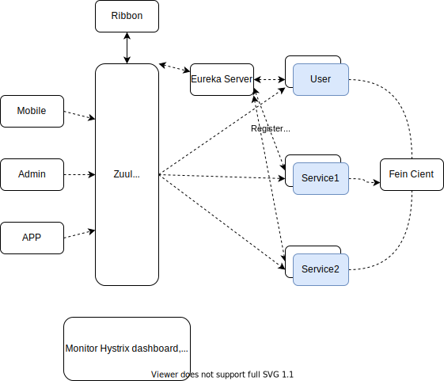

### 单体应用存在的问题

#### 为什么需要微服务

传统开发模式下，绝大部分的Web应用都是采用单体架构的风格来进行构建的，这意味着Web应用是作为单个可部署的软件制品进行交付的，所有的接口、业务逻辑、持久层都被打包在一个Web应用中，并且部署在一台服务器上，这种开发模式会带来诸多不便，多团队协同开发的成本极高。

单体架构



- 随着业务的发展，开发变得越来越复杂
- 修改、新增某个功能，需要对整个系统进行测试、重新部署
- 一个模块出现问题，很可能导致整个系统崩溃
- 多个开发团队同时对数据进行管理，容易产生安全漏洞
- 各个模块使用同一种技术进行开发，各个模块很难根据实际选择更合适的技术框架，局限性很大
- 模块内容过于复杂，如果有员工离职，可能需要很长时间才能完成工作交接

分布式、集群

集群：一台服务器无法负荷高并发的数据访问量，那么就设置十台服务器一起分担压力，十台不行就设置一百台（物理层面，运维层面）。很多人干同一件事情，来分摊压力。

分布式：将一个复杂的问题拆分成若干个简单的小问题，将一个大型的项目架构拆分成若干个微服务来协同完成。（软件的设计层面，开发层面）。将一个庞大的工作拆分成若干个小步骤，分别由不同的人完成这些小步骤，最终将所有的结果进行整合实现大的需求。

微服务架构



#### 微服务的优点

- 各个服务的开发、测试、部署都互相独立，比如用户服务就可以拆分作为一个单独的服务，而它的开发也不用依赖于其他服务，如果用户量很大，我们可以很容易的对其进行负载
- 当一个新的需求出现时，特别是在一个庞大的项目系统中，你得去考虑各方的问题，兼用性、影响度等等，而使用微服务则可以直接跳过这些费时又烧脑的环节
- 使用微服务将项目进行拆分之后，各服务之间就消除了诸多限制，只需要保证对外提供的接口正常使用，至于使用什么语言、什么框架统统不用关心

架构图



#### 微服务的不足

- 上面我们提到微服务的拆分是基于业务的，不是我们随心所欲，想怎么拆就怎么拆，那么问题来了，由谁来拆，怎么拆？这就给团队协作沟通带来了很多挑战。
- 当服务调用方需要使用某服务接口时，首先需要找到该服务的提供方，通常在一个大公司中，这种场景是跨部门的，沟通成本可想而知。同时，如果服务的提供方需要对某个接口进行修改，也得和各个服务调用方进行沟通。
- 由于各个服务相对独立，它们的数据也是独立的，这就会带来一个问题，当调用多个服务接口来进行操作时，如何保证各个服务的数据一致性，这是问题，也是难点

微服务落地框架对比

| RPC框架    | dubbo                     | motan         | thrift            | grpc           | spring cloud |
| ---------- | ------------------------- | ------------- | ----------------- | -------------- | ------------ |
| 支持语言   | java                      | java          | 跨语言            | 跨语言         | java         |
| 服务治理   | 是                        | 是            | 否                | 否             | 是           |
| 多注册中心 | 是                        | 是            | 否                | 否             | 是           |
| 序列化方式 | hessianlite/json/Kryo/FST | hessian2/json | thrift(byte)/json | protobuf(byte) | java/Kryo    |
| 跨语言通信 | 否                        | 否            | 是                | 是             | 否           |
| 性能       | 3                         | 4             | 5                 | 3              | 4            |
| 使用       | 4                         | 3             | 3                 | 3              | 4            |
| 易上手     | 4                         | 4             | 3                 | 3              | 4            |

#### 为什么是Spring Cloud

- Spring Cloud完全基于Spring Boot，服务调用方式是基于REST API，整合了各种成熟的产品和架构，同时基于Spring Boot也使得整体的开发、配置、部署都非常的方便。
- Spring系的产品集功能齐全、简单好用、性能优越、文档规范等等于一身，因此Spring Cloud还是微服务机构中一个十分优越的实现方案。

#### Spring Cloud架构图



Spring Cloud

- 服务治理Eureka
- 服务通信Ribbon
- 服务通信Feign
- 服务网关Zuul
- 服务容错Hystrix
- 服务配置Config
- 服务监控Actuator
- 服务跟踪Zipkin

服务治理的核心有三部分组成：服务提供者、服务消费者、注册中心

在分布式系统架构中，每个微服务在启动时，将自己的信息存储在注册中心，这个行为叫服务注册

服务消费者从注册中心获取服务提供者的网络信息，通过该信息调用服务，叫做服务发现

Spring Cloud的服务治理使用的是Eureka来实现，Eureka是Netflix开源的基于REST的服务治理解决方案，Spring Cloud集成了Eureka，提供服务注册和服务发现的功能，可以和基于Spring Boot搭建的微服务应用轻松完成整合，开箱即用，Spring Cloud Eureka，

#### Spring Cloud Eureka

- Eureka Server，注册中心
- Eureka Client。所有要进行注册的微服务通过Eureka Client连接到Eureka Server，完成注册



#### Eureka Server代码实现

- 创建父工程，pom.xml

```xml
<?xml version="1.0" encoding="UTF-8"?>
<project xmlns="http://maven.apache.org/POM/4.0.0"
         xmlns:xsi="http://www.w3.org/2001/XMLSchema-instance"
         xsi:schemaLocation="http://maven.apache.org/POM/4.0.0 http://maven.apache.org/xsd/maven-4.0.0.xsd">
  <modelVersion>4.0.0</modelVersion>

  <groupId>com.anasiangangster</groupId>
  <artifactId>anasiangangster</artifactId>
  <version>1.0-SNAPSHOT</version>

  <properties>
    <maven.compiler.source>13</maven.compiler.source>
    <maven.compiler.target>13</maven.compiler.target>
  </properties>

  <parent>
    <groupId>org.springframework.boot</groupId>
    <artifactId>spring-boot-starter-parent</artifactId>
    <version>2.5.4</version>
  </parent>

  <dependencies>
    <dependency>
      <groupId>org.springframework.boot</groupId>
      <artifactId>spring-boot-starter-web</artifactId>
      <version>2.5.4</version>
    </dependency>
  </dependencies>

  <dependencyManagement>
    <dependencies>
      <dependency>
        <groupId>org.springframework.cloud</groupId>
        <artifactId>spring-cloud-dependencies</artifactId>
        <version>2020.0.3</version>
        <type>pom</type>
        <scope>import</scope>
      </dependency>
    </dependencies>
  </dependencyManagement>

</project>
```

- 在父工程下创建Module, pom.xml

```xml
<dependencies>
  <dependency>
    <groupId>org.springframework.cloud</groupId>
    <artifactId>spring-cloud-starter-netflix-eureka-server</artifactId>
  </dependency>
</dependencies>
```

- 创建配置文件application.yml，添加eureka server相关的配置

```yaml
server:
  port: 8761 # 当前Eureka Server的服务端口

eureka:
  client:
    register-with-eureka: false # 是否将当前的Eureka Server服务作为客户端进行注册
    fetch-registry: false # 是否获取其他Eureka Server服务的数据
    service-url:
      defaultZone: http://localhost:8761/eureka/ # 注册中心的访问地址
```

- 创建启动类

```java
package com.anasiangangster;

import org.springframework.boot.SpringApplication;
import org.springframework.boot.autoconfigure.SpringBootApplication;
import org.springframework.cloud.netflix.eureka.server.EnableEurekaServer;

@SpringBootApplication
@EnableEurekaServer
public class EurekaServerApplication {
  public static void main(String[] args) {
    SpringApplication.run(EurekaServerApplication.class, args);
  }
}
```

> 注解说明

`@SpringBootApplication`： 声明该类是Spring Boot服务的入口

`@EnableEurekaServer`：声明该类是一个Eureka Server微服务，提供服务注册和服务发现功能，即注册中心

#### Eureka Client代码实现

- 创建Module, pom.xml

```xml
<dependencies>
  <dependency>
    <groupId>org.springframework.cloud</groupId>
    <artifactId>spring-cloud-starter-netflix-eureka-client</artifactId>
  </dependency>
</dependencies>
```

- 创建配置文件application.yml, 添加Eureka Client相关配置

```yaml
server:
  port: 8010

spring:
  application:
    name: provider # 当前服务注册在Eureka Server上的名称
eureka:
  client:
    service-url:
      defaultZone: http://localhost:8761/eureka/ # 注册中心的访问地址
  instance:
    prefer-ip-address: true # 是否将当前的服务的IP注册到Eureka Server
```

- 创建启动类

```java
package com.anasiangangster;

import org.springframework.boot.SpringApplication;
import org.springframework.boot.autoconfigure.SpringBootApplication;

@SpringBootApplication
public class ProviderApplication {
  public static void main(String[] args) {
    SpringApplication.run(ProviderApplication.class, args);
  }
}
```

- Entity实体类

```java
package com.anasiangangster.entity;

import lombok.AllArgsConstructor;
import lombok.Data;
import lombok.NoArgsConstructor;

@Data
@AllArgsConstructor
@NoArgsConstructor
public class Student {
  private long id;
  private String name;
  private int age;
}
```

- Repositry interface

```java
package com.anasiangangster.repository;

import com.anasiangangster.entity.Student;

import java.util.Collection;

public interface StudentRepository {
  public Collection<Student> findAll();
  public Student findById(long id);
  public void saveOrUpdate(Student student);
  public void deleteById(long id);
}
```

- impl

```java
package com.anasiangangster.repository.impl;

import com.anasiangangster.entity.Student;
import com.anasiangangster.repository.StudentRepository;
import org.springframework.stereotype.Repository;

import java.util.Collection;
import java.util.HashMap;
import java.util.Map;

@Repository
public class StudentRepositoryImpl implements StudentRepository {

  private static Map<Long, Student> studentMap;

  static {
    studentMap = new HashMap<>();
    studentMap.put(1L, new Student(1L, "aobo", 25));
    studentMap.put(2L, new Student(2L, "jake", 27));
    studentMap.put(3L, new Student(3L, "jame", 23));
  }

  @Override
  public Collection<Student> findAll() {
    return studentMap.values();
  }

  @Override
  public Student findById(long id) {
    return studentMap.get(id);
  }

  @Override
  public void saveOrUpdate(Student student) {
    studentMap.put(student.getId(), student);
  }

  @Override
  public void deleteById(long id) {
    studentMap.remove(id);
  }
}
```

- controller

```java
package com.anasiangangster.controller;

import com.anasiangangster.entity.Student;
import com.anasiangangster.repository.StudentRepository;
import org.springframework.beans.factory.annotation.Autowired;
import org.springframework.web.bind.annotation.*;

import java.util.Collection;

@RestController
@RequestMapping("/student")
public class StudentHandler {

  @Autowired
  private StudentRepository studentRepository;

  @GetMapping("/findAll")
  public Collection<Student> findAll(){
    return studentRepository.findAll();
  }

  @GetMapping("/findById/{id}")
  public Student findById(@PathVariable("id") long id) {
    return studentRepository.findById(id);
  }

  @PostMapping("/save")
  public void save(@RequestBody Student student) {
    studentRepository.saveOrUpdate(student);
  }

  @PutMapping("/update")
  public void update(@RequestBody Student student) {
    studentRepository.saveOrUpdate(student);
  }

  @DeleteMapping("/delete/{id}")
  public void deleteById(@PathVariable("id") long id) {
    studentRepository.deleteById(id);
  }
}
```

### RestTamplate的使用

- 什么是RestTemplate？

  RestTemplate是Spring框架提供的基于REST的服务组件，底层是对HTTP请求及响应进行了封装，提供了很多访问REST服务的方法，可以简化代码开发。

- 如何使用RestTemplate？

  1. 创建maven工程，pom.xml
  2. 创建实体类

```java
package com.anasiangangster.entity;

import lombok.AllArgsConstructor;
import lombok.Data;
import lombok.NoArgsConstructor;

@Data
@AllArgsConstructor
@NoArgsConstructor
public class Student {
  private long id;
  private String name;
  private int age;
}
```

	3. handler

```java
package com.anasiangangster.controller;

import com.anasiangangster.entity.Student;
import org.springframework.beans.factory.annotation.Autowired;
import org.springframework.web.bind.annotation.*;
import org.springframework.web.client.RestTemplate;

import java.util.Collection;

@RestController
@RequestMapping("/rest")
public class RestHandler {
  @Autowired
  private RestTemplate restTemplate;

  @GetMapping("findAll")
  public Collection<Student> findAll(){
    return restTemplate.getForEntity("http://localhost:8010/student/findAll", Collection.class).getBody();
  }

  @GetMapping("findAllTwo")
  public Collection<Student> findAllTwo(){
    return restTemplate.getForObject("http://localhost:8010/student/findAll", Collection.class);
  }

  @GetMapping("findById/{id}")
  public Student findById(@PathVariable("id") long id){
    return restTemplate.getForEntity("http://localhost:8010/student/findById/{id}", Student.class, id).getBody();
  }

  @GetMapping("findByIdTwo/{id}")
  public Student findByIdTwo(@PathVariable("id") long id){
    return restTemplate.getForObject("http://localhost:8010/student/findById/{id}", Student.class, id);
  }

  @PostMapping("save")
  public void save(@RequestBody Student student){
    restTemplate.postForEntity("http://localhost:8010/student/save", student, null).getBody();
  }

  @PostMapping("saveTwo")
  public void saveTwo(@RequestBody Student student){
    restTemplate.postForObject("http://localhost:8010/student/save", student, null);
  }

  @PutMapping("update")
  public void update(@RequestBody Student student){
    restTemplate.put("http://localhost:8010/student/update", student);
  }

  @DeleteMapping("delete/{id}")
  public void delete(@PathVariable("id") long id){
    restTemplate.delete("http://localhost:8010/student/delete/{id}", id);
  }
}
```

	4. 启动类

```java
package com.anasiangangster;

import org.springframework.boot.SpringApplication;
import org.springframework.boot.autoconfigure.SpringBootApplication;
import org.springframework.context.annotation.Bean;
import org.springframework.web.client.RestTemplate;

@SpringBootApplication
public class RestTemplateApplication {
  public static void main(String[] args) {
    SpringApplication.run(RestTemplateApplication.class, args);
  }

  @Bean
  public RestTemplate restTemplate(){
    return new RestTemplate();
  }
}
```

### 服务消费者

