# Spring MVC

### 目标

- 使用Maven搭建Spring MVC开发环境
- 掌握Spring MVC各个组件的使用

### Spring MVC是什么

Spring MVC概述

SpringMVC是目前主流的实现MVC设计模式的框架，是Spring框架的一个分支产品，以Spring IoC容器为基础，并利用容器的特性来简化它的配置。SpringMVC相当于Spring的一个子模块，可以很好的和Spring结合起来进行开发，是Java Web开发者必须要掌握的框架。



### Spring MVC

Spring MVC是目前主流的实现MVC设计模式的企业级开发框架，Spring框架的一个子模块，无序整合，开发起来更加便捷。

### 什么是MVC设计模式

将应用程序分为Controller、Model、View三层，Controller接收客户端请求，调用Model生成业务数据，传递给View。

Spring MVC就是对这套流程的封装，屏蔽了很多底层代码，开放出接口，让开发者更加轻松、便捷地完成基于MVC模式的Web开发。

### Spring MVC核心组件

- DispatcherServlet：前置控制器，是整个流程控制的核心，控制其他组件的执行，进行统一调度，降低组件之间的耦合性，相当于总指挥。
- Handler：处理器，完成具体的业务逻辑，相当于Servlet或Action。
- HandlerMapping：DispatcherServlet接收到请求之后，通过handlerMapping将不同的请求映射到不同的Handler。
- HandlerInterceptor：处理器拦截器，是一个接口，如果需要完成一些拦截处理，可以实现该接口。
- HandlerExecutionChain：处理器执行链，包括两部分内容：Handler和HandlerInterceptor（系统会有一个默认的HandlerInterceptor，如果需要额外设置拦截，可以添加拦截器）。
- HandlerAdapter：处理器适配器，Handler执行业务方法之前，需要进行一系列的操作，包括表单数据的验证、数据类型的转换、将表单数据封装到JavaBean等，这些操作都是由HandlerAdaptor来完成，开发者只需要将注意力集中业务逻辑的处理上，DispatcherServlet通过HandlerAdapter 执行不同的Handler。
- ModelAndView：装载了模型数据和视图信息，作为Handler的处理结果，返回给DispatcherServlet。
- ViewResolver：视图解析器，DispatcherServlet通过将逻辑视图解析为物理视图，最终将渲染的结果响应给客户端。

### Spring MVC工作流程



- 客户端请求被DispatcherServlet接收
- 根据HandlerMapping映射到Handler
- 生成Handler和HandlerInterceptor
- Handler和HandlerInterceptor以HandlerExecutionChain的形式一并返回给DispatchServlet。
- DispatcherServlet通过HandlerAdapter调用Handler的方法完成业务逻辑处理
- 返回一个ModelAndView对象给DispatcherServlet。
- DispatcherServlet将获取的ModelAndView对象传给ViewResolver视图解析器，将逻辑视图解析为物理视图View。
- ViewResolver返回一个View给DispatcherServlet。
- DispatcherServlet根据View进行视图渲染（将模型数据Model填充到视图View中）。
- DispatcherServlet将渲染后的结果响应给客户端。

### Spring MVC的特点

- 清晰地角色划分
- 灵活的配置功能
- 提供了大量的控制器接口和实现类
- 分离View层的实现
- 国际化支持
- 面向接口编程

Spring MVC流程非常复杂，实际开发中很简单，因为大部分的组件不需要开发者创建、管理，只需要通过配置文件的方式完成配置即可，真正需要开发者进行处理的只有Handler、VIew，

### 如何使用

- 创建Maven工程，pom.xml

  ```xml
  <dependencies>
    <dependency>
      <groupId>org.springframework</groupId>
      <artifactId>spring-webmvc</artifactId>
      <version>5.3.8</version>
    </dependency>
  </dependencies>
  ```

- 在web.xml中DispatcherServlet

  ```xml
  <!DOCTYPE web-app PUBLIC
   "-//Sun Microsystems, Inc.//DTD Web Application 2.3//EN"
   "http://java.sun.com/dtd/web-app_2_3.dtd" >
  
  <web-app>
    <display-name>Archetype Created Web Application</display-name>
  
    <servlet>
      <servlet-name>dispatcherServlet</servlet-name>
      <servlet-class>org.springframework.web.servlet.DispatcherServlet</servlet-class>
      <init-param>
        <param-name>contextConfigLocation</param-name>
        <param-value>classpath:springmvc.xml</param-value>
      </init-param>
    </servlet>
  
    <servlet-mapping>
      <servlet-name>dispatcherServlet</servlet-name>
      <url-pattern>/</url-pattern>
    </servlet-mapping>
  </web-app>
  ```

- springmvc.xml

  ```xml
  <?xml version="1.0" encoding="UTF-8"?>
  <beans xmlns="http://www.springframework.org/schema/beans"
         xmlns:mvc="http://www.springframework.org/schema/mvc"
         xmlns:context="http://www.springframework.org/schema/context"
         xmlns:xsi="http://www.w3.org/2001/XMLSchema-instance"
         xsi:schemaLocation="
          http://www.springframework.org/schema/beans
          http://www.springframework.org/schema/beans/spring-beans.xsd
          http://www.springframework.org/schema/mvc
          http://www.springframework.org/schema/mvc/spring-mvc.xsd
          http://www.springframework.org/schema/context
          http://www.springframework.org/schema/context/spring-context.xsd">
  
      <!-- 自动扫描 -->
      <context:component-scan base-package="com.anasiangangster"></context:component-scan>
  
      <!-- 配置视图解析器 -->
      <bean class="org.springframework.web.servlet.view.InternalResourceViewResolver">
          <property name="prefix" value="/"></property>
          <property name="suffix" value=".jsp"></property>
      </bean>
  </beans>
  ```

- 创建Handler

  ```java
  package com.anasiangangster.controller;
  
  import org.springframework.stereotype.Controller;
  import org.springframework.web.bind.annotation.RequestMapping;
  
  @Controller
  public class HelloHandler {
    @RequestMapping("/index")
    public String index(){
      System.out.println("执行了index...");
      return "index";
    }
  }
  ```

### Spring MVC注解

- @RequestMapping

SpringMVC通过@ResquestMapping注解将URL请求与业务方法进行映射，在Hander的类定义处以及方法定义处都可以添加@ResquestMapping，在类定义处添加，相当于客户端多了一层访问路径。

- @Controller

@Controller注解在类定义处添加，将该类交给IoC容器来管理（结合springmvc.xml的自动扫描配置使用），同时使其成为一个控制器，可以接收客户端请求。

```java
package com.anasiangangster.controller;

import org.springframework.stereotype.Controller;
import org.springframework.web.bind.annotation.RequestMapping;

@Controller
@RequestMapping("/hello")
public class HelloHandler {
  @RequestMapping("/index")
  public String index(){
    System.out.println("执行了index...");
    return "index";
  }
}
```

- @ResquestMapping相关参数

1. value：指定URL请求的实际地址，是@RequestMapping的默认值

```java
@RequestMapping("/index")
public String index(){
  System.out.println("执行了index...");
  return "index";
}
```

等于

```java
@RequestMapping(value = "/index")
public String index(){
  System.out.println("执行了index...");
  return "index";
}
```

2. method：指定请求的method类型，GET、POST、PUT、DELETE。

   HTTP 405 method not allowed

```java
@RequestMapping(value="/index",method=RequestMethod.GET)
public String index(){
  System.out.println("执行了index...");
  return "index";
}
```

上述代码表示index方法只接收GET。

3. params：指定请求中必须包含某系参数，否则无法调用该方法。 

   HTTP 400 bad request

```java
@RequestMapping(value="/index",method=RequestMethod.GET,params={"name","id=10"})
public String index(){
  System.out.println("执行了index...");
  return "index";
}
```

上述代码表示请求中必须包含name和id两个参数，同时id的值必须是10

关于参数绑定，在形参列表中通过添加@RequestParam注解完成HTTP请求的参数与业务方法形参的映射。

通常情况下HTTP请求的参数与业务方法形参名称相同，就默认不用绑定了

```java
@RequestMapping(value="/index",method=RequestMethod.GET,params={"name","id=10"})
public String index(@RequestParam("name") String str,@RequestParam("id") int age){
  System.out.println(str);
  System.out.println(age);
  System.out.println("执行了index...");
  return "index";
}
```

上述代码表示将请求的参数name和id分别赋给了形参str和age，同时自动完成了数据类型转换，将“10”转为了int类型的10，再赋给age，这些工作是由HandlerAdapter来完成的（要么名称相同，要么参数绑定、映射）。

Spring MVC也支持RESTful风格的URL。

传统类型：http://localhost:8080/hello/index?name=aobo&id=10

REST：http://localhost:8080/hello/index/aobo/10

REST必须手动映射

```java
@RequestMapping(value="/rest/{name}/{id}",method=RequestMethod.GET)
public String rest(@PathVariable("name") String name,@PathVariable("id") int id) {
  System.out.println(name);
  System.out.println(id);
  return "index";
}
```

通过@PathVariable注解完成请求参数与形参的映射

- 映射Cookie

Spring MVC 通过映射可以直接在业务方法中获取Cookie的值。

```java
@RequestMapping(value="/rest/{name}/{id}",method=RequestMethod.GET)
public String rest(@PathVariable("name") String name,@PathVariable("id") int id) {
  System.out.println(name);
  System.out.println(id);
  return "index";
}
```

- 使用JavaBean绑定参数

Spring MVC会根据请求参数名和JavaBean属性名进行自动匹配，自动为对象填充属性值，同时支持级联属性。

```java
package com.anasiangangster.entity;

import lombok.Data;

@Data
public class Address {
  private String value;
}
```

```java
package com.anasiangangster.entity;

import lombok.Data;

@Data
public class User {
  private long id;
  private String name;
  private Address address;
}
```

```jsp
<%@ page contentType="text/html;charset=UTF-8" language="java" %>
<html>
<head>
    <title>register</title>
</head>
<body>
    <form action="/hello/save" method="post">
        用户名id：<input type="text" name="id">
        用户名：<input type="text" name="name">
        用户地址：<input type="text" name="address.value">
        <input type="submit" value="注册">
    </form>
</body>
</html>
```

```java
@RequestMapping(value="/save",method=RequestMethod.POST)
public String save(User user) {
  System.out.println(user);
  return "index";
}
```

如果出现中文乱码问题，只需要在web.xml添加Spring MVC自带的过滤器

```xml
<filter>
  <filter-name>encodingFilter</filter-name>
  <filter-class>org.springframework.web.filter.CharacterEncodingFilter</filter-class>
  <init-param>
    <param-name>encoding</param-name>
    <param-value>UTF-8</param-value>
  </init-param>
</filter>
<filter-mapping>
  <filter-name>encodingFilter</filter-name>
  <url-pattern>/*</url-pattern>
</filter-mapping>
```

- JSP页面的转发（客户端地址栏URL不变，服务端跳转）和重定向（客户端地址栏URL变了，客户端跳转）：

Spring MVC默认是以转发形式响应JSP

1. 转发

   ```java
   @RequestMapping("/forward")
   public String forward(){
     return "forward:/index.jsp";
     //        return "index"; //默认转发
   }
   ```

2. 重定向

   ```java
   @RequestMapping("/redirect")
   public String redirect() {
     return "redirect:/index.jsp";
   }
   ```

### Spring MVC数据绑定

数据绑定：在后端的业务方法中直接获取客户端HTTP请求中的参数，将请求参数映射到业务方法的形参中。Spring MVC中数据绑定的工作是由HandlerAdapter来完成的。

- 基本数据类型的，不放params，不传id，HTTP 500 给id传null值异常

  ```java
  @RequestMapping(value="/primitiveType",params={"id"})
  @ResponseBody
  public String primitiveType(int id){
    return id+"";
  }
  ```

  @ResponseBody表示Spring MVC会直接将业务的返回值响应给客户端，如果不加@ResponseBody注解，Spring MVC会将业务方法的返回汉字传递给DispatcherServlet，再由DispatcherServlet调用ViewResolver对返回值进行解析，映射到一个JSP资源

- 包装类，用基本数据类型，如果参数找不到，Spring MVC会给一个null值-->参数不匹配异常

  ```java
  @RequestMapping("/referenceType")
  @ResponseBody
  public String referenceType(Integer id) {
    return id+"";
  }
  ```

  包装类可以接收null，当HTTP请求没有参数时，使用包装类定义形参的数据类型，程序不会抛出异常。

  ```java
  @RequestMapping(value="/referenceType")
  @ResponseBody
  public String referenceType(@RequestParam(value="num",
                                            required=false,
                                            defaultValue="0") Integer id) {
    return id+"";
  }
  ```

@RequestParam

value=“num"：将HTTP请求中名为怒骂的参数赋给形参id。

required：设置num是否为必填项，true表示必填，false表示非必填。默认true

defaultValue="0"：如果HTTP请求中没有num参数，默认值为0

- 数组

```java
@RestController
@RequestMapping("/data")
public class DataBindHandler {
	@RequestMapping("/array")
	public String array(String[] name){
 	 String str = Arrays.toString(name);
 	 return str;
	}
}
```

@RestController表示该控制器会直接将业务方法返回值响应给客户端，不进行视图解析。

@Controller表示该控制器的每一个业务方法的返回值都会交给视图解析器进行解析。如果只需要将数据响应给客户端，而不需要进行视图解析，则需要在对应的业务方法定义处添加@ResponseBody。

```java
@RestController
@RequestMapping("/data")
public class DataBindHandler {
	@RequestMapping("/array")
	public String array(String[] name){
 	 String str = Arrays.toString(name);
 	 return str;
	}
}
```

等同于

```java
@Controller
@RequestMapping("/data")
public class DataBindHandler {
	@RequestMapping("/array")
  @ResponseBody
	public String array(String[] name){
 	 String str = Arrays.toString(name);
 	 return str;
	}
}
```

- List

Spring MVC不支持List类型的直接转换，需要对List集合进行包装。

集合封装类

```java
package com.anasiangangster.entity;

import lombok.Data;

import java.util.List;

@Data
public class UserList {
  private List<User> users;
}
```

jsp

```jsp
<%--
  Created by IntelliJ IDEA.
  User: anasiangangster
  Date: 14/7/21
  Time: 9:57 PM
  To change this template use File | Settings | File Templates.
--%>
<%@ page contentType="text/html;charset=UTF-8" language="java" %>
<html>
<head>
    <title>addList</title>
</head>
<body>
    <form action="/data/list" method="post">
        用户1编号：<input type="text" name="users[0].id">
        用户1名称：<input type="text" name="users[0].name">
        用户2编号：<input type="text" name="users[1].id">
        用户2名称：<input type="text" name="users[1].name">
        用户3编号：<input type="text" name="users[2].id">
        用户3名称：<input type="text" name="users[2].name">
        <input type="submit" value="提交">
    </form>
</body>
</html>
```

业务方法

```java
@RequestMapping("list")
public String list(UserList userList) {
  StringBuffer str = new StringBuffer();
  for(User user: userList.getUsers()) str.append(user);
  return str.toString();
}
```

处理@ResponseBody中文乱码，在springmvc.xml中配置消息转换器

```xml
<mvc:annotation-driven>
  <!-- 消息转换器 -->
  <mvc:message-converters register-defaults="true">
    <bean class="org.springframework.http.converter.StringHttpMessageConverter">
      <property name="supportedMediaTypes" value="text/html;charset=UTF-8"></property>
    </bean>
  </mvc:message-converters>
</mvc:annotation-driven>
```

- Map

