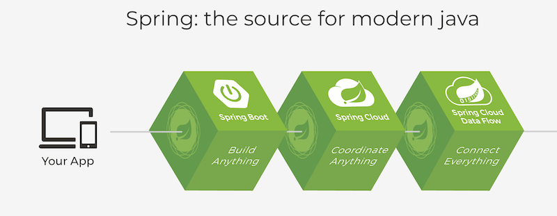

# Spring全家桶

### 前言

Spring是当前Java开发的行业标准，第一框架。

Sping概念诞生于2002年，于2003年正式发布第一个版本Spring Framework0.9。

经过几十年的优化迭代，Spring Framework已经从最初的取代EjB的框架逐步发展为一套完整的生态，最新的版本是5.X。


### Spring架构体系图



### Spring两大核心机制

* IoC：工厂模式
* AOP：代理模式

### IoC

IoC是Spring框架的灵魂，控制反转。

```java
//传统的开发方式，手动创建对象
Student student = new Student();
student.setId(1);
System.out.println(student);
```

> 有点类似缓冲池的概念

### 开发步骤

1. 创建Maven工程，pom.xml导入依赖

```xml
<dependencies>
  <dependency>
    <groupId>org.springframework</groupId>
    <artifactId>spring-context</artifactId>
    <version>5.3.7</version>
  </dependency>
</dependencies>
```

> 对象属性尽量使用包装类

> Lombok可以帮助开发者自动生成实体类相关方法。在IDEA中使用，必须预先安装插件。

2. 在resources路径下创建spring.xml

> ApplicationContext接口可以简单理解成IoC容器

```xml
<?xml version="1.0" encoding="UTF-8"?>
<beans xmlns="http://www.springframework.org/schema/beans"
       xmlns:xsi="http://www.w3.org/2001/XMLSchema-instance"
       xmlns:context="http://www.springframework.org/schema/context"
       xsi:schemaLocation="http://www.springframework.org/schema/beans http://www.springframework.org/schema/beans/spring-beans.xsd
    http://www.springframework.org/schema/context http://www.springframework.org/schema/context/spring-context.xsd">
    <bean id="student" class="com.anasiangangster.entity.Student"></bean>
</beans>
```

3. IoC容器通过读取spring.xml配置文件，加载bean标签来创建对象。

> 实际上是通过反射机制来实现的

4. 调用API获取IoC容器中已经创建的对象

```java
//IoC容器自动创建对象，开发者只需要取出对象即可
ApplicationContext applicationContext = new ClassPathXmlApplicationContext("spring.xml");
Student student1 = (Student) applicationContext.getBean("student");
student1.setId(2);
System.out.println(student1);
```

> 当IoC中存在两个或两个以上同类型的对象时，不能使用实体类的类名ge'tBean，如.getBean(Student.class)，抛NoUniqueBeanDefinition异常

### IoC容器创建bean的两种方式

1. 无参构造函数

```xml
<bean id="student" class="com.anasiangangster.entity.Student"></bean>
```

给成员变量赋值

```xml
<bean id="student" class="com.anasiangangster.entity.Student">
  <property name="id" value="1"/>
  <property name="name" value="张三"/>
  <property name="age" value="30"/>
</bean>
```

> 赋值是通过set方法，通过反射机制自动做类型装换

2. 有参构造函数

通过name指定

```xml
<bean id="student3" class="com.anasiangangster.entity.Student">
  <constructor-arg name="id" value="3"/>
  <constructor-arg name="name" value="李四"/>
  <constructor-arg name="age" value="33"/>
</bean>
```

也可以通过下标（index）指定，

默认按构造函数入参顺序

### 从IoC容器中去Bean

- 通过xml bean id取值 -> 类似变量名

```java
Student student1 = (Student) applicationContext.getBean("student");
```

- 通过类型取值，运行实类。

```java
Student student1 = (Student) applicationContext.getBean(Student.class);
```

当IoC容器中同时存在两个以上Student Bean的时候就会抛出异常，因为此时没有唯一的bean

### bean的属性中如果包含特殊字符，如下处理

```xml
<bean id="group" class="com.anasiangangster.entity.Group">
  <property name="id" value="1"/>
  <property name="name">
    <value><![CDATA[<一班>]]></value>
  </property>
</bean>
```

### IoC DI

DI指bean之间的依赖注入，设置对象之间的级联关系

> 把一个对象注入到另一个对象中

Group

```java
@Data
public class Group {
    private Integer id;
    private String name;
}
```

Student

```java
@Data
public class Student {
    private Integer id;
    private String name;
    private Integer age;
    private Group group;
}
```

spring-di.xml

```xml
<?xml version="1.0" encoding="UTF-8"?>
<beans xmlns="http://www.springframework.org/schema/beans"
       xmlns:xsi="http://www.w3.org/2001/XMLSchema-instance"
       xmlns:context="http://www.springframework.org/schema/context"
       xsi:schemaLocation="http://www.springframework.org/schema/beans http://www.springframework.org/schema/beans/spring-beans.xsd
                           http://www.springframework.org/schema/context http://www.springframework.org/schema/context/spring-context.xsd">
  <!-- Group -->
  <bean id="group" class="com.anasiangangster.entity.Group">
    <property name="id" value="1"/>
    <property name="name" value="一班"/>
  </bean>
  <!-- Student -->
  <bean id="student" class="com.anasiangangster.entity.Student">
    <property name="id" value="100"/>
    <property name="name" value="张三"/>
    <property name="age" value="32"/>
    <property name="group" ref="group"/>
  </bean>
</beans>
```

bean之间的级联需要使用ref属性来完成映射，而不能之间使用value，否则会出现类型转换异常

#### List

Group

```java
@Data
public class Group {
    private Integer id;
    private String name;
    private List<Student> studentList;
}
```

Student

```java
@Data
public class Student {
    private Integer id;
    private String name;
    private Integer age;
}
```

Spring-di.xml

```xml
<?xml version="1.0" encoding="UTF-8"?>
<beans xmlns="http://www.springframework.org/schema/beans"
       xmlns:xsi="http://www.w3.org/2001/XMLSchema-instance"
       xmlns:context="http://www.springframework.org/schema/context"
       xsi:schemaLocation="http://www.springframework.org/schema/beans http://www.springframework.org/schema/beans/spring-beans.xsd
                           http://www.springframework.org/schema/context http://www.springframework.org/schema/context/spring-context.xsd">
  <!-- Group -->
  <bean id="group" class="com.anasiangangster.entity.Group">
    <property name="id" value="1"/>
    <property name="name">
      <value><![CDATA[<一班>]]></value>
    </property>
    <property name="studentList">
      <list>
        <ref bean="student"/>
        <ref bean="student2"/>
      </list>
    </property>
  </bean>
  <!-- Student -->
  <bean id="student" class="com.anasiangangster.entity.Student">
    <property name="id" value="100"/>
    <property name="name" value="张三"/>
    <property name="age" value="32"/>
  </bean>
  <bean id="student2" class="com.anasiangangster.entity.Student">
    <property name="id" value="200"/>
    <property name="name" value="李四"/>
    <property name="age" value="34"/>
  </bean>
</beans>
```

### Spring中的bean

bean是根据scope来生成，表示bean的作用域，scope有4种类型：

- singleton，单例，表示通过Spring容器获取的对象是唯一的，默认值
- prototype，原型，表示通过Spring容器获取的对象是不同的对象
- request，请求，表示在一次HTTP请求内有效
- session，会话，表示在一个用户会话内有效

request、session适用于Web项目

singleton模式下，只要加载IoC容器，无论是否从IoC中取出bean，配置文件中的bean都会被创建（饿汉模式）

prototype模式下，如果不从IoC中取bean，则不创建对象，取一次bean，就会创建一个对象

### Spring的继承

Spring的继承不同于Java中的继承，区别：Java中的继承是针对于类的，Spring的继承是针对于对象（bean）

Spring的继承中，子bean可以继承父bean中的所有成员变量的值

```xml
<bean id="user1" class="com.anasiangangster.entity.User" scope="singleton">
  <property name="id" value="1"/>
  <property name="name" value="张三"/>
</bean>
<bean id="user2" class="com.anasiangangster.entity.User" parent="user1">
  <property name="name" value="李四"/>
</bean>
```

通过设置bean标签的parent属性建立继承关系，同时子bean可以覆盖父bean的属性值

Spring的继承是针对对象的，所有子bean和父bean并不需要属于同一数据类型，只要其成员变量列表一致即可

### Spring的依赖

用来设置两个bean的创建顺序

IoC容器默认情况下是通过spring.xml中bean的配置顺序来决定创建顺序的，配置在前面的bean会先创建

在不更改spring.xml配置顺序的前提下，通过设置bean之间的依赖关系来调整bean的创建顺序

```xml
<bean id="account" class="com.anasiangangster.entity.Account" depends-on="user"/>
<bean id="user" class="com.anasiangangster.entity.User"/>
```

上述代码的结果是先创建User，再创建Account

### Spring读取外部资源

实际开发中，数据库的配置一般会单独保存到后缀为properties的文件中，方便维护和修改，如果使用spring来加载数据源，就需要在spring.xml中读取properties中的数据，这就是读取外部资源

jdbc.properties

```properties
user = root
password = password
url = jdbc:mysql://localhost:3306/aomall
driverName = com.mysql.cj.jdbc.Driver
```

spring.xml

```xml
<?xml version="1.0" encoding="UTF-8"?>
<beans xmlns="http://www.springframework.org/schema/beans"
       xmlns:xsi="http://www.w3.org/2001/XMLSchema-instance"
       xmlns:context="http://www.springframework.org/schema/context"
       xsi:schemaLocation="http://www.springframework.org/schema/beans http://www.springframework.org/schema/beans/spring-beans.xsd
                           http://www.springframework.org/schema/context http://www.springframework.org/schema/context/spring-context.xsd">

  <!--  导入外部资源  -->
  <context:property-placeholder location="classpath:jdbc.properties"/>
  <!--  SpringEL  -->
  <bean id="dataSource" class="com.anasiangangster.data.DataSource">
    <property name="user" value="${user}"/>
    <property name="password" value="${password}"/>
    <property name="url" value="${url}"/>
    <property name="driverName" value="${driverName}"/>
  </bean>
</beans>
```

### Spring p命名空间

p命名空间可以用来简化bean的配置

```xml
<?xml version="1.0" encoding="UTF-8"?>
<beans xmlns="http://www.springframework.org/schema/beans"
       xmlns:xsi="http://www.w3.org/2001/XMLSchema-instance"
       xmlns:p="http://www.springframework.org/schema/p"
       xsi:schemaLocation="http://www.springframework.org/schema/beans http://www.springframework.org/schema/beans/spring-beans.xsd">

  <bean id="student" class="com.anasiangangster.entity.Student"
        p:id="1" p:name="杨奥博" p:age="26"/>

  <bean id="group" class="com.anasiangangster.entity.Group"
        p:id="1" p:name="一班" p:studentList-ref="student"/>
</beans>
```

