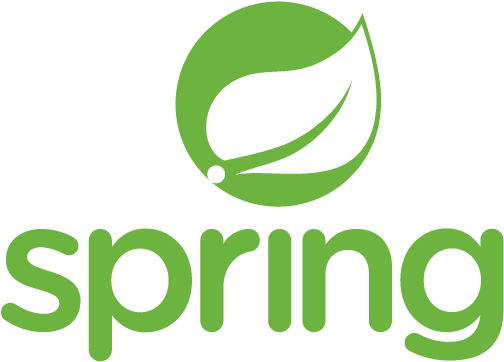

# Spring全家桶

### 前言

Spring是当前Java开发的行业标准，第一框架。

Sping概念诞生于2002年，于2003年正式发布第一个版本Spring Framework0.9。

经过几十年的优化迭代，Spring Framework已经从最初的取代EjB的框架逐步发展为一套完整的生态，最新的版本是5.X。

### Spring架构体系图

### Spring两大核心机制

* Ioc
* 