## 操作系统的 概念（定义）功能和目标

常见的操作系统

Windows、Android、iOS、MacOS、Linux

---

### 知识总览

操作系统的。。。

- 概念（定义）
- 功能和目标
  - 资源的管理者   安全、高效
  - 向用户提供服务   方便使用
  - 对硬件机器的扩展   扩展能力

---

### 操作系统的概念（定义）一

结合生活经验来理解计算机系统的层次结构：

​	一台电脑的诞生：

	1. 买一台裸机
	2. 安装**Windows**操作系统
	3. 安装**微信**
	4. 使用**微信**和朋友聊天


---

### 操作系统的概念（定义）二

**操作系统**（Operating System, OS）是指控制和管理整个计算机系统的硬件和软件资源，并合理地组织调度计算机的工作和资源分配，以提供用户和其他软件方便的接口和环境，它是计算机系统中最基本的**系统软件**

例子：打开Mac操作系统的Activity Monitor


---

### 操作系统的功能和目标


1. 操作系统**作为系统资源的管理者**（这些资源包括软件、硬件、文件等），需要提供什么功能？
2. 操作系统**作为用户与计算机硬件之间的接口**，要为其上层的用户、应用程序提供简单易用的服务，需要实现什么功能？
3. 操作系统**作为最接近硬件的层次**，需要在纯硬件的基础上实现什么功能？

---

#### 作为系统资源的管理者


补充知识：进程是一个程序的执行过程。执行前**需要将该程序放到内存中**，才能被CPU处理。


用QQ和朋友视频聊天的过程：

1. 在各个文件夹中找到QQ安装的位置（如：D:/Tencent/QQ/Bin）
   - 逐层打开文件夹，找到QQ.exe这个程序（可执行文件）的存放位置 --> 文件管理
2. 双击打开QQ.exe
   - 需要把该程序相关数据放入内存 --> 存储器管理
3. QQ程序正常运行
   - 对应的进程被处理机（CPU）处理 --> 处理机管理
4. 开始和朋友视频聊天
   - 需要将摄像头设备分配给进程 --> 设备管理

---

#### 作为用户和计算机硬件之间的接口


自下往上看，需要提供的功能

命令接口：允许用户**直接使用**

程序接口：允许用户通过程序**间接使用**

GUI：现代操作系统中最流行的图形用户接口


命令接口、程序接口、GUI可以统称为“用户接口”


- 联机命令实例（Windows系统）联机命令接口=**互交式**命令接口
  1. win键 + R
  2. 输入cmd，按回车，打开命令解析器
  3. 尝试使用time指令

UNIX例子（`date` MacOSX 11.4）：

```shell
$ date  
Wed Jul 28 15:33:28 +08 2021
```

- 脱机命令接口实例（Windows系统）脱机命令接口=**批处理**命令接口

使用windows系统的搜索功能，搜索C盘中的`*.bat`文件，用记事本任意打开一个

shellScript in UNIX `*.sh`

```shell
#! /usr/bin/env zsh

say repeat five times after me

max=6

for i in `seq 2 $max`
do
	say PHP is the best language
	say everyone should learn it
done
```

- 程序接口：如`C:\Windows\System32\user32.dll`程序员在程序中调用user32.dll（该调用过程即为**系统调用**）即可实现创建窗口等功能。只能通过用户程序**间接**使用。

---

GUI：图形用户界面（Graphical User Interface）

用户可以使用形象的图形界面进行操作，而不再需要记忆复杂的命令、参数。

例子：在Windows操作系统中，删除一个文件只需要把文件“拖拽”到回收站即可。

---

#### 作为最接近硬件的层次


需要提供的功能和目标：实现对硬件机器的扩展

没有任何软件支持的计算机称为**裸机**。在裸机上安装的操作系统，可以提供资源管理功能和方便用户的服务功能，将裸机改造成功能更强、使用更方便的机器。

通常把覆盖了软件的机器称为**扩充机器**，又称之为**虚拟机**。

类比：

硬件：锤子、锯子、木头、钉子......

操作系统：优秀的工匠

操作系统对硬件机器的扩展：通过优秀的工匠，这些简单的原料可以组织成房子、帆船、皮诺曹......普通用户可以直接使用工匠提供的房子、帆船、皮诺曹，而无需关心这些东西在底层是怎么组织起来工作的

> 封装思想

---

### 小结


---

## 操作系统的四个特征

 ### 知识总览



