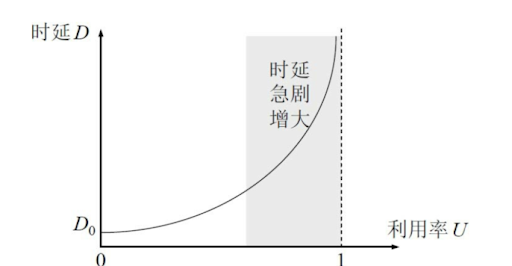
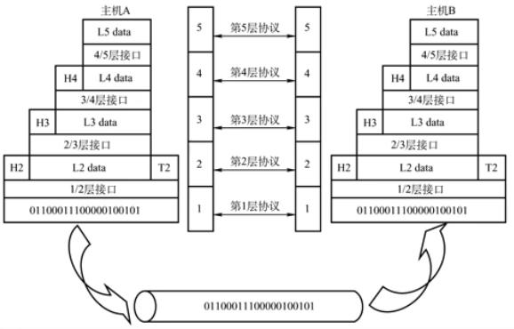
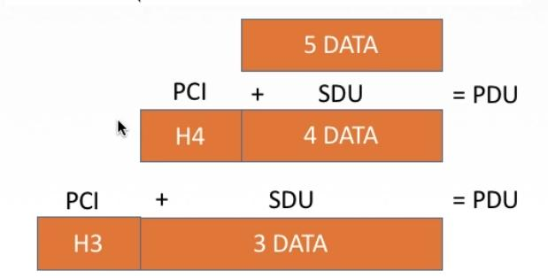

# 计算机网络

怎么学计算机网络

- 理解记忆
- 抓住重点
  - 协议
  - 应用：经典网络（以太网）
  - 网络设备

网络体系结构

---

内容

- 概念
- 组成
- 功能
- 分类

---

计算机网络的概念


计算机网络：是一个将分散的、具有独立功能的**计算机系统**（客户端,，Android、iOS、Windows、MacOS），通过**通信设备**（交换机、路由器）与**线路**连接起来，由功能完善的**软件**实现**资源共享**和**信息传递**的系统。

线路：端系统和通信设备所连接的一个介质

软件：端系统上面安装软件来实现网络的功能

总的来说，计算机网络是**互连**的、**自治**的计算机集合。

**互连**-互联互通。通信链路

**自治**-无主从关系

---

计算机网络的功能

1. **数据通信**（连通性）
2. **资源共享** （硬件、软件、数据）
3. 分布式处理 多台计算机各自承担同一工作任务的不同部分 Hadoop平台
4. 提高可靠性 有替代机来替代线路中的宕机
5. 负载均衡 各计算机之间更加亲密

---

计算机网络的组成

1. 组成部分
   - 硬件、软件、协议
   - 硬件：主机（端系统）、链路（双绞线、光纤）、通信设备（路由器、交换机）
   - 软件： 安装在端系统上面的应用软件
   - 协议：一系列规则和约定的集合
2. **工作方式**
   - 边缘部分-->用户直接使用
     - c/s方式 客户端/服务端方式
     - P2P方式
   - 核心部分-->为边缘部分服务  


3. **功能组成** 数据通信、资源共享
   - 通信子网 实现**数据通信**
   - 资源子网 实现**资源共享**/数据处理

 

---

计算机网络的分类

1. 按分布范围分`广域网WAN` `城域网MAN` `局域网LAN` `个人区域网PAN`
   - 广域网WAN：跨国，交换技术
   - 局域网LAN：广播技术
2. 按使用者分
   - 共用网：联通、电信
   - **专**用网：需要权限、军用网
3. 按交换技术分
   - 电路交换
   - 报文交换
   - 分组交换
4. 按拓扑结构分 Topology


网状型常用于广域网（Internet）

5. 按传输技术分
   - 广播式网络 共享公共通信信道
   - 点对点网络 使用**分组存储转发**和**路由选择**机制

## 标准化工作及相关组织

标准化工作

标准化对计算机网络至关重要！

要实现不同厂商的硬、软件之间互相连通，必须遵从统一的标准。

---

标准的分类

- 法定标准 由权威机构指定的正式的、合法的标准**OSI**
- 事实标准 某些公司的产品在竞争中占据了主流，时间长了，这些产品的协议和技术就成了标准。

**RFC**(Request for Comments)-->因特网标准的形式

RFC要上升为因特网正式标准的**四个阶段**：

1. **因特网草案**（Internet Draft）这个阶段还不是RFC文档

2. **建议标准**（Proposed Standard）从这个阶段开始成为RFC文档

3. **草案标准**（Draft Standard）(2011起取消)

   IETF、IAB

4. **因特网标准**（Internet Standard）

---

标准化工作的相关组织

- 国际标准化组织ISO OSI参考模型、HDLC协议

- 国际电信联盟ITU 制定通信规则、电信电话

- 国际电气电子工程师协会IEEE 学术机构、IEEE802系列标准、5G

- Internet工程任务组IETF 负责因特网相关标准的制定 RFC XXXX

## 性能指标（一）

速率、带宽、吞吐量

### 速率

速率即数据率或称数据传输率或比特率

比特 1/0 位

连接在计算机网络上的**主机**在数字信道上传送数据**位数**的**速率**

单位是b/s、kb/s、Mb/s、Gb/s、Tb/s

```java
// 发送端 ----> 接收端
// 01010
// 。。。。1 秒。。。。
//             01010
// => 速率是5b/s
```

单位换算

速率 速率小写

- 千 1kb/s=1*10^3b/s
- 兆 1Mb/s=1*10^3kb/s
- 吉 1Gb/s=1*10^3Mb/s
- 太 1Tb/s=1*10^3Gb/s

存储容量 1Byte（字节）= 8bit（比特）容量大写

1KB = 2^10B = 1024B = 1024 * 8b

1MB = 2^10KB = 1024KB

1GB = 2^10MB = 1024MB

1TB = 2^10GB = 1024GB

### 带宽 = 速率

1. “带宽”原本指某个信号具有的频带宽度，即最高频率与最低频率之差，单位是赫兹（Hz）
2. 计算机网络中，带宽用来表示网络的通信线路传达数据的能力，通常是指单位时间内从网络中的某一点到另一点所能通过的“最高数据率”。单位是“比特每秒”，b/s、kb/s、Mb/s、Gb/s

网络设备所支持的最高速度



### 吞吐量

表示在**单位时间**内通过**某个网络（或信道、接口）**的数据量。单位b/s、kb/s、Mb/s等

吞吐量受网络的带宽或网络的额定速率的限制


## 性能标准（二）

时延、时延带宽积、往返时间RTT、利用率

### 时延

指数据（报文/分组/比特流）从网络（或链路）的另一端传送到另一端所需的时间。也叫**延迟**或迟延。单为是**s**。

时延四大类

- 发送时延（传输时延）
  - 从发送分组的第一个比特算起，到该分组的最后一个比特发送完毕所需时间
  - 两个影响点，数据长度、发送速度
  - **发送时延 = 数据长度 / 信道带宽（发送速率）**
  - 发生在主机网络适配器中
- 传播时延
  - 取决于电磁波传播速度和链路的长度
  - **传播时延 = 信道长度 / 电磁波（信息的载体）在信道上的传播速率**
  - 发生在信道上
- 排队时延
  - 等待 输出/入链路可用
- 处理时延
  - 检错、找出口

高速链路是发送速率提高


### 时延带宽积

时延带宽积 = 传播时延 X 带宽

bit = s * b/s

时延带宽积又称为以**比特为单位的链路长度**，即“某段链路现在有多少比特”。

描述数据量，管道数据容量

### 往返时延RTT

从发送方发送数据开始，到发送方收到接收方的确认（接收方收到数据后立即确认），总共经历的时延。

例子：

```shell
$ ping www.baidu.com
PING www.wshifen.com (45.113.192.101): 56 data bytes
64 bytes from 45.113.192.101: icmp_seq=0 ttl=54 time=6.756 ms
64 bytes from 45.113.192.101: icmp_seq=1 ttl=54 time=14.543 ms
64 bytes from 45.113.192.101: icmp_seq=2 ttl=54 time=13.483 ms
^C
--- www.wshifen.com ping statistics ---
3 packets transmitted, 3 packets received, 0.0% packet loss
round-trip min/avg/max/stddev = 6.756/11.594/14.543/3.448 ms
```

RTT越大，在收到确认之前，可以发送的数据越多。

- RTT包括
  - 往返传播时延=传播时延*2
  - 末端处理时间

- 不包括传输时延-->只管信道

### 利用率

- 信道利用率：有数据通过时间 / （有+无）数据通过时间
- 网络利用率：信道利用率加权平均值



## 性能指标小结

- 性能指标
  - 速度
    - 速率、带宽、吞吐量
  - 时间
    - 时延、时延带宽积、往返时间RTT
  - 利用率

## 分层结构

协议、接口、服务

### 为什么要分层

发送文件前要完成的工作：

1. 发起通信的计算机必须将数据通信的通路进行**激活**。
2. 要告诉网络如何识别目的主机
3. 发起通信的计算机要查明目的主机是否开机，并且与网络连接正常
4. 发起通信的计算机要弄清楚，对方计算机中文件管理程序是否已经做好准备工作
5. 确保差错和意外可以解决

。。。。。。

### 怎么分层

分层的**基本原则**

1. 各层之间相互**独立**，每层只实现一种相对独立的功能。
2. 每层之间界面**自然清晰**，易于理解，相互交流尽可能少。（接口问题）
3. 结构上可分割开。每层都采用**最合适的技术**来实现。
4. 保持**下层**对**上层**的独立性，**上层单向使用下层提供的服务**
5. 整个分层结构应该能促进标准化工作

### 正式分层结构



1. **实体**：第n层中的活动元素称为**n层实体**。同一层的实体叫**对等实体**
2. **协议**：为进行网络中的**对等实体**数据交换而建立的规则、标准或约定称为网络协议「水平维度」
   - 语法：规定传输数据的格式
   - 语义：规定所要完成的功能
   - 同步：规定各种操作的顺序
3. **接口（访问服务点SAP）**：上层使用下层服务的入口
4. **服务**：下层为相邻上层提供的功能调用。「垂直维度」



SDU服务数据单元：为完成用户所要求的功能而应传送的数据

PCI协议控制信息：控制协议操作的信息

PDU协议数据单元：对等层次之间传送的数据单位

### 概念总结

网络体系结构是从**功能**上描述计算机网络结构

计算机网络体系结构简称网络体系结构是**分层结构**

每层遵循某个/些网络协议以完成本层功能

**计算机网络体系结构**是计算机网络的**各层及其协议**的集合

第n层在向n+1层提供服务时，此服务不仅包含第n层本身的功能，还包含由下层服务提供的功能

仅仅在**相邻层间有接口**，且所提供服务的具体实现细节对上一层完全屏蔽

体系结构是抽象的，而实现是指能运行的一些软件和硬件

### 分层结构小结

- 为什么分层
- 怎么分层
  - 协议（对等）、服务（上层用下层服务）、接口

## 计算机网络分层结构

