# 计算机网络

怎么学计算机网络

- 理解记忆
- 抓住重点
  - 协议
  - 应用：经典网络（以太网）
  - 网络设备

网络体系结构

---

内容

- 概念
- 组成
- 功能
- 分类

---

计算机网络的概念

计算机网络：是一个将分散的、具有独立功能的**计算机系统**（客户端,，Android、iOS、Windows、MacOS），通过**通信设备**（交换机、路由器）与**线路**连接起来，由功能完善的**软件**实现**资源共享**和**信息传递**的系统。

线路：端系统和通信设备所连接的一个介质

软件：端系统上面安装软件来实现网络的功能

总的来说，计算机网络是**互连**的、**自治**的计算机集合。

**互连**-互联互通。通信链路

**自治**-无主从关系

---

计算机网络的功能

1. **数据通信**（连通性）
2. **资源共享** （硬件、软件、数据）
3. 分布式处理 多台计算机各自承担同一工作任务的不同部分 Hadoop平台
4. 提高可靠性 有替代机来替代线路中的宕机
5. 负载均衡 各计算机之间更加亲密

---

计算机网络的组成

1. 组成部分
   - 硬件、软件、协议
   - 硬件：主机（端系统）、链路（双绞线、光纤）、通信设备（路由器、交换机）
   - 软件： 安装在端系统上面的应用软件
   - 协议：一系列规则和约定的集合
2. **工作方式**
   - 边缘部分-->用户直接使用
     - c/s方式 客户端/服务端方式
     - P2P方式
   - 核心部分-->为边缘部分服务  

3. **功能组成** 数据通信、资源共享
   - 通信子网 实现**数据通信**
   - 资源子网 实现**资源共享**/数据处理

 

---

计算机网络的分类

1. 按分布范围分`广域网WAN` `城域网MAN` `局域网LAN` `个人区域网PAN`
   - 广域网WAN：跨国，交换技术
   - 局域网LAN：广播技术
2. 按使用者分
   - 共用网：联通、电信
   - **专**用网：需要权限、军用网
3. 按交换技术分
   - 电路交换
   - 报文交换
   - 分组交换
4. 按拓扑结构分 Topology

网状型常用于广域网（Internet）

5. 按传输技术分
   - 广播式网络 共享公共通信信道
   - 点对点网络 使用**分组存储转发**和**路由选择**机制

